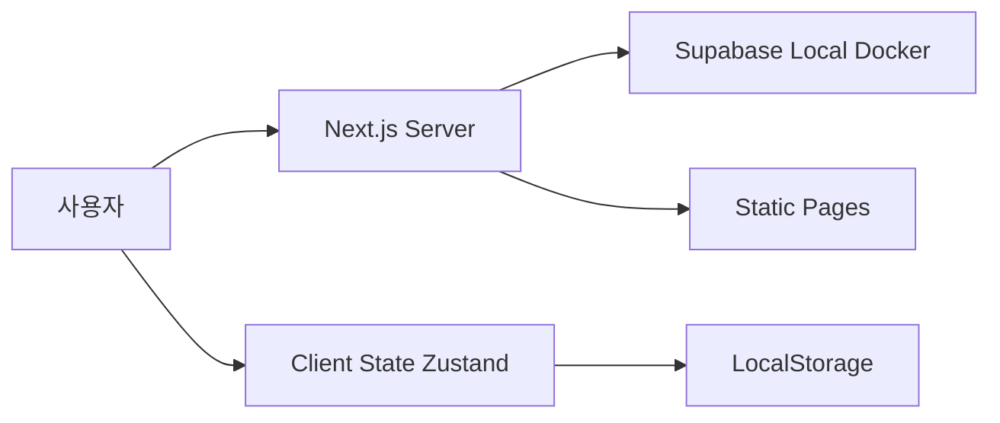

# CLAUDE.md

This file provides guidance to Claude Code (claude.ai/code) when working with code in this repository.

---

# 소장님 프로젝트

## 프로젝트 개요

견적서 출력용 제품 카탈로그 웹사이트. 회원가입 없이 제품을 조회하고 장바구니에 담아 견적서를 출력하는 간소화된 B2B 카탈로그.

## 개발 명령어

```bash
# 로컬 Supabase 시작 (Docker 필수)
supabase start

# 개발 서버 실행
npm run dev          # http://localhost:3000

# 프로덕션 빌드
npm run build
npm start

# 린트
npm run lint

# Supabase 마이그레이션 적용
supabase db reset    # 마이그레이션 + 시드 데이터 재적용

# Supabase 상태 확인
supabase status
```

## 기술 스택

- **프론트엔드**: Next.js 16.0.0 App Router, React 19.2.0, TypeScript, Tailwind CSS 4.1.16
- **상태관리**: Zustand 5.0.8 (클라이언트 상태, localStorage 영속화)
- **백엔드**: Supabase PostgreSQL (Docker 로컬 환경)
- **배포**: Vercel (예정)

## 아키텍처 원칙

### 1. 인증 없는 공개 카탈로그
- 회원가입/로그인 기능 없음
- 모든 사용자가 즉시 접근 가능
- 장바구니는 브라우저 로컬스토리지 기반

### 2. 읽기 전용 데이터베이스
- Supabase는 제품 정보 조회만 담당
- 데이터 수정은 Supabase Dashboard에서만
- RLS 정책으로 읽기 권한만 허용

### 3. Server-First 아키텍처
- 데이터 fetch는 Server Component에서
- 클라이언트 상태는 최소화
- 상호작용 필요 시에만 Client Component 사용



## 핵심 아키텍처

### 데이터베이스 스키마

**중요**: 데이터베이스 변경은 마이그레이션 파일로 관리합니다.
- 위치: `supabase/migrations/*.sql`
- 시드 데이터: `supabase/seed.sql`

```sql
-- 핵심 테이블 구조
categories (id, name, slug, created_at)
products (id, name, description, price, image_url, category_id, badge, specs, created_at)

-- badge는 ENUM: '신제품' | '베스트' | '프리미엄' | '할인'
-- specs는 JSONB: {"전압": "20V", "토크": "180Nm", ...}
```

### 상태 관리 흐름

1. **서버 상태**: Supabase에서 Server Component로 직접 fetch
2. **클라이언트 상태**: Zustand store (`src/store/`)
   - `cartStore`: 장바구니 (localStorage persist)
   - Hydration 에러 방지 필수 (`mounted` 체크)

### 라우팅 구조

```
/ (홈)
  ├── /products (제품 목록, 카테고리 필터)
  │   └── /products/[id] (제품 상세)
  └── /cart (장바구니)
```

### Supabase 연결

**로컬 개발**:
- Docker로 Supabase 실행: `supabase start`
- 환경변수는 `.env.local`에 자동 생성됨
- 클라이언트: `src/lib/supabase/client.ts` (싱글톤)

**주의사항**:
- Supabase 클라이언트는 `@/lib/supabase/client`에서만 import
- 환경변수: `NEXT_PUBLIC_SUPABASE_URL`, `NEXT_PUBLIC_SUPABASE_ANON_KEY`
- RLS 정책: 읽기만 허용 (쓰기는 SQL Editor에서만)

## 코딩 원칙

### TypeScript
- 모든 함수/컴포넌트는 명시적 타입 정의
- `interface` 우선, `type`은 유니온/교차 타입에만
- Supabase 스키마와 1:1 매칭되는 타입

### React 컴포넌트
- **Server Component 기본**: 데이터 fetch는 서버에서
- **Client Component**: 상호작용/상태 관리 시에만 `'use client'`
- **Props**: `interface Props` 형태로 정의
- **파일명**: PascalCase

### Tailwind CSS
- Professional Clean 디자인 시스템 준수
- 색상: `#1a1a1a` (primary), `#fafafa` (surface), `#e0e0e0` (border)
- 클래스 순서: layout → spacing → typography → colors → effects
- 반응형: 모바일 우선, `md:`, `lg:` breakpoints

### Supabase
- 클라이언트는 `@/lib/supabase/client`에서만 import
- 모든 쿼리에 에러 핸들링 필수
- 필요한 컬럼만 `select`, `limit` 설정으로 최적화

## 디자인 시스템

**참고**: `design-mockups/03-professional-clean.html` 참조

### Professional Clean 색상

```typescript
const colors = {
  primary: '#1a1a1a',      // 주 텍스트
  secondary: '#4a4a4a',    // 보조 텍스트
  accent: '#888',          // 메타 정보
  background: '#ffffff',   // 배경
  surface: '#fafafa',      // 카드/박스
  border: '#e0e0e0',       // 테두리
}

const badgeColors = {
  '신제품': 'bg-blue-500',
  '베스트': 'bg-red-500',
  '프리미엄': 'bg-purple-500',
  '할인': 'bg-green-500',
}
```

### 레이아웃 원칙
- 리스트형 제품 카드 (이미지 좌측, 정보 중앙, 가격 우측)
- 여백은 넉넉하게 (`p-6`, `gap-6`)
- Hover 효과로 상호작용 표시
- 모든 이미지는 fallback 이모지 제공 (📦)

## 성능 최적화

1. **Server Components 우선**: 렌더링은 서버에서
2. **Dynamic Import**: 큰 클라이언트 컴포넌트는 지연 로딩
3. **Supabase 쿼리**: 필요한 데이터만, 인덱스 활용
4. **이미지**: `next/image` + width/height 명시
5. **상태**: Zustand persist는 필요한 store만

## 에러 처리

### Hydration Error 방지
Client Component에서 Zustand persist 사용 시:
```typescript
const [mounted, setMounted] = useState(false)
useEffect(() => { setMounted(true) }, [])
if (!mounted) return null
```

### Supabase 에러 핸들링
```typescript
const { data, error } = await supabase.from('products').select('*')
if (error) {
  // 에러 처리 로직
}
```

## 프로젝트 구조

```
sojangnim/
├── .claude/
│   ├── CLAUDE.md           # 이 파일
│   └── skills/             # 프로젝트 전용 스킬
├── design-mockups/         # HTML 디자인 참고
├── tasks/                  # Phase별 작업 문서
├── src/
│   ├── app/               # 페이지 (Server Components)
│   ├── components/        # 재사용 컴포넌트
│   ├── lib/supabase/     # Supabase 클라이언트
│   ├── store/            # Zustand stores
│   └── types/            # TypeScript 타입
└── public/images/        # 정적 이미지
```

## 구현 완료 현황

### ✅ Phase 1: Supabase 로컬 환경 구성
- Docker 기반 Supabase 로컬 환경 설정
- 데이터베이스 스키마 마이그레이션 파일 생성
- 5개 카테고리, 8개 샘플 제품 시드 데이터
- RLS 정책 설정 (공개 읽기 권한)

### ✅ Phase 2: Next.js 프로젝트 설정
- Next.js 16.0.0 + React 19.2.0 설치
- Tailwind CSS 4.1.16 설정 (@tailwindcss/postcss 사용)
- TypeScript 설정 및 타입 정의
- Supabase 클라이언트 설정
- 기본 폴더 구조 생성

### ✅ Phase 3: 제품 조회 기능 구현
- **컴포넌트**:
  - Header (로고, 네비게이션, 장바구니 버튼)
  - Footer (회사 정보, 링크)
  - CategorySidebar (카테고리 필터)
  - ProductCard (제품 카드)
  - AddToCartButton (장바구니 담기)
- **페이지**:
  - 홈페이지 (Hero, 추천/최신 제품)
  - 제품 목록 (/products, 카테고리 필터)
  - 제품 상세 (/products/[id], 사양 표시)

### ✅ Phase 4: 장바구니 기능 구현
- Zustand 스토어 (cartStore)
- localStorage 영속화
- 장바구니 페이지 (/cart)
- 수량 조절, 제품 삭제, 전체 삭제
- 견적서 출력 기능 (window.print)
- Header에 장바구니 아이템 수 표시

### 🚧 Phase 5: 배포 (미완료)
- Supabase Cloud 설정 필요
- Vercel 배포 필요
- 환경 변수 설정 필요

## 다음 단계

1. **Supabase 로컬 DB 시작**: `supabase start`로 Docker 컨테이너 실행
2. **개발 서버 실행**: `npm run dev`
3. **테스트**: http://localhost:3000에서 기능 확인
4. **운영 배포**: `tasks/05-deployment.md` 참고

## 참고 문서

- **전체 계획**: `tasks/00-overview.md`
- **디자인 참고**: `design-mockups/03-professional-clean.html`
- **Phase 문서**: `tasks/01-supabase-setup.md` ~ `tasks/05-deployment.md`
