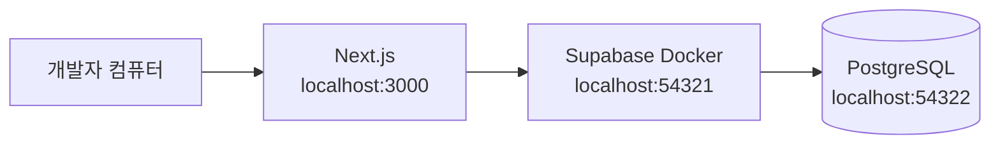
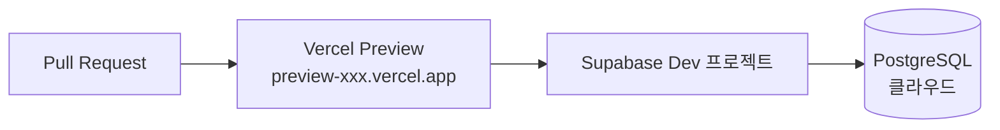
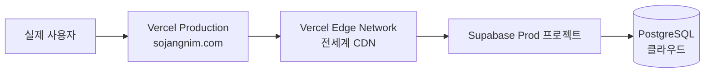
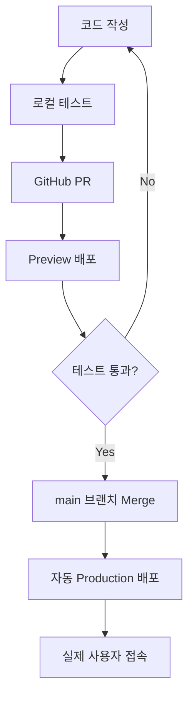

# 🌍 환경 구분 가이드

로컬, 스테이징, 프로덕션 환경을 이해하고 관리하는 방법을 배웁니다.

## 📌 왜 환경을 구분하나요?

**환경 구분**은 개발, 테스트, 운영을 분리하여 안전하게 서비스를 제공하는 방법입니다.

### 실제 시나리오

**❌ 환경 구분 없이**:
- 개발 중인 기능이 실제 사용자에게 노출
- 테스트 데이터가 운영 DB에 섞임
- 버그가 발견되어도 즉시 롤백 어려움

**✅ 환경 구분하면**:
- 로컬에서 자유롭게 개발 및 테스트
- 스테이징에서 운영과 동일한 환경 검증
- 프로덕션은 검증된 코드만 배포

## 🏗️ 3가지 환경

### 환경 비교표

| 항목 | 로컬 (Local) | 스테이징 (Staging) | 프로덕션 (Production) |
|------|-------------|-------------------|---------------------|
| **목적** | 개발 및 디버깅 | 운영 전 검증 | 실제 서비스 운영 |
| **Next.js** | localhost:3000 | Vercel Preview | Vercel Production |
| **Supabase** | Docker 로컬 | Supabase Dev 프로젝트 | Supabase Prod 프로젝트 |
| **도메인** | localhost:3000 | preview-xxx.vercel.app | sojangnim.com |
| **데이터** | 시드 데이터 (가짜) | 테스트 데이터 | 실제 운영 데이터 |
| **사용자** | 개발자 본인 | 내부 테스터 | 실제 고객 |
| **에러 허용** | 자유롭게 테스트 | 발견하면 수정 | 절대 불가 |
| **비용** | 무료 | 무료 (또는 최소) | 유료 (사용량 기반) |

## 🖥️ 로컬 환경 (Local Development)

**개발자 개인 컴퓨터에서 실행되는 환경**

### 구성



### 특징

- **완전히 격리됨**: 다른 개발자/환경에 영향 없음
- **빠른 피드백**: 코드 저장 시 즉시 반영 (Hot Reload)
- **자유로운 실험**: DB 초기화, 데이터 삭제 자유
- **오프라인 가능**: 인터넷 없이도 개발 가능

### 사용하는 기술

- **Next.js**: `npm run dev` (개발 서버)
- **Supabase**: Docker 컨테이너
- **환경 변수**: `.env.local`

### 시작 방법

```bash
# Supabase 시작
supabase start

# Next.js 개발 서버
npm run dev
```

**접속**: http://localhost:3000

## 🧪 스테이징 환경 (Staging / Preview)

**운영 환경과 동일하지만 내부 테스트용 환경**

### 구성



### 특징

- **운영과 동일한 인프라**: Vercel + Supabase Cloud
- **자동 배포**: PR 생성 시 자동으로 Preview URL 생성
- **독립된 DB**: 운영 DB와 완전히 분리
- **테스트 데이터**: 실제 같은 가짜 데이터

### 사용 시나리오

1. **새 기능 개발 완료** → GitHub PR 생성
2. **Vercel이 자동으로 Preview 배포** → `preview-abc123.vercel.app`
3. **팀원들이 Preview URL에서 테스트**
4. **문제 없으면 main 브랜치에 Merge**

### 환경 변수

Vercel Dashboard에서 **Preview** 환경 변수 설정:

```bash
NEXT_PUBLIC_SUPABASE_URL=https://xxx-dev.supabase.co
NEXT_PUBLIC_SUPABASE_ANON_KEY=eyJhbG...dev-key
```

**주의**: 개발용 Supabase 프로젝트 사용!

## 🚀 프로덕션 환경 (Production)

**실제 고객이 사용하는 운영 환경**

### 구성



### 특징

- **고가용성**: 24/7 무중단 서비스
- **글로벌 배포**: Vercel Edge Network (CDN)
- **실제 데이터**: 고객 데이터, 절대 삭제 불가
- **모니터링**: 에러 추적, 성능 모니터링 필수

### 배포 프로세스



### 환경 변수

Vercel Dashboard에서 **Production** 환경 변수 설정:

```bash
NEXT_PUBLIC_SUPABASE_URL=https://xxx-prod.supabase.co
NEXT_PUBLIC_SUPABASE_ANON_KEY=eyJhbG...prod-key
```

**주의**: 운영용 Supabase 프로젝트 사용!

## 🔀 환경 전환 흐름

### 개발 → 배포 전체 흐름

```
1. 로컬 개발
   ├─ 코드 작성
   ├─ localhost:3000에서 테스트
   └─ Git commit

2. GitHub PR 생성
   ├─ feature 브랜치 push
   └─ Pull Request 생성

3. 스테이징 검증 (자동)
   ├─ Vercel Preview 자동 배포
   ├─ preview-xxx.vercel.app 생성
   ├─ E2E 테스트 자동 실행 (GitHub Actions)
   └─ 팀원 리뷰 및 테스트

4. 프로덕션 배포
   ├─ main 브랜치 Merge
   ├─ Vercel 자동 Production 배포
   └─ sojangnim.com 업데이트
```

## 🗄️ 데이터베이스 환경 분리

### Supabase 프로젝트 2개 생성 권장

| 프로젝트 | 용도 | 연결 환경 |
|---------|------|----------|
| **sojangnim-dev** | 개발/테스트 | 로컬, 스테이징 |
| **sojangnim-prod** | 운영 | 프로덕션 |

### 왜 분리하나요?

**시나리오**: 제품에 "재고" 필드 추가

**❌ DB 통합 사용**:
- 로컬에서 마이그레이션 테스트
- 실수로 운영 DB에 마이그레이션 푸시
- 운영 DB 구조 변경 → **서비스 중단!**

**✅ DB 분리**:
- 개발 DB에서 마이그레이션 테스트
- 문제 발견 시 개발 DB만 초기화
- 검증 완료 후 운영 DB에 안전하게 적용

### 마이그레이션 적용 순서

```bash
# 1. 로컬에서 개발
supabase migration new add_stock_field
# SQL 작성
supabase db reset

# 2. 개발 DB에 푸시 (스테이징 검증)
supabase link --project-ref <dev-project-ref>
supabase db push

# 3. 검증 완료 후 운영 DB에 푸시
supabase link --project-ref <prod-project-ref>
supabase db push
```

## 🌳 브랜치 전략

### Git 브랜치와 환경 매핑

```
main (브랜치)           → Production (환경)
  └─ develop (브랜치)   → Staging (환경)
      └─ feature/*      → Preview (임시 환경)
```

### 실제 워크플로우

```bash
# 1. 새 기능 개발
git checkout -b feature/add-stock
# 코드 작성
git commit -m "feat: 재고 관리 추가"

# 2. PR 생성
git push origin feature/add-stock
# GitHub에서 PR 생성 → Vercel Preview 자동 배포

# 3. 검증 후 Merge
# develop 브랜치로 Merge → Staging 배포 (선택사항)
# main 브랜치로 Merge → Production 배포
```

## 🔐 환경별 환경 변수 관리

### .env 파일 구조

```
프로젝트/
├── .env.local              # 로컬 개발용 (Git 무시)
├── .env.example            # 템플릿 (Git 커밋)
└── Vercel Dashboard        # 스테이징/프로덕션 설정
```

### 예시

**.env.example** (템플릿):
```bash
# Supabase
NEXT_PUBLIC_SUPABASE_URL=your-supabase-url
NEXT_PUBLIC_SUPABASE_ANON_KEY=your-anon-key
```

**.env.local** (로컬):
```bash
NEXT_PUBLIC_SUPABASE_URL=http://localhost:54321
NEXT_PUBLIC_SUPABASE_ANON_KEY=eyJhbG...local-key
```

**Vercel - Preview**:
```bash
NEXT_PUBLIC_SUPABASE_URL=https://xxx-dev.supabase.co
NEXT_PUBLIC_SUPABASE_ANON_KEY=eyJhbG...dev-key
```

**Vercel - Production**:
```bash
NEXT_PUBLIC_SUPABASE_URL=https://xxx-prod.supabase.co
NEXT_PUBLIC_SUPABASE_ANON_KEY=eyJhbG...prod-key
```

> 💡 자세한 내용은 [환경 변수 관리 문서](../deployment/environment-variables.md)를 참고하세요.

## 📊 환경별 체크리스트

### 로컬 환경 체크리스트

- [ ] Docker Desktop 실행 중
- [ ] `supabase start` 성공
- [ ] `.env.local` 파일 존재
- [ ] `npm run dev` 실행
- [ ] http://localhost:3000 접속 확인

### 스테이징 환경 체크리스트

- [ ] Supabase Dev 프로젝트 생성
- [ ] 마이그레이션 푸시 완료
- [ ] Vercel Preview 환경 변수 설정
- [ ] PR 생성 시 자동 배포 확인
- [ ] E2E 테스트 통과

### 프로덕션 환경 체크리스트

- [ ] Supabase Prod 프로젝트 생성
- [ ] 마이그레이션 검증 완료
- [ ] 운영 데이터 백업
- [ ] Vercel Production 환경 변수 설정
- [ ] 도메인 연결
- [ ] 모니터링 설정 (Analytics, Logs)

## 🚨 주의사항

### ❌ 절대 하지 말아야 할 것

1. **운영 DB에서 직접 테스트**
   - 항상 개발 DB에서 먼저 테스트!

2. **환경 변수 혼용**
   - 운영 키를 로컬에 사용하거나 그 반대

3. **main 브랜치에 직접 커밋**
   - 항상 PR을 통해 Merge

4. **시드 데이터를 운영 DB에 삽입**
   - 시드 데이터는 개발용!

### ✅ 베스트 프랙티스

1. **로컬에서 충분히 테스트**
2. **마이그레이션은 단계별 적용** (로컬 → 개발 → 운영)
3. **환경 변수는 Vercel Dashboard에서 관리**
4. **운영 배포 전 반드시 Preview 검증**
5. **운영 DB 백업 정기적으로 확인**

## 📚 다음 단계

- [Supabase Cloud 설정](../supabase/cloud-setup.md) - 개발/운영 프로젝트 생성
- [Vercel 설정](../deployment/vercel-setup.md) - 자동 배포 설정
- [환경 변수 관리](../deployment/environment-variables.md) - 민감 정보 안전하게 관리

---

**다음 읽을 문서**: [Supabase Cloud 설정](../supabase/cloud-setup.md)
