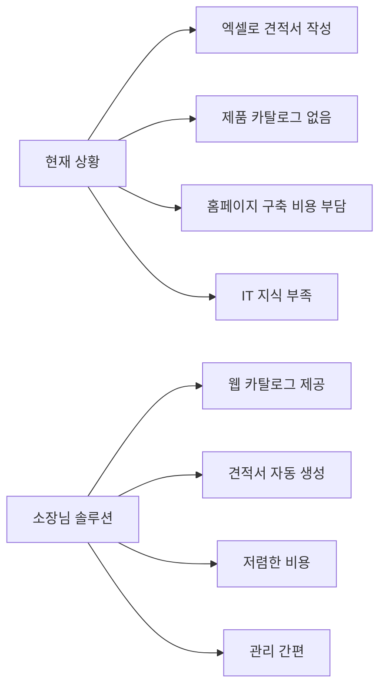
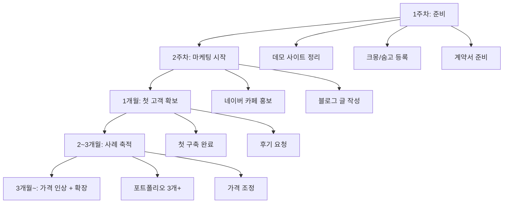

# 소장님 사업화 계획

## 개요

견적서 출력용 제품 카탈로그 솔루션을 B2B 소상공인에게 판매하는 사업 모델.

### 타겟 고객

- 공구상, 철물점
- 산업용품 도매상
- 부품/소모품 유통업체
- 인테리어 자재 업체
- 농기계/농자재 판매점

### 고객의 문제



---

## 사업 모델

### 모델 A: 구축 + 셀프 호스팅 (일시불)

고객이 직접 Vercel/Supabase 계정 운영, 구축 후 손 뗌

| 항목 | 가격 | 포함 내용 |
|------|------|-----------|
| 기본 패키지 | 80만원 | 사이트 구축, 배포, 교육 30분 |
| 표준 패키지 | 120만원 | 기본 + 제품 50개 등록 + 도메인 연결 |
| 프리미엄 | 180만원 | 표준 + 디자인 커스텀 + 유지보수 3개월 |

**고객 직접 부담 (월)**:
- Vercel: 무료 (소규모)
- Supabase: 무료~$25
- 도메인: 연 1~3만원

**장점**: 일시불 수익, 관리 부담 없음
**단점**: 반복 수익 없음

---

### 모델 B: 구축 + 호스팅 대행 (월정액)

내 인프라에서 운영, 월 비용 수금

| 항목 | 가격 | 내용 |
|------|------|------|
| 초기 구축비 | 50만원 | 사이트 구축, 배포 |
| 월 호스팅 | 3~5만원 | 서버 유지, 백업, 소소한 수정 |
| 연간 계약 | 월 2.5~4만원 | 2개월 할인 |

**수익 구조**:

```
인프라 비용 (고정)
├── Vercel Pro: 월 $20 (약 2.7만원)
└── Supabase Pro: 월 $25 (약 3.4만원)
────────────────────────────
합계: 약 월 6만원

손익분기점: 고객 2명 (월 6~10만원 수입)

고객 5명: 순익 약 14~19만원/월
고객 10명: 순익 약 34~44만원/월
고객 20명: 순익 약 74~94만원/월
```

**장점**: 반복 수익 (MRR), 고객 락인
**단점**: 지속적 관리 필요, 미수금 리스크

---

### 모델 C: 하이브리드 (추천)

고객에게 선택권 제공

```
옵션 1: 구축 + 호스팅 대행
- 초기비 50만원 + 월 4만원
- 관리 걱정 없이 사용

옵션 2: 구축 + 셀프 호스팅
- 일시불 100만원
- 본인이 직접 관리

옵션 3: 구축만 (호스팅 별도 안내)
- 일시불 80만원
- 호스팅 가이드 제공
```

---

## 추가 수익 옵션

| 서비스 | 가격 | 비고 |
|--------|------|------|
| 제품 등록 대행 | 3만원/10개 | 사진+설명 정리 |
| 도메인 연결 | 10만원 | 1회성 |
| 디자인 커스텀 | 30~50만원 | 색상, 레이아웃 변경 |
| 추가 기능 개발 | 협의 | 재고 연동, 주문 기능 등 |
| 월 유지보수 | 5만원/월 | 셀프호스팅 고객용 |
| 긴급 대응 | 10만원/건 | 장애 복구 |

---

## 운영 체크리스트

### 호스팅 대행 시 필요 사항

- [ ] 정기 결제 수단 (토스페이먼츠, 계좌이체)
- [ ] 서비스 이용 계약서
- [ ] 고객 관리 스프레드시트
- [ ] 백업 자동화 설정
- [ ] 모니터링 알림 설정

### 고객 관리 스프레드시트 항목

```
| 업체명 | 담당자 | 연락처 | 도메인 | 플랜 | 시작일 | 결제일 | 금액 | 상태 |
```

### 월간 운영 업무

1. **결제 확인** (매월 1~5일)
2. **백업 확인** (주 1회)
3. **보안 업데이트** (월 1회)
4. **고객 문의 대응** (수시)

---

## 마케팅 채널

### 온라인

| 채널 | 방법 | 비용 |
|------|------|------|
| 크몽 | 서비스 등록 | 수수료 20% |
| 숨고 | 서비스 등록 | 수수료 |
| 네이버 카페 | 자영업자 커뮤니티 홍보 | 무료 |
| 블로그 | 기술 글 + 사례 공유 | 무료 |
| 인스타그램 | 비포/애프터 포트폴리오 | 무료 |

### 타겟 네이버 카페

- 자영업자 모임
- 소상공인 정보공유
- 공구인, 철물인
- 인테리어 자재 정보

### 키워드 (크몽/숨고용)

```
견적서 사이트 제작
B2B 카탈로그 홈페이지
제품 홈페이지 제작
도매 사이트 제작
공구 홈페이지
자재 카탈로그
```

---

## 상품 설명 예시 (크몽용)

```
[제목]
공구상/자재상 전용! 견적서 자동 생성 카탈로그 사이트 만들어드립니다

[설명]
엑셀로 견적서 작성하시나요?
제품 사진 찾느라 시간 낭비하시나요?

✅ 웹사이트에서 제품 보여주고
✅ 장바구니에 담아서
✅ 견적서 바로 출력!

고객에게 링크만 보내면 끝!

포함 사항:
- 반응형 웹사이트 (PC/모바일)
- 제품 카탈로그 페이지
- 장바구니 기능
- 견적서 출력 기능
- 무료 호스팅 설정 (Vercel)
- 사용법 교육 (30분 영상통화)

작업 기간: 3~5일
```

---

## 계약서 핵심 조항

### 서비스 범위

```
1. 제공 서비스
   - 웹사이트 호스팅 및 유지
   - 월 1시간 이내 소소한 수정
   - 장애 발생 시 24시간 내 대응
   - 주간 자동 백업

2. 미포함 사항
   - 신규 기능 개발
   - 대규모 디자인 변경
   - 제품 등록 대행
   - 마케팅/SEO
```

### 결제 조건

```
- 결제일: 매월 [   ]일
- 결제 방법: 계좌이체 / 카드 자동결제
- 연체 시: 7일 유예 후 서비스 중단
- 해지: 1개월 전 서면 통보
```

### 해지 조건

```
- 고객 해지: 1개월 전 통보, 잔여 기간 환불 없음
- 사업자 해지: 1개월 전 통보, 데이터 백업 제공
- 미납 해지: 2개월 연체 시 자동 해지
```

---

## 실행 로드맵



### 1주차: 준비

- [ ] 데모 사이트 최종 점검
- [ ] 스크린샷/GIF 촬영
- [ ] 크몽 상품 등록
- [ ] 숨고 전문가 등록
- [ ] 계약서 템플릿 작성

### 2주차: 마케팅 시작

- [ ] 네이버 카페 3곳 가입
- [ ] 소개 글 작성 (홍보 아닌 정보 공유 형태)
- [ ] 블로그에 "견적서 사이트 만들기" 글 작성

### 1개월: 첫 고객

- [ ] 첫 문의 대응
- [ ] 견적서 발송
- [ ] 계약 및 착수금 수령
- [ ] 구축 완료
- [ ] 후기 요청

### 3개월~: 확장

- [ ] 가격 10~20% 인상
- [ ] 호스팅 고객 5명 이상 확보
- [ ] 추가 기능 옵션화 (주문, 재고 등)

---

## 참고 문서

- [멀티 테넌트 확장](./extensions/01-멀티-테넌트.md) - 여러 고객 한 인프라에서 운영 시
- [배포 가이드](./deployment/04-첫-배포-가이드.md) - Vercel + Supabase 배포
- [관리자 운영](./operations/01-관리자-운영.md) - 제품 관리 방법
