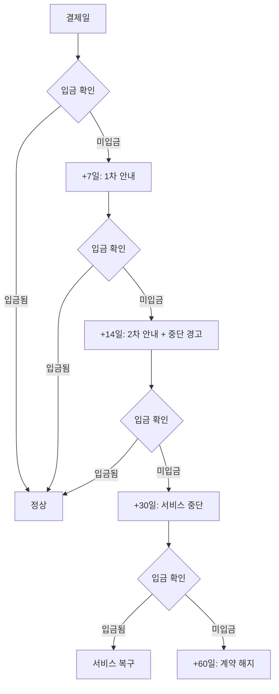

# 고객 관리

## 고객 관리 스프레드시트

### 기본 정보

| 고객ID | 업체명 | 대표자 | 연락처 | 이메일 | 업종 |
|--------|--------|--------|--------|--------|------|
| C001 | 예시철물 | 홍길동 | 010-1234-5678 | hong@example.com | 철물점 |

### 계약 정보

| 고객ID | 플랜 | 구축비 | 월비용 | 계약일 | 시작일 | 결제일 | 상태 |
|--------|------|--------|--------|--------|--------|--------|------|
| C001 | 호스팅 | 500,000 | 40,000 | 2024-01-15 | 2024-01-20 | 매월 20일 | 활성 |

### 기술 정보

| 고객ID | 도메인 | Vercel 프로젝트 | Supabase 프로젝트 | 관리자ID |
|--------|--------|-----------------|-------------------|----------|
| C001 | example.com | example-catalog | example-db | admin@example.com |

---

## 상태 정의

| 상태 | 설명 |
|------|------|
| 문의 | 첫 문의 접수 |
| 상담 | 견적/상담 진행 중 |
| 계약 | 계약 완료, 구축 전 |
| 구축중 | 사이트 구축 진행 |
| 검수 | 고객 검수 중 |
| 활성 | 서비스 운영 중 |
| 연체 | 미납 상태 |
| 해지예정 | 해지 통보됨 |
| 해지 | 서비스 종료 |

---

## 신규 고객 체크리스트

### 문의 접수

- [ ] 문의 내용 확인
- [ ] 업종, 규모 파악
- [ ] 필요 기능 파악
- [ ] 예산 확인

### 견적 및 상담

- [ ] 견적서 작성
- [ ] 견적서 발송
- [ ] 추가 질문 대응
- [ ] 플랜 결정

### 계약

- [ ] 계약서 작성
- [ ] 계약서 서명
- [ ] 계약금 청구
- [ ] 계약금 입금 확인
- [ ] 고객 정보 스프레드시트 등록

### 구축 착수

- [ ] 킥오프 미팅 (요구사항 정리)
- [ ] 제품 자료 수집
- [ ] 로고/색상 등 브랜딩 자료 수집
- [ ] 도메인 확인 (기존 or 신규)

### 구축

- [ ] Vercel 프로젝트 생성
- [ ] Supabase 프로젝트 생성
- [ ] 사이트 배포
- [ ] 제품 데이터 등록
- [ ] 커스텀 도메인 연결 (해당 시)
- [ ] 테스트

### 검수 및 인수인계

- [ ] 고객 검수 요청
- [ ] 수정 사항 반영
- [ ] 관리자 교육 (화상 통화)
- [ ] 계정 정보 전달
- [ ] 사용 가이드 전달
- [ ] 잔금 청구
- [ ] 잔금 입금 확인

### 서비스 시작

- [ ] 스프레드시트 상태 "활성" 변경
- [ ] 월 결제 일정 등록
- [ ] 환영 메시지 발송

---

## 월간 운영 체크리스트

### 매월 초 (1~5일)

- [ ] 결제 대상 고객 확인
- [ ] 미입금 고객 1차 안내
- [ ] 입금 확인 및 기록

### 매주

- [ ] 백업 상태 확인
- [ ] 서버 상태 확인
- [ ] 고객 문의 확인

### 매월 말

- [ ] 다음 달 결제 안내 발송
- [ ] 연체 고객 현황 점검
- [ ] 수익 정산

---

## 연체 대응 프로세스



### 안내 메시지 템플릿

**1차 안내 (결제일 +7일)**

```
안녕하세요, [업체명] 담당자님.

[월] 호스팅 비용 [금액]원이 아직 입금 확인되지 않았습니다.
확인 부탁드립니다.

입금 계좌: [은행] [계좌번호]
예금주: [예금주]

감사합니다.
```

**2차 안내 (결제일 +14일)**

```
안녕하세요, [업체명] 담당자님.

호스팅 비용 미납으로 안내드립니다.
[결제일]까지 입금 확인되지 않을 경우,
서비스가 일시 중단될 수 있습니다.

미납 금액: [금액]원
입금 계좌: [은행] [계좌번호]

문의사항 있으시면 연락 부탁드립니다.
```

**서비스 중단 안내 (결제일 +30일)**

```
안녕하세요, [업체명] 담당자님.

호스팅 비용 미납으로 서비스가 중단되었습니다.
입금 확인 후 서비스가 복구됩니다.

미납 금액: [금액]원
입금 계좌: [은행] [계좌번호]

30일 이내 입금되지 않을 경우 계약이 해지되며,
데이터가 삭제될 수 있습니다.
```

---

## 해지 처리

### 고객 요청 해지

1. 해지 요청 접수 (이메일/문자)
2. 해지 사유 확인
3. 해지 예정일 안내 (요청일 +1개월)
4. 데이터 백업 안내
5. 해지일에 서비스 종료
6. 데이터 백업 파일 전달
7. 스프레드시트 상태 변경

### 데이터 백업 제공

- Supabase 데이터 export (CSV)
- 이미지 파일 (해당 시)
- 소스코드 (해당 시)

---

## 고객 문의 대응

### 대응 시간 기준

| 유형 | 대응 시간 |
|------|-----------|
| 장애 (사이트 접속 불가) | 4시간 이내 |
| 긴급 수정 | 24시간 이내 |
| 일반 문의 | 48시간 이내 |
| 기능 요청 | 1주 이내 견적 회신 |

### 문의 기록

| 일시 | 고객 | 유형 | 내용 | 처리 | 소요시간 |
|------|------|------|------|------|----------|
| 2024-01-20 | 예시철물 | 수정 | 제품 가격 수정 요청 | 완료 | 10분 |
