# 소스코드 판매 가이드

프로젝트 소스코드 자체를 판매하여 패시브 인컴을 만드는 방법.

---

## 판매 플랫폼 비교

### 글로벌 마켓플레이스

| 플랫폼 | 특징 | 수수료 | 가격대 | 난이도 |
|--------|------|--------|--------|--------|
| [CodeCanyon](https://codecanyon.net/) | 최대 규모, Envato 소속 | 37.5~55% | $15~99 | 높음 (심사 까다로움) |
| [Gumroad](https://gumroad.com/) | 간편, 개발자 친화적 | 10% | 자유 | 낮음 |
| [GitMarket](https://git.market/) | Git 레포 기반 판매 | 30% | 자유 | 중간 |
| [Codester](https://www.codester.com/) | PHP/JS/템플릿 전문 | 30~70% | $10~200 | 중간 |
| [SellAnyCode](https://www.sellanycode.com/) | 앱/게임 소스 특화 | 20% | 자유 | 낮음 |
| [CodeIntra](https://codeintra.com/) | 리스팅 무료 | 협의 | 자유 | 낮음 |
| [PieceX](https://www.piecex.com/kor/) | B2B 특화, 한국어 지원 | 협의 | 고가 | 중간 |

### 한국 플랫폼

| 플랫폼 | 특징 | 수수료 | 적합도 |
|--------|------|--------|--------|
| [크몽](https://kmong.com/) | 전자책/템플릿/IT서비스 | 20% | 높음 |
| [디자인키트](https://www.designkits.co.kr/) | 웹 템플릿 전문 | 협의 | 중간 |
| [탈잉](https://taling.me/) | 강의 + 템플릿 번들 | 20~30% | 중간 |

### Next.js 특화 마켓

| 플랫폼 | 특징 | 가격대 |
|--------|------|--------|
| [Next.js Templates](https://nextjstemplates.com/) | Next.js 전문 | $49~299 |
| [Vercel Templates](https://vercel.com/templates) | 공식 템플릿 | 무료~유료 |
| [SaaS Boilerplates](https://saasboilerplates.dev/) | SaaS 스타터킷 모음 | 링크 모음 |

---

## 추천 플랫폼 (우선순위)

### 1순위: Gumroad (즉시 시작)

**장점**:
- 가입 즉시 판매 가능
- 수수료 10%로 저렴
- 라이선스 키 자동 생성
- 개발자 커뮤니티에서 인지도 높음

**단점**:
- 트래픽 직접 유치 필요
- 한국 결제 불편할 수 있음

**시작 방법**:
1. [gumroad.com](https://gumroad.com) 가입
2. 상품 등록 (소스코드 ZIP)
3. 가격 설정
4. 트위터/블로그로 홍보

### 2순위: 크몽 (한국 시장)

**장점**:
- 한국 결제 편리
- 기존 트래픽 활용
- 전자책 형태로 등록 가능

**단점**:
- 수수료 20%
- IT 소스코드 카테고리 약함

**시작 방법**:
1. 크몽 전문가 등록
2. "전자책/템플릿" 카테고리 선택
3. 소스코드 + 설치 가이드 PDF 구성
4. 상품 등록

### 3순위: CodeCanyon (장기)

**장점**:
- 최대 규모 마켓플레이스
- 글로벌 노출
- 검증된 수요

**단점**:
- 심사 까다로움 (코드 품질, 문서화)
- 수수료 높음 (최대 55%)
- 경쟁 치열

**준비 사항**:
- 영문 문서화 완벽히
- 데모 사이트 필수
- 코드 품질 검토

---

## 가격 전략

### 인디해커 가격 통계

```
평균 가격: $200
고가 제품: $500~2,000
저가 진입: $49~99
```

### 추천 가격 티어

```
Basic: $79 (약 10만원)
├── 소스코드 전체
├── 설치 가이드 (PDF)
├── 6개월 업데이트

Pro: $149 (약 20만원)
├── Basic 전체
├── 영상 튜토리얼
├── 1년 업데이트
├── Discord 커뮤니티 접근

Extended: $299 (약 40만원)
├── Pro 전체
├── 평생 업데이트
├── 1회 설치 지원 (30분 화상)
├── 상업용 라이선스 (재판매 가능)
```

### 초기 전략

1. **$49로 시작** - 첫 판매 + 후기 확보
2. **10개 판매 후 $79로 인상**
3. **후기 쌓이면 $99~149으로 조정**

---

## 패키지 구성

### 기본 패키지 내용

```
소장님-견적서-카탈로그/
├── README.md              # 설치 가이드
├── source/                # 전체 소스코드
│   ├── src/
│   ├── supabase/
│   ├── public/
│   └── ...
├── docs/
│   ├── 설치-가이드.pdf
│   ├── Vercel-배포.pdf
│   └── Supabase-설정.pdf
├── demo/
│   └── 데모-영상.mp4      # Pro 이상
└── LICENSE.md
```

### 라이선스 종류

| 라이선스 | 용도 | 가격 배수 |
|----------|------|-----------|
| Personal | 본인 프로젝트 1개 | 1x |
| Commercial | 클라이언트 프로젝트 | 2x |
| Extended | 재판매/SaaS 가능 | 5x |

---

## 판매 페이지 예시 (Gumroad용)

```markdown
# 소장님 - 견적서 카탈로그 웹사이트

B2B 업체를 위한 제품 카탈로그 + 견적서 자동 생성 솔루션

## 데모
🔗 [라이브 데모 보기](https://demo.example.com)

## 기술 스택
- Next.js 16 + React 19
- Supabase (PostgreSQL)
- Tailwind CSS
- Zustand (상태관리)
- Vercel 배포

## 주요 기능
✅ 제품 카탈로그 (카테고리별)
✅ 장바구니 (로컬 저장)
✅ 견적서 출력 (PDF 저장 가능)
✅ 반응형 디자인
✅ 관리자 페이지 (Supabase 연동)

## 포함 내용
- 전체 소스코드
- 설치 가이드 (PDF)
- Vercel + Supabase 배포 가이드
- 6개월 무료 업데이트

## 적합한 분
- 공구상, 철물점, 자재상 사장님
- B2B 카탈로그가 필요한 사업자
- 프리랜서 개발자 (클라이언트 프로젝트용)

## 가격
- Basic: $79 (소스 + 가이드)
- Pro: $149 (+ 영상 튜토리얼 + 1년 업데이트)
```

---

## 마케팅 채널

### 인디해커 커뮤니티

| 채널 | 특징 | 방법 |
|------|------|------|
| [Indie Hackers](https://www.indiehackers.com/) | 인디메이커 커뮤니티 | 빌드인퍼블릭, 런칭 공유 |
| [Product Hunt](https://www.producthunt.com/) | 신제품 런칭 | 런칭 데이 활용 |
| [Hacker News](https://news.ycombinator.com/) | 개발자 뉴스 | Show HN 게시 |
| [Twitter/X](https://twitter.com/) | 빌드인퍼블릭 | 개발 과정 공유 |
| [Reddit](https://www.reddit.com/r/SideProject/) | r/SideProject 등 | 프로젝트 공유 |

### 한국 채널

| 채널 | 특징 |
|------|------|
| [OKKY](https://okky.kr/) | 개발자 커뮤니티 |
| 네이버 카페 | 자영업자 대상 |
| 블로그 | SEO + 기술 글 |

### 빌드인퍼블릭 전략

```mermaid
graph LR
    A[개발 과정 공유] --> B[팔로워 확보]
    B --> C[런칭 전 관심 유도]
    C --> D[런칭 + 초기 판매]
    D --> E[후기 + 입소문]
    E --> F[가격 인상]
```



1. 트위터/블로그에 개발 과정 공유
2. "곧 출시" 티저로 관심 유도
3. 런칭 시 할인 (Launch Price)
4. 첫 구매자 후기 확보
5. 후기 기반으로 가격 점진적 인상

---

## 성공 사례

### Supastarter
- Next.js + Supabase SaaS 스타터킷
- $49로 시작 → 현재 $299
- 월 $12,000+ 수익 달성
- [supastarter.dev](https://supastarter.dev/)

### ShipFast
- Next.js 보일러플레이트
- $169~249 가격대
- 빌드인퍼블릭으로 성장
- [shipfa.st](https://shipfa.st/)

### 공통점
- 명확한 타겟 (개발자, 스타트업)
- 지속적 업데이트
- 강력한 문서화
- 빌드인퍼블릭 마케팅

---

## 체크리스트

### 판매 전 준비

- [ ] 데모 사이트 배포
- [ ] README 영문화
- [ ] 설치 가이드 PDF 작성
- [ ] 스크린샷/GIF 준비
- [ ] 라이선스 파일 작성
- [ ] 가격 결정

### 플랫폼 등록

- [ ] Gumroad 계정 생성
- [ ] 상품 등록
- [ ] 결제 설정 (Stripe/PayPal)
- [ ] 판매 페이지 작성

### 런칭

- [ ] 런칭 가격 설정 (할인)
- [ ] 트위터/블로그 공유
- [ ] Indie Hackers 게시
- [ ] Product Hunt 예약 (선택)

### 런칭 후

- [ ] 첫 구매자 지원
- [ ] 후기 요청
- [ ] 피드백 반영
- [ ] 가격 조정

---

## Sources

- [Gumroad 판매 가이드](https://help.gumroad.com/article/303-sell-digital-products)
- [CodeCanyon 제출 가이드](https://codecanyon.net/)
- [Indie Hackers - 보일러플레이트 판매 전략](https://www.indiehackers.com/post/tech/hitting-12k-mo-with-a-boilerplate-j2n9ECQvdJBw9Gvf4TKA)
- [2024 디지털 상품 판매 플랫폼](https://medium.com/@fraxool/selling-digital-products-in-2024-what-are-the-best-platforms-fac6d5db6c45)
- [PieceX 한국어](https://www.piecex.com/kor/)
- [크몽 전자책 가이드](https://support.kmong.com/hc/ko/articles/13531011874713)
