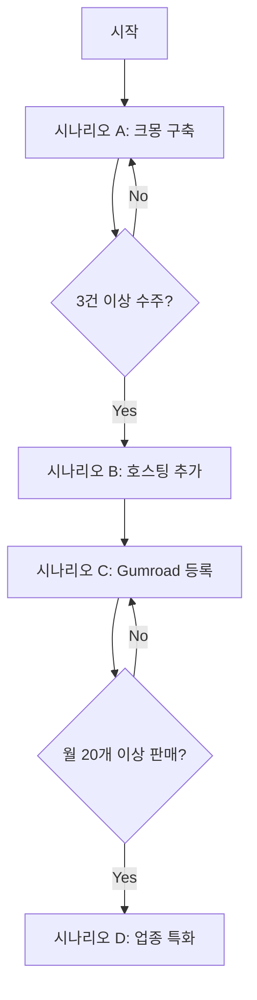

# 수익화 시나리오

소장님 프로젝트로 실제 수익을 만드는 구체적인 시나리오.

---

## 시나리오 비교 요약

| 시나리오 | 초기 수익 | 월 수익 | 난이도 | 시간 투자 | 확장성 |
|----------|-----------|---------|--------|-----------|--------|
| A. 크몽 구축 대행 | 80~150만/건 | 불규칙 | 낮음 | 건당 3~5일 | 낮음 |
| B. 호스팅 대행 | 50만 + 월4만 | 안정적 | 중간 | 지속 관리 | 중간 |
| C. Gumroad 판매 | 불규칙 | 패시브 | 중간 | 초기 집중 | 높음 |
| D. 업종 특화 | 100~200만/건 | 높음 | 높음 | 높음 | 높음 |

---

## 시나리오 A: 크몽 구축 대행

### 개요

크몽에서 "견적서 카탈로그 사이트 제작" 서비스를 판매.
고객이 Vercel/Supabase 직접 운영, 구축 후 손 뗌.

### 타겟 고객

- 공구상, 철물점, 자재상 사장님
- IT 지식 없지만 홈페이지 필요한 소상공인
- 예산 100만원 내외

### 가격 구성

```
기본 패키지: 80만원
├── 카탈로그 사이트 구축
├── 제품 20개 등록
├── Vercel + Supabase 세팅
├── 사용법 교육 (30분 화상)
└── 1개월 버그 수정

표준 패키지: 120만원
├── 기본 전체
├── 제품 50개 등록
├── 커스텀 도메인 연결
└── 로고/색상 커스텀

프리미엄 패키지: 180만원
├── 표준 전체
├── 제품 무제한 등록
├── 디자인 커스터마이징
└── 3개월 유지보수
```

### 수익 시뮬레이션

```
월 2건 수주 (기본 패키지 기준)
─────────────────────────
매출: 160만원/월
비용: 0원 (고객이 호스팅 부담)
순익: 160만원/월

연간: 약 1,900만원
```

### 실행 타임라인

```
Day 1-2: 준비
├── 데모 사이트 점검
├── 스크린샷 촬영 (PC/모바일)
├── 상품 설명 작성
└── 크몽 전문가 등록

Day 3: 상품 등록
├── 크몽 서비스 등록
├── 포트폴리오 이미지 업로드
└── 가격/옵션 설정

Day 4~14: 첫 문의 대기
├── 크몽 프로필 최적화
├── 네이버 카페 홍보 (자영업자 모임)
└── 문의 응대 준비

Day 15~30: 첫 프로젝트
├── 견적서 발송
├── 계약 및 착수금 수령
├── 구축 (3~5일)
├── 교육 및 인수인계
└── 잔금 수령 + 후기 요청
```

### 크몽 상품 등록 예시

**제목**: 공구상/자재상 전용! 견적서 자동생성 카탈로그 사이트

**상세 설명**:
```
엑셀로 견적서 작성하시느라 힘드시죠?
제품 사진 찾느라 시간 낭비하시죠?

✅ 웹사이트에서 제품 선택
✅ 장바구니에 담기
✅ 견적서 바로 출력!

고객에게 링크만 보내면 됩니다.

[포함 사항]
• 반응형 웹사이트 (PC/모바일)
• 제품 카탈로그 + 카테고리
• 장바구니 기능
• 견적서 출력/PDF 저장
• 무료 호스팅 설정
• 사용법 교육 (30분)

[작업 기간] 3~5일

[이런 분께 추천]
• 공구상, 철물점, 자재상
• 산업용품 도매상
• 인테리어 자재 업체
```

### 필요 준비물

- [ ] 크몽 전문가 계정
- [ ] 데모 사이트 URL
- [ ] 스크린샷 5~10장
- [ ] 작업 프로세스 안내문
- [ ] 계약서 템플릿 (간단 버전)

---

## 시나리오 B: 호스팅 대행 (월정액)

### 개요

내 인프라에서 고객 사이트 운영, 월 비용 수금.
초기 구축비 낮추고 월정액으로 수익.

### 타겟 고객

- IT 완전 무지한 사장님
- "알아서 해주세요" 원하는 고객
- 월 비용 부담 가능한 업체

### 가격 구성

```
초기 구축비: 50만원
├── 사이트 구축
├── 제품 30개 등록
└── 기본 교육

월 호스팅: 4만원/월
├── 서버 유지
├── 주간 백업
├── 소소한 수정 (월 1시간)
└── 장애 대응

연간 계약: 3.5만원/월 (2개월 할인)
```

### 수익 시뮬레이션

```
고객 10명 확보 시
─────────────────────────
초기 수익: 500만원 (구축비)
월 수익: 40만원 (호스팅)

인프라 비용
├── Vercel Pro: 월 2.7만원
└── Supabase Pro: 월 3.4만원
합계: 월 6.1만원

순익: 약 34만원/월 (고객 10명)

1년 후
├── 초기 수익: 500만원
├── 월정액 수익: 408만원 (34만 × 12)
└── 연간 총 수익: 약 900만원
```

### 확장 시뮬레이션

```
고객 20명: 순익 약 74만원/월
고객 30명: 순익 약 114만원/월
고객 50명: 순익 약 194만원/월
```

### 실행 타임라인

```
Week 1: 인프라 준비
├── Vercel Pro 가입
├── Supabase Pro 가입
├── 백업 자동화 설정
└── 모니터링 설정

Week 2: 상품 준비
├── 크몽/숨고 등록
├── 호스팅 포함 상품 구성
└── 계약서 준비

Month 1-3: 고객 확보
├── 월 2~3건 목표
├── 첫 고객은 할인 제공
└── 후기 확보

Month 4-6: 안정화
├── 고객 10명 달성
├── 운영 루틴 정립
└── 추가 마케팅
```

### 운영 루틴

```
매일 (5분)
├── 사이트 접속 확인
└── 문의 확인

매주 (30분)
├── 백업 상태 확인
└── 고객 문의 처리

매월 (2시간)
├── 결제 확인
├── 미납 안내
├── 보안 업데이트
└── 수익 정산
```

### 필요 준비물

- [ ] Vercel Pro 계정
- [ ] Supabase Pro 계정
- [ ] 정기결제 수단 (토스페이먼츠 or 계좌이체)
- [ ] 고객 관리 스프레드시트
- [ ] 서비스 계약서
- [ ] 백업/모니터링 자동화

---

## 시나리오 C: Gumroad 소스코드 판매

### 개요

Gumroad에서 소스코드 패키지 판매.
한 번 등록하면 패시브 인컴.

### 타겟 고객

- 프리랜서 개발자
- 클라이언트 프로젝트용 템플릿 찾는 개발자
- 빠르게 사이트 만들고 싶은 스타트업
- 해외 고객 (영문화 시)

### 가격 구성

```
Basic: $79 (약 10만원)
├── 전체 소스코드
├── 설치 가이드 (PDF)
├── 6개월 업데이트
└── Personal License (1 프로젝트)

Pro: $149 (약 20만원)
├── Basic 전체
├── 영상 튜토리얼 (30분)
├── 1년 업데이트
├── Discord 커뮤니티
└── Commercial License (클라이언트용)

Extended: $299 (약 40만원)
├── Pro 전체
├── 평생 업데이트
├── 1회 설치 지원 (30분 화상)
└── Extended License (재판매/SaaS)
```

### 수익 시뮬레이션

```
초기 (런칭 할인 $49)
├── 첫 달 10개 판매: 약 65만원
└── 후기 확보

성장 ($79~149 정가)
├── 월 20개 판매 (평균 $100)
├── 매출: 약 260만원/월
├── Gumroad 수수료 10%: 26만원
└── 순익: 약 234만원/월

안정화
├── 월 30~50개 판매
├── 순익: 약 350~600만원/월
└── 연간: 4,000~7,000만원
```

### 실행 타임라인

```
Week 1: 패키지 준비
├── README 영문화
├── 설치 가이드 PDF 작성
├── 데모 사이트 정리
├── 스크린샷/GIF 촬영
└── 라이선스 파일 작성

Week 2: Gumroad 등록
├── Gumroad 계정 생성
├── 상품 페이지 작성
├── 결제 설정 (Stripe)
└── 테스트 구매

Week 3: 런칭
├── 런칭 가격 설정 ($49)
├── Twitter에 런칭 공유
├── Indie Hackers 게시
├── Reddit r/SideProject 게시
└── Product Hunt 예약 (선택)

Week 4+: 마케팅
├── 빌드인퍼블릭 콘텐츠
├── 기술 블로그 글
├── 첫 구매자 지원
├── 후기 수집
└── 가격 점진적 인상
```

### Gumroad 상품 페이지 예시

```
# Sojangnim - B2B Catalog & Quote Generator

Build a product catalog website with automatic quote
generation for your B2B business.

## Live Demo
🔗 [View Demo](https://demo.example.com)

## Tech Stack
- Next.js 16 + React 19
- Supabase (PostgreSQL)
- Tailwind CSS 4
- Zustand (State Management)
- Vercel Ready

## Features
✅ Product catalog with categories
✅ Shopping cart (localStorage)
✅ Quote/Invoice generation
✅ Print & PDF export
✅ Responsive design
✅ Admin via Supabase Dashboard

## Perfect For
- Hardware stores
- Industrial suppliers
- B2B wholesalers
- Freelance developers (client projects)

## What's Included
- Full source code
- Installation guide (PDF)
- Deployment guide (Vercel + Supabase)
- 6 months free updates

## Pricing
- Basic $79: Source + Guide
- Pro $149: + Video tutorial + 1yr updates
- Extended $299: + Lifetime + 1:1 Support
```

### 필요 준비물

- [ ] Gumroad 계정
- [ ] Stripe 계정 (결제용)
- [ ] 영문 README
- [ ] 설치 가이드 PDF (영문)
- [ ] 데모 사이트
- [ ] 스크린샷/GIF 5~10개
- [ ] 라이선스 파일 (MIT 변형)
- [ ] Twitter 계정 (마케팅용)

---

## 시나리오 D: 업종 특화 솔루션

### 개요

특정 업종(공구상, 철물점 등)에 특화된 버전으로
프리미엄 가격 책정.

### 타겟 업종 예시

```
1. 공구상 전용 "공구왕"
   - 공구 카테고리 프리셋
   - 공구 스펙 템플릿 (전압, 토크, RPM 등)
   - 공구 아이콘/이미지 세트

2. 철물점 전용 "철물마스터"
   - 철물 카테고리 (볼트, 너트, 피팅 등)
   - 규격별 검색 (M6, M8, 1/2인치 등)
   - 단가표 연동

3. 인테리어 자재 "자재샵"
   - 자재 카테고리 (타일, 마루, 벽지 등)
   - 면적 계산기
   - 시공 견적 기능
```

### 가격 구성

```
업종 특화 패키지: 150~250만원
├── 업종별 프리셋 데이터
├── 특화 기능 (규격 검색, 계산기 등)
├── 업종 맞춤 디자인
├── 샘플 제품 100개
└── 3개월 유지보수

+ 호스팅: 5만원/월
```

### 수익 시뮬레이션

```
월 1~2건 수주
─────────────────────────
매출: 200만원/건 × 1.5건 = 300만원/월
+ 호스팅: 누적 고객 × 5만원

1년 후 (18건 구축, 15명 호스팅)
├── 구축 수익: 3,600만원
├── 호스팅 수익: 450만원 (월평균 7.5명 × 5만 × 12)
└── 연간 총: 약 4,000만원
```

### 실행 타임라인

```
Month 1: 업종 선정 및 리서치
├── 타겟 업종 1개 선정
├── 해당 업종 사장님 인터뷰 2~3명
├── 경쟁 솔루션 분석
└── 필요 기능 정리

Month 2: 특화 버전 개발
├── 업종별 카테고리 설계
├── 특화 기능 개발
├── 샘플 데이터 구축
└── 랜딩페이지 제작

Month 3: 마케팅 시작
├── 업종 커뮤니티 진입
├── 데모 시연 영상 제작
├── 첫 고객 할인 프로모션
└── 후기 확보
```

### 마케팅 채널 (업종별)

```
공구상
├── 네이버 카페 "공구인"
├── 공구 유튜버 협업
└── 공구 박람회 참가

철물점
├── 철물 도매상 직접 영업
├── 철물 협회 제휴
└── 지역 철물점 방문

인테리어 자재
├── 인테리어 커뮤니티
├── 시공업체 네트워크
└── 자재 전시회 참가
```

### 필요 준비물

- [ ] 업종별 카테고리 데이터
- [ ] 특화 기능 개발
- [ ] 업종별 랜딩페이지
- [ ] 데모 영상
- [ ] 업종 커뮤니티 계정

---

## 시나리오 조합 전략

### 추천 실행 순서



### 1단계: 크몽으로 검증 (1~3개월)

```
목표: 첫 수익 + 고객 피드백
─────────────────────────
• 크몽 등록 → 첫 3건 수주
• 고객 반응 확인
• 자주 묻는 질문 정리
• 프로세스 최적화
```

### 2단계: 호스팅 추가 (3~6개월)

```
목표: 월정액 수익 기반 구축
─────────────────────────
• 기존 고객에게 호스팅 제안
• 신규 고객은 호스팅 포함 상품 권유
• 고객 5~10명 확보
• 운영 루틴 정립
```

### 3단계: Gumroad 병행 (6개월~)

```
목표: 패시브 인컴 추가
─────────────────────────
• 영문 문서화
• Gumroad 등록
• 빌드인퍼블릭 시작
• 월 10~20개 판매 목표
```

### 4단계: 업종 특화 (1년~)

```
목표: 프리미엄 시장 진입
─────────────────────────
• 가장 반응 좋은 업종 선택
• 특화 버전 개발
• 프리미엄 가격 책정
• 업종 내 포지셔닝
```

---

## 1년 수익 시뮬레이션

### 보수적 시나리오

```
크몽 구축: 월 1건 × 100만원 × 12 = 1,200만원
호스팅: 평균 5명 × 4만원 × 6개월 = 120만원
Gumroad: 월 5개 × 10만원 × 6개월 = 300만원
─────────────────────────────────────
연간 총 수익: 약 1,600만원
```

### 중간 시나리오

```
크몽 구축: 월 2건 × 120만원 × 12 = 2,880만원
호스팅: 평균 10명 × 4만원 × 8개월 = 320만원
Gumroad: 월 15개 × 12만원 × 6개월 = 1,080만원
─────────────────────────────────────
연간 총 수익: 약 4,300만원
```

### 적극적 시나리오

```
크몽/직접 영업: 월 3건 × 150만원 × 12 = 5,400만원
호스팅: 평균 20명 × 4만원 × 10개월 = 800만원
Gumroad: 월 30개 × 15만원 × 6개월 = 2,700만원
업종 특화: 5건 × 200만원 = 1,000만원
─────────────────────────────────────
연간 총 수익: 약 9,900만원
```

---

## 지금 바로 할 일

### 오늘

- [ ] 크몽 전문가 가입
- [ ] 데모 사이트 URL 확인
- [ ] 스크린샷 5장 촬영

### 이번 주

- [ ] 크몽 상품 등록
- [ ] 상품 설명 작성
- [ ] 포트폴리오 이미지 업로드

### 이번 달

- [ ] 첫 문의 응대
- [ ] 첫 프로젝트 완료
- [ ] 후기 1개 확보
