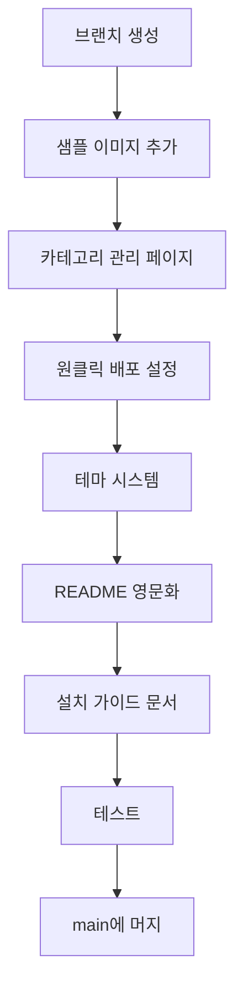

# 수익화를 위한 프로젝트 개선사항

## 현재 상태 요약

| 항목 | 상태 | 비고 |
|------|------|------|
| 페이지 구조 | ✅ 100% | 홈, 제품목록, 상세, 장바구니, 관리자 |
| 컴포넌트 | ✅ 100% | 13개 컴포넌트 구현 |
| 관리자 기능 | ⚠️ 60% | 제품 CRUD만, 카테고리 관리 없음 |
| 브랜딩 설정 | ✅ 90% | 환경변수로 모두 설정 가능 |
| 샘플 데이터 | ⚠️ 70% | 제품 8개, 이미지 없음 |

---

## 시나리오별 필요 개선사항

### 시나리오 A: 크몽 구축 대행

**필수**:
- [x] 제품 관리 페이지 (이미 있음)
- [ ] 카테고리 관리 페이지 ⭐
- [ ] 샘플 이미지 추가 (최소 8개) ⭐
- [ ] 설치 체크리스트 문서

**권장**:
- [ ] 대량 제품 등록 (CSV 업로드)
- [ ] 데이터 내보내기 기능

### 시나리오 B: 호스팅 대행

**필수**:
- [ ] 백업/복구 스크립트
- [ ] 모니터링 대시보드 or 알림
- [ ] 고객별 환경 분리 가이드

**권장**:
- [ ] 멀티테넌트 아키텍처 (선택)
- [ ] 자동 백업 설정 가이드

### 시나리오 C: Gumroad 판매

**필수**:
- [ ] README 영문화 ⭐
- [ ] 원클릭 배포 버튼 (Vercel) ⭐
- [ ] 설치 가이드 (영문 PDF)
- [ ] 데모 사이트 고도화

**권장**:
- [ ] 영상 튜토리얼
- [ ] FAQ 문서
- [ ] 라이선스 파일

### 시나리오 D: 업종 특화

**필수**:
- [ ] 업종별 시드 데이터
- [ ] 업종별 카테고리 프리셋
- [ ] 테마/색상 커스터마이징 ⭐

**권장**:
- [ ] 업종별 특화 기능 (규격 검색 등)
- [ ] 업종별 랜딩페이지

---

## 우선순위별 개선 목록

### 🔴 P0: 즉시 필요 (수익화 전 필수)

| 개선사항 | 시나리오 | 예상 시간 |
|----------|----------|-----------|
| 샘플 이미지 추가 | A, C, D | 2시간 |
| 카테고리 관리 페이지 | A, B | 4시간 |
| 원클릭 배포 버튼 | C | 1시간 |
| README 영문화 | C | 2시간 |

### 🟡 P1: 단기 개선 (1주 내)

| 개선사항 | 시나리오 | 예상 시간 |
|----------|----------|-----------|
| 설치 가이드 문서 | A, C | 3시간 |
| 테마 색상 설정 | D | 4시간 |
| 더 많은 샘플 제품 | A, C | 2시간 |
| 에러 페이지 (404, 500) | 공통 | 1시간 |

### 🟢 P2: 중기 개선 (1개월 내)

| 개선사항 | 시나리오 | 예상 시간 |
|----------|----------|-----------|
| CSV 대량 업로드 | A | 6시간 |
| 백업/복구 스크립트 | B | 4시간 |
| 영상 튜토리얼 | C | 8시간 |
| 업종별 시드 데이터 | D | 6시간 |

---

## 기술적 개선 상세

### 1. 카테고리 관리 페이지

**현재**: Supabase Dashboard에서만 관리 가능
**개선**: `/admin/categories` 페이지 추가

```
필요 기능:
- 카테고리 목록 조회
- 카테고리 추가 (이름, slug)
- 카테고리 수정
- 카테고리 삭제 (제품 있으면 경고)
- 카테고리 순서 변경 (선택)
```

### 2. 원클릭 배포 버튼

**README.md에 추가**:
```markdown
## Deploy

[](https://vercel.com/new/clone?repository-url=https://github.com/username/sojangnim)

1. Click the button above
2. Create a Supabase project
3. Add environment variables
4. Done!
```

### 3. 테마/색상 시스템

**현재**: Tailwind에 하드코딩된 색상
**개선**: CSS 변수 + 환경변수 연동

```css
:root {
  --color-primary: var(--theme-primary, #1a1a1a);
  --color-accent: var(--theme-accent, #3b82f6);
  --color-background: var(--theme-background, #ffffff);
}
```

```typescript
// src/lib/theme.ts
export const themeConfig = {
  primary: process.env.NEXT_PUBLIC_THEME_PRIMARY || '#1a1a1a',
  accent: process.env.NEXT_PUBLIC_THEME_ACCENT || '#3b82f6',
  // ...
}
```

### 4. 샘플 이미지

**방법 1**: Unsplash/Pexels에서 무료 공구 이미지
**방법 2**: AI 생성 이미지 (Midjourney, DALL-E)
**방법 3**: 제조사 제공 이미지 (저작권 주의)

```
필요 이미지:
1. 임팩트 드라이버
2. 앵글 그라인더
3. 레이저 측정기
4. 에어 임팩트 렌치
5. 버니어 캘리퍼스
6. 인버터 용접기
7. 안전화
8. 무선 드릴
```

### 5. 백업/복구 스크립트

```bash
# scripts/backup.sh
#!/bin/bash
DATE=$(date +%Y%m%d_%H%M%S)
BACKUP_DIR="./backups/$DATE"

mkdir -p $BACKUP_DIR

# Supabase 데이터 덤프
supabase db dump -f $BACKUP_DIR/database.sql

# Storage 백업 (선택)
# supabase storage download ...

echo "Backup completed: $BACKUP_DIR"
```

---

## 브랜치 전략

```
main
├── feature/commercialization  ← 수익화 개선 브랜치
│   ├── 카테고리 관리
│   ├── 샘플 이미지
│   ├── 원클릭 배포
│   ├── 테마 시스템
│   └── 문서화
└── (merge 후) main
```

---

## 구현 순서



### Phase 1: 데모 개선 (Day 1)
- 샘플 이미지 8개 추가
- 시드 데이터 보강

### Phase 2: 관리자 기능 (Day 2)
- 카테고리 관리 페이지
- 에러 페이지 추가

### Phase 3: 배포 준비 (Day 3)
- 원클릭 배포 버튼
- README 영문화
- 설치 가이드

### Phase 4: 테마 시스템 (Day 4)
- CSS 변수 기반 테마
- 환경변수 연동

---

## 예상 결과

### 개선 후 가치 상승

| 항목 | 개선 전 | 개선 후 |
|------|---------|---------|
| 크몽 가격 | 80만원 | 100~120만원 |
| Gumroad 가격 | $49 | $79~99 |
| 구축 시간 | 5일 | 3일 |
| 고객 만족도 | 보통 | 높음 |

### 판매 포인트 강화

**개선 전**:
- "견적서 사이트 만들어드립니다"

**개선 후**:
- "공구상 전용 카탈로그 솔루션"
- "관리자 페이지 포함"
- "샘플 데이터 기본 제공"
- "원클릭 배포 가능"
- "영문 문서 제공 (글로벌 판매)"
