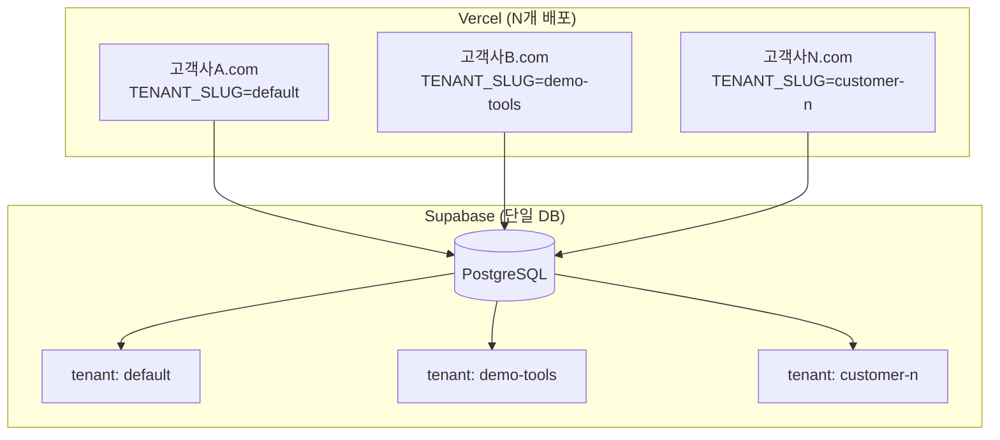

# 멀티테넌트 아키텍처 구현

## 개요

하나의 Supabase DB에서 N개의 고객사(테넌트)를 격리하여 운영하는 SaaS 아키텍처.



## 비용 효율성

| 구분 | 고객별 DB | 멀티테넌트 |
|------|----------|-----------|
| Supabase 비용 | $25 × N개 | $25 (고정) |
| 20개 고객 시 | $500/월 | $25/월 |
| 확장성 | 선형 증가 | 거의 무제한 |

## 데이터베이스 스키마

### tenants 테이블

```sql
CREATE TABLE tenants (
    id UUID PRIMARY KEY DEFAULT gen_random_uuid(),
    slug TEXT UNIQUE NOT NULL,        -- 테넌트 식별자 (환경변수용)
    name TEXT NOT NULL,               -- 업체명
    domain TEXT,                      -- 커스텀 도메인
    theme JSONB,                      -- 브랜딩 설정
    company_info JSONB,               -- 견적서용 회사 정보
    plan TEXT DEFAULT 'free',         -- free/pro/enterprise
    limits JSONB,                     -- 사용량 제한
    is_active BOOLEAN DEFAULT true,
    created_at TIMESTAMPTZ DEFAULT now()
);
```

### 테넌트 격리 컬럼

모든 주요 테이블에 `tenant_id` 컬럼 추가:

```sql
ALTER TABLE categories ADD COLUMN tenant_id UUID NOT NULL REFERENCES tenants(id);
ALTER TABLE products ADD COLUMN tenant_id UUID NOT NULL REFERENCES tenants(id);
ALTER TABLE admin_users ADD COLUMN tenant_id UUID NOT NULL REFERENCES tenants(id);
```

## 서버 구현

### 환경변수

```bash
# .env.local
TENANT_SLUG=default                    # 테넌트 식별자
SUPABASE_SERVICE_ROLE_KEY=eyJ...       # RLS 우회용 (서버 전용)
```

### 테넌트 조회 (캐싱)

```typescript
// src/lib/supabase/server.ts
import { cache } from 'react'

export const getTenant = cache(async (): Promise<Tenant> => {
  const tenantSlug = process.env.TENANT_SLUG || 'default'
  const serviceClient = getServiceClient()

  const { data, error } = await serviceClient
    .from('tenants')
    .select('*')
    .eq('slug', tenantSlug)
    .eq('is_active', true)
    .single()

  if (error || !data) {
    throw new Error(`Invalid tenant: ${tenantSlug}`)
  }

  return data as Tenant
})
```

### 테넌트 기반 쿼리

```typescript
// 모든 쿼리에 tenant_id 필터 적용
export async function getServerSupabase(): Promise<TenantSupabase> {
  const tenant = await getTenant()
  const serviceClient = getServiceClient()

  return {
    tenant,
    from: (table: string) => serviceClient.from(table),
    raw: serviceClient
  }
}

// 사용 예시
const { tenant, raw: supabase } = await getServerSupabase()
const { data } = await supabase
  .from('products')
  .select('*')
  .eq('tenant_id', tenant.id)  // 필수!
```

## 데이터 격리 검증

### 테스트 결과

| 테넌트 | 제품 수 | 카테고리 수 |
|--------|--------|------------|
| default | 17 | 7 |
| demo-tools | 2 | 0 |

### 격리 확인 쿼리

```sql
SELECT
  t.slug as tenant,
  COUNT(p.id) as product_count
FROM tenants t
LEFT JOIN products p ON p.tenant_id = t.id
GROUP BY t.slug;
```

## 신규 고객 온보딩

### 1. 테넌트 생성 (DB)

```sql
INSERT INTO tenants (slug, name, plan, theme, company_info) VALUES (
  'new-customer',
  '새로운 공구상',
  'pro',
  '{
    "brandName": "새로운 공구상",
    "logoImage": "/images/logo.png",
    "colors": {"primary": "#1a1a1a", "accent": "#3b82f6"}
  }'::jsonb,
  '{
    "businessNumber": "123-45-67890",
    "representative": "홍길동",
    "address": "서울시 강남구",
    "phone": "02-1234-5678"
  }'::jsonb
);
```

### 2. 관리자 계정 생성

```sql
-- admin_users 테이블에 추가
INSERT INTO admin_users (email, role, tenant_id) VALUES (
  'admin@new-customer.com',
  'admin',
  (SELECT id FROM tenants WHERE slug = 'new-customer')
);
```

### 3. Vercel 배포

```bash
# 같은 Git 저장소에서 새 프로젝트 생성
# 환경변수만 다르게 설정

TENANT_SLUG=new-customer
NEXT_PUBLIC_SUPABASE_URL=https://xxx.supabase.co
NEXT_PUBLIC_SUPABASE_ANON_KEY=eyJ...
SUPABASE_SERVICE_ROLE_KEY=eyJ...
```

### 4. 커스텀 도메인 연결

Vercel에서 고객사 도메인 연결 (예: `catalog.new-customer.com`)

## 플랜별 제한

### limits JSONB 구조

```typescript
interface TenantLimits {
  maxProducts: number      // 최대 제품 수
  maxCategories: number    // 최대 카테고리 수
  maxQuotationsPerMonth: number  // 월 견적서 발행 수
}
```

### 플랜 기본값

| 플랜 | 제품 | 카테고리 | 월 견적서 |
|------|-----|---------|----------|
| free | 50 | 10 | 100 |
| pro | 500 | 50 | 무제한 |
| enterprise | 무제한 | 무제한 | 무제한 |

### 제한 확인 함수

```typescript
export async function checkTenantLimits() {
  const tenant = await getTenant()
  const { raw } = await getServerSupabase()

  const { count: productCount } = await raw
    .from('products')
    .select('*', { count: 'exact', head: true })
    .eq('tenant_id', tenant.id)

  return {
    products: {
      current: productCount || 0,
      max: tenant.limits.maxProducts,
      canAdd: (productCount || 0) < tenant.limits.maxProducts
    },
    plan: tenant.plan
  }
}
```

## 보안 고려사항

### Service Role Key

- **절대 클라이언트에 노출 금지**
- `SUPABASE_SERVICE_ROLE_KEY`는 서버 전용
- RLS를 우회하므로 모든 데이터 접근 가능

### 테넌트 ID 검증

```typescript
// 관리자 액션에서 테넌트 검증
export async function requireAdmin() {
  const user = await getUser()
  if (!user) redirect('/admin/login')

  const tenant = await getTenant()

  // 해당 테넌트의 관리자인지 확인
  const { data: adminData } = await supabase
    .from('admin_users')
    .select('*')
    .eq('email', user.email)
    .eq('tenant_id', tenant.id)  // 테넌트 격리!
    .single()

  if (!adminData) redirect('/admin/login')
  return { user, role: adminData.role, tenant }
}
```

## 마이그레이션 파일

### 위치

```
supabase/migrations/
├── 20251130000000_add_multi_tenant.sql      # 스키마 변경
└── 20251130000001_migrate_existing_data.sql  # 기존 데이터 마이그레이션
```

### 적용 방법

```bash
# 로컬
supabase db reset

# 프로덕션
supabase db push
```

## 다음 단계

1. **Supabase Cloud 설정**: 프로덕션 DB 생성
2. **첫 고객 배포**: Vercel에 첫 번째 테넌트 배포
3. **모니터링 구축**: 테넌트별 사용량 대시보드
4. **결제 연동**: Stripe 등 결제 시스템 연동
