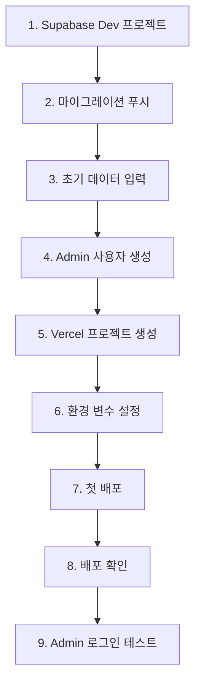

# 🚀 첫 배포 가이드

처음으로 소장님 프로젝트를 실제 인터넷에 배포하는 전체 과정을 단계별로 안내합니다.

## 📌 시작하기 전에

### 준비물 체크리스트

- [ ] GitHub 계정
- [ ] Supabase 계정
- [ ] Vercel 계정
- [ ] 로컬 프로젝트 빌드 성공 (`npm run build`)
- [ ] Git 저장소 준비

**예상 소요 시간**: 30-40분

## 🗺️ 배포 로드맵



## 🗄️ Phase 1: Supabase 설정

### 1-1. Supabase Dev 프로젝트 생성

**목적**: 스테이징/개발용 데이터베이스

1. **Supabase 로그인**
   - https://supabase.com/dashboard

2. **New Project** 클릭

3. **프로젝트 정보 입력**
   - Name: `sojangnim-dev`
   - Database Password: 강력한 비밀번호 (저장!)
   - Region: `Northeast Asia (Seoul)`
   - Pricing Plan: **Free**

4. **Create new project** 클릭 (1-2분 대기)

**✅ 프로젝트 생성 완료**

### 1-2. API Keys 확보

**Settings** → **API** 메뉴

**복사할 값** (메모장에 저장):
```
Project URL: https://abcdefgh.supabase.co
anon public: eyJhbGciOiJIUzI1NiIsInR5cCI6IkpXVCJ9...
```

**⚠️ 중요**: 이 값들을 안전하게 보관하세요!

### 1-3. 로컬 프로젝트 연결

```bash
# 프로젝트 디렉토리로 이동
cd /path/to/sojangnim

# Supabase 로그인 (최초 1회)
supabase login

# 클라우드 프로젝트와 연결
supabase link --project-ref abcdefgh
# abcdefgh를 실제 Reference ID로 변경

# Database Password 입력
# (프로젝트 생성 시 설정한 비밀번호)
```

**출력**:
```
Linked sojangnim to project abcdefgh
```

### 1-4. 마이그레이션 푸시

```bash
# 로컬 마이그레이션을 클라우드로 푸시
supabase db push
```

**실행 과정**:
```
Applying migration 20251024000000_initial_schema.sql...
Applying migration 20250125000000_create_admin_users.sql...
Applying migration 20251024000001_add_admin_rls_policies.sql...

Migration complete!
```

**✅ 데이터베이스 스키마 적용 완료**

### 1-5. 초기 데이터 입력

**Supabase Dashboard** → **SQL Editor**

**카테고리 데이터 삽입**:
```sql
INSERT INTO categories (name, slug) VALUES
('전동공구', 'power-tools'),
('수공구', 'hand-tools'),
('측정공구', 'measuring-tools'),
('안전용품', 'safety-equipment'),
('작업대', 'workbenches');
```

**실행** (Run) 클릭

**Table Editor**에서 확인:
- categories 테이블에 5개 행

**제품 데이터 입력** (선택사항):

```sql
INSERT INTO products (name, description, price, category_id, badge, specs) VALUES
(
  '무선 드릴 세트',
  '20V 리튬이온 배터리 포함, 고토크 무선 드릴',
  180000,
  (SELECT id FROM categories WHERE slug = 'power-tools'),
  '신제품',
  '{"전압": "20V", "토크": "180Nm", "배터리": "2.0Ah"}'::jsonb
);
```

> 💡 초기에는 Admin 페이지에서 제품을 추가할 수 있으므로 선택사항입니다.

### 1-6. Admin 사용자 생성

**SQL Editor**에서 실행:

```sql
-- Admin 화이트리스트에 추가
INSERT INTO admin_users (email) VALUES
('your-email@example.com');  -- 실제 이메일로 변경
```

**Authentication** → **Users** → **Add user**:
- Email: `your-email@example.com` (위와 동일)
- Password: 강력한 비밀번호
- **Auto Confirm User** 체크
- **Create user**

**✅ Admin 사용자 생성 완료**

## ☁️ Phase 2: Vercel 설정

### 2-1. GitHub에 코드 푸시

```bash
# 현재 상태 확인
git status

# 변경사항 커밋
git add .
git commit -m "feat: 첫 배포 준비"

# GitHub에 푸시
git push origin main
```

**GitHub 저장소 확인**:
- https://github.com/username/sojangnim
- 최신 커밋이 반영되었는지 확인

### 2-2. Vercel 프로젝트 생성

1. **Vercel Dashboard** 접속
   - https://vercel.com/dashboard

2. **Add New... → Project** 클릭

3. **Import Git Repository**
   - `sojangnim` 저장소 찾기
   - **Import** 클릭

### 2-3. 프로젝트 설정

**Configure Project** 화면:

- **Project Name**: `sojangnim` (그대로)
- **Framework Preset**: Next.js (자동 감지)
- **Root Directory**: `./` (그대로)
- **Build Command**: `next build` (자동)

**Environment Variables** 섹션:

**Add** 버튼 클릭하여 추가:

#### 변수 1: NEXT_PUBLIC_SUPABASE_URL
- **Name**: `NEXT_PUBLIC_SUPABASE_URL`
- **Value**: `https://abcdefgh.supabase.co` (1-2단계에서 복사한 URL)
- **Environment**: `Production`, `Preview` 모두 체크
- **Add**

#### 변수 2: NEXT_PUBLIC_SUPABASE_ANON_KEY
- **Name**: `NEXT_PUBLIC_SUPABASE_ANON_KEY`
- **Value**: `eyJhbGciOiJIUzI1NiIsInR5cCI6IkpXVCJ9...` (전체 복사!)
- **Environment**: `Production`, `Preview` 모두 체크
- **Add**

### 2-4. 첫 배포

**Deploy** 버튼 클릭!

**빌드 진행**:
```
Building...
  ├─ Cloning repository
  ├─ Installing dependencies
  ├─ Building application
  └─ Deploying
```

**1-2분 대기...**

**배포 성공**:
```
✓ Production: https://sojangnim.vercel.app
```

**🎉 축하합니다! 첫 배포 완료!**

## ✅ Phase 3: 배포 확인

### 3-1. Production 사이트 접속

**배포 URL**: `https://sojangnim.vercel.app`

또는 Vercel Dashboard에서 **Visit** 클릭

### 3-2. 기능 테스트

#### 홈페이지 확인
- [ ] "소장님 제품 카탈로그" 제목 표시
- [ ] 추천 제품 섹션 (없으면 비어있음)
- [ ] 최신 제품 섹션 (없으면 비어있음)
- [ ] Header, Footer 정상 표시

#### 제품 목록 확인
- URL: `/products`
- [ ] 좌측 카테고리 사이드바 (5개 카테고리)
- [ ] 제품 카드 표시 (없으면 "제품이 없습니다")
- [ ] 카테고리 클릭 시 필터링 작동

#### 장바구니 확인
- URL: `/cart`
- [ ] 장바구니 페이지 로드
- [ ] "장바구니가 비어있습니다" 표시

**✅ 모든 페이지 정상 작동!**

### 3-3. Supabase 연결 확인

**제품이 표시되지 않는다면**:

**브라우저 개발자 도구** (F12) → **Console** 탭

**에러 확인**:
```
Error: NEXT_PUBLIC_SUPABASE_URL is not defined
```

→ 환경 변수 재확인 필요

**네트워크 에러**:
```
Failed to fetch
```

→ Supabase URL이 잘못되었거나 RLS 정책 문제

**해결 방법**:
1. Vercel Dashboard → Settings → Environment Variables 확인
2. 값이 정확한지 확인
3. **Redeploy** (재배포)

## 🔐 Phase 4: Admin 기능 테스트

### 4-1. Admin 로그인

**URL**: `https://sojangnim.vercel.app/admin/login`

**로그인 정보**:
- Email: `your-email@example.com` (1-6단계에서 생성한 이메일)
- Password: Admin 사용자 비밀번호

**로그인** 클릭

**✅ 로그인 성공** → Admin 대시보드로 이동

### 4-2. 제품 추가 테스트

**Admin Products** 페이지

**제품 추가** 버튼 클릭 (`/admin/products/new`)

**제품 정보 입력**:
- 제품명: `테스트 제품`
- 설명: `첫 배포 테스트용 제품`
- 가격: `99000`
- 카테고리: `전동공구`
- 배지: `신제품`

**저장**

**✅ 제품 추가 성공!**

### 4-3. 공개 페이지에서 확인

**로그아웃** 후 `/products` 페이지 접속

- [ ] 방금 추가한 "테스트 제품" 표시
- [ ] 가격 99,000원
- [ ] "신제품" 배지

**🎉 Admin 시스템 정상 작동!**

## 📊 Phase 5: Preview 배포 테스트 (선택사항)

### 5-1. Feature 브랜치 생성

```bash
# 새 브랜치 생성
git checkout -b feature/test-preview

# 간단한 변경
echo "// Preview 테스트" >> src/app/page.tsx

# 커밋
git add .
git commit -m "test: Preview 배포 테스트"

# GitHub에 푸시
git push origin feature/test-preview
```

### 5-2. Pull Request 생성

**GitHub** → **Pull requests** → **New pull request**

- base: `main` ← compare: `feature/test-preview`
- **Create pull request**

### 5-3. Vercel Preview 확인

**PR 페이지에 Vercel 봇 코멘트**:
```
✅ Deploy Preview ready!
https://sojangnim-git-feature-test-preview-username.vercel.app
```

**Preview URL 클릭**

- [ ] Preview 사이트 정상 로드
- [ ] Production과 동일한 기능

**✅ Preview 배포 작동 확인!**

**PR Merge** (또는 Close):
```bash
# 테스트 완료 후 브랜치 삭제
git checkout main
git branch -D feature/test-preview
git push origin --delete feature/test-preview
```

## 🎯 배포 후 체크리스트

### 필수 확인 사항

- [ ] Production URL 접속 가능
- [ ] 홈페이지 정상 로드
- [ ] 제품 목록 표시 (Supabase 연결)
- [ ] 카테고리 필터링 작동
- [ ] 장바구니 기능 정상
- [ ] Admin 로그인 성공
- [ ] Admin 제품 추가 성공
- [ ] 공개 페이지에 추가한 제품 표시

### 성능 확인

- [ ] 페이지 로딩 속도 (< 3초)
- [ ] 이미지 로딩 (또는 fallback 이모지)
- [ ] 모바일 반응형 (크롬 개발자 도구로 확인)

### 보안 확인

- [ ] HTTPS 자동 적용 (🔒 자물쇠 아이콘)
- [ ] 환경 변수가 코드에 하드코딩되지 않음
- [ ] `.env.local`이 Git에 커밋되지 않음

## 🚨 문제 해결

### "빌드 실패" 에러

**Vercel 빌드 로그 확인**:
- Vercel Dashboard → Deployments → 실패한 배포 클릭
- **Build Logs** 확인

**흔한 원인**:
1. TypeScript 타입 에러
2. 환경 변수 누락
3. 의존성 버전 충돌

**해결**:
```bash
# 로컬에서 빌드 테스트
npm run build

# 에러 수정 후 재푸시
git add .
git commit -m "fix: 빌드 에러 수정"
git push origin main
```

### "제품이 표시되지 않음"

**원인**: Supabase 연결 또는 데이터 문제

**확인**:
1. Supabase Dashboard → Table Editor → products 테이블에 데이터 있는가?
2. Vercel Environment Variables에 올바른 URL/Key가 있는가?
3. RLS 정책이 활성화되어 있는가?

**해결**:
```bash
# RLS 정책 확인 (Supabase SQL Editor)
SELECT * FROM pg_policies WHERE tablename = 'products';
```

### "Admin 로그인 실패"

**원인**: Admin 사용자 미생성 또는 비밀번호 오류

**확인**:
1. Supabase → Authentication → Users에 사용자 있는가?
2. admin_users 테이블에 이메일 있는가?

```sql
-- admin_users 확인
SELECT * FROM admin_users;

-- 없다면 추가
INSERT INTO admin_users (email) VALUES ('your-email@example.com');
```

## 📚 다음 단계

### 운영 환경 준비

배포가 성공했다면 다음 단계를 진행하세요:

1. **Supabase Production 프로젝트 생성**
   - `sojangnim-prod` 프로젝트 생성
   - 마이그레이션 푸시
   - 실제 데이터 입력

2. **Vercel Production 환경 변수 변경**
   - Production 환경만 운영 Supabase 사용
   - Preview는 개발 Supabase 유지

3. **커스텀 도메인 연결**
   - `sojangnim.com` 도메인 구매
   - Vercel에서 도메인 연결

### 고급 주제

- [지속적 배포](./continuous-deployment.md) - CI/CD 파이프라인
- [모니터링](../operations/monitoring.md) - 성능 및 에러 추적
- [롤백 전략](./rollback.md) - 배포 실패 시 대응

## 🎉 축하합니다!

첫 배포를 성공적으로 완료했습니다! 이제 실제 사용자가 접속할 수 있는 서비스가 운영되고 있습니다.

**배포 URL**: `https://sojangnim.vercel.app`

**공유하기**:
- 팀원에게 URL 공유
- 테스트 사용자 초대
- 피드백 수집

---

**다음 읽을 문서**: [Admin 운영 가이드](../operations/admin-operations.md)
