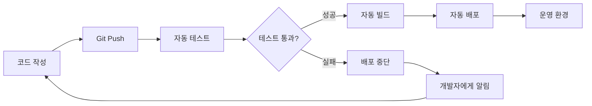
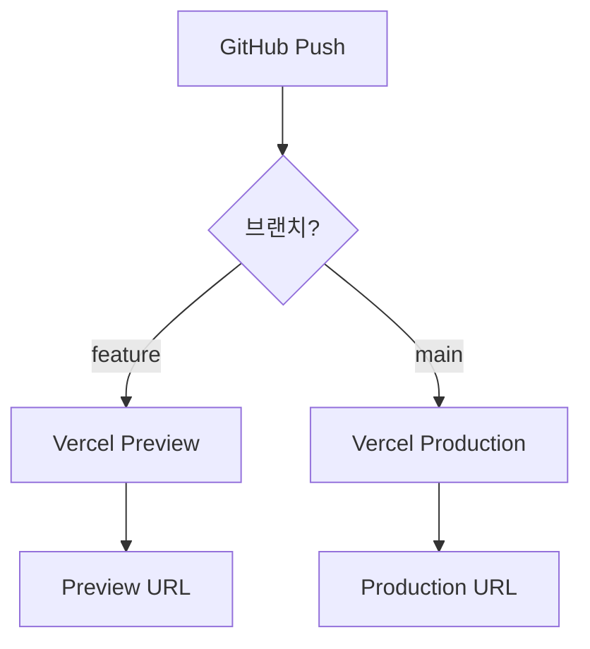

# 🔄 지속적 배포 (CI/CD) 가이드

GitHub Actions를 활용한 자동화된 배포 파이프라인 구축 및 운영 방법을 안내합니다.

## 📌 CI/CD란?

### Continuous Integration / Continuous Deployment



### CI/CD의 이점

**CI (Continuous Integration)**:
- 코드 품질 자동 검증
- 조기 버그 발견
- 통합 문제 최소화

**CD (Continuous Deployment)**:
- 빠른 배포 주기
- 수동 작업 감소
- 일관된 배포 프로세스

## 🚀 현재 배포 프로세스

### Vercel 기본 배포

**소장님 프로젝트는 이미 자동 배포가 설정되어 있습니다**:



**작동 방식**:
1. Git Push → GitHub
2. Vercel이 자동 감지
3. 빌드 실행 (`npm run build`)
4. 배포

**장점**:
- 설정 불필요 (Vercel + GitHub 연동 시 자동)
- 모든 PR에 Preview URL 생성
- main 브랜치는 자동으로 Production 배포

## 🛠️ GitHub Actions 추가

### 왜 GitHub Actions가 필요한가?

**Vercel 자동 배포만으로는 부족한 부분**:
- 테스트 실행 여부 확인 불가
- 린트 검증 자동화 없음
- 배포 전 데이터베이스 마이그레이션 확인 불가

**GitHub Actions 추가 시**:
- PR 생성 시 자동 테스트
- 테스트 실패 시 병합 차단
- 빌드 실패 조기 발견

### CI Workflow 생성

#### 1단계: Workflow 파일 생성

**`.github/workflows/ci.yml` 생성**:
```yaml
name: CI

on:
  pull_request:
    branches: [main]
  push:
    branches: [main]

jobs:
  lint:
    name: Lint
    runs-on: ubuntu-latest

    steps:
      - name: Checkout code
        uses: actions/checkout@v4

      - name: Setup Node.js
        uses: actions/setup-node@v4
        with:
          node-version: '20'
          cache: 'npm'

      - name: Install dependencies
        run: npm ci

      - name: Run ESLint
        run: npm run lint

  type-check:
    name: Type Check
    runs-on: ubuntu-latest

    steps:
      - name: Checkout code
        uses: actions/checkout@v4

      - name: Setup Node.js
        uses: actions/setup-node@v4
        with:
          node-version: '20'
          cache: 'npm'

      - name: Install dependencies
        run: npm ci

      - name: Type check
        run: npx tsc --noEmit

  build:
    name: Build
    runs-on: ubuntu-latest

    steps:
      - name: Checkout code
        uses: actions/checkout@v4

      - name: Setup Node.js
        uses: actions/setup-node@v4
        with:
          node-version: '20'
          cache: 'npm'

      - name: Install dependencies
        run: npm ci

      - name: Build application
        run: npm run build
        env:
          NEXT_PUBLIC_SUPABASE_URL: ${{ secrets.NEXT_PUBLIC_SUPABASE_URL }}
          NEXT_PUBLIC_SUPABASE_ANON_KEY: ${{ secrets.NEXT_PUBLIC_SUPABASE_ANON_KEY }}

  test:
    name: E2E Tests
    runs-on: ubuntu-latest

    steps:
      - name: Checkout code
        uses: actions/checkout@v4

      - name: Setup Node.js
        uses: actions/setup-node@v4
        with:
          node-version: '20'
          cache: 'npm'

      - name: Install dependencies
        run: npm ci

      - name: Install Playwright
        run: npx playwright install --with-deps

      - name: Run E2E tests
        run: npm run test:e2e
        env:
          NEXT_PUBLIC_SUPABASE_URL: ${{ secrets.NEXT_PUBLIC_SUPABASE_URL }}
          NEXT_PUBLIC_SUPABASE_ANON_KEY: ${{ secrets.NEXT_PUBLIC_SUPABASE_ANON_KEY }}

      - name: Upload test results
        if: always()
        uses: actions/upload-artifact@v4
        with:
          name: playwright-report
          path: playwright-report/
          retention-days: 30
```

#### 2단계: GitHub Secrets 설정

**GitHub 저장소** → **Settings** → **Secrets and variables** → **Actions**

**New repository secret** 클릭:

1. **NEXT_PUBLIC_SUPABASE_URL**
   - Value: `https://xxx.supabase.co`

2. **NEXT_PUBLIC_SUPABASE_ANON_KEY**
   - Value: `eyJhbGciOiJIUzI1NiIsInR5cCI6IkpXVCJ9...`

**⚠️ 주의**: 개발 Supabase 프로젝트 키 사용 (운영 키 아님!)

#### 3단계: Workflow 적용

```bash
# Workflow 파일 커밋
git add .github/workflows/ci.yml
git commit -m "ci: GitHub Actions CI workflow 추가"
git push origin main
```

#### 4단계: 확인

**GitHub 저장소** → **Actions** 탭

- Workflow 실행 확인
- 각 Job의 상태 확인 (✅ 또는 ❌)

### PR 보호 규칙 설정

**GitHub 저장소** → **Settings** → **Branches**

**Branch protection rules** → **Add rule**:

**설정**:
- Branch name pattern: `main`
- ✅ **Require a pull request before merging**
- ✅ **Require status checks to pass before merging**
  - Required checks:
    - `lint`
    - `type-check`
    - `build`
    - `test`
- ✅ **Require branches to be up to date before merging**

**효과**:
- main 브랜치 직접 푸시 불가
- CI 테스트 통과해야만 병합 가능

## 🔄 배포 Workflow

### 자동 배포 (Vercel 기본)

**Vercel이 자동으로 처리**:
- main 브랜치 푸시 → Production 배포
- PR 생성 → Preview 배포

**추가 설정 불필요**

### 배포 전 마이그레이션 확인 (선택사항)

**시나리오**: 마이그레이션이 있을 때만 배포

**`.github/workflows/deploy-check.yml`**:
```yaml
name: Deploy Check

on:
  pull_request:
    branches: [main]

jobs:
  check-migrations:
    name: Check Migrations
    runs-on: ubuntu-latest

    steps:
      - name: Checkout code
        uses: actions/checkout@v4
        with:
          fetch-depth: 0  # 전체 히스토리 가져오기

      - name: Check for migration changes
        id: migration-check
        run: |
          # 마이그레이션 파일 변경 확인
          if git diff --name-only origin/main...HEAD | grep -q "^supabase/migrations/"; then
            echo "has_migrations=true" >> $GITHUB_OUTPUT
            echo "⚠️ 마이그레이션 파일이 변경되었습니다!"
          else
            echo "has_migrations=false" >> $GITHUB_OUTPUT
            echo "✅ 마이그레이션 변경 없음"
          fi

      - name: Comment on PR
        if: steps.migration-check.outputs.has_migrations == 'true'
        uses: actions/github-script@v7
        with:
          script: |
            github.rest.issues.createComment({
              issue_number: context.issue.number,
              owner: context.repo.owner,
              repo: context.repo.repo,
              body: '⚠️ **마이그레이션 파일이 변경되었습니다!**\n\n배포 전에 `supabase db push`를 실행하세요.\n\n```bash\nsupabase link --project-ref <your-project-ref>\nsupabase db push\n```'
            })
```

**효과**:
- 마이그레이션 변경 시 PR에 자동 코멘트
- 배포 전 데이터베이스 업데이트 리마인더

## 🚦 배포 전략

### Feature Flag 배포

**시나리오**: 새 기능을 숨긴 채로 배포

**환경 변수로 기능 토글**:
```typescript
// src/lib/features.ts
export const FEATURES = {
  newProductFilter: process.env.NEXT_PUBLIC_ENABLE_NEW_FILTER === 'true',
  advancedSearch: process.env.NEXT_PUBLIC_ENABLE_ADVANCED_SEARCH === 'true',
}

// 사용 예시
import { FEATURES } from '@/lib/features'

export default function ProductsPage() {
  return (
    <>
      {FEATURES.newProductFilter && <NewFilterComponent />}
      {!FEATURES.newProductFilter && <OldFilterComponent />}
    </>
  )
}
```

**배포 프로세스**:
1. 기능 개발 (Feature Flag로 숨김)
2. main 병합 및 배포 (기능은 비활성)
3. Vercel 환경 변수로 기능 활성화
4. 문제 시 환경 변수만 수정하여 롤백

### Canary 배포

**Vercel Pro 플랜 기능** (월 $20):
- 트래픽의 일부만 새 버전으로
- 점진적 롤아웃

**예시**:
```
10%의 트래픽 → 새 버전
90%의 트래픽 → 기존 버전

→ 문제 없으면 100%로 증가
```

### Blue-Green 배포

**2개의 환경 유지**:
- Blue: 현재 운영 중
- Green: 새 버전 배포

**전환 프로세스**:
1. Green 환경에 새 버전 배포
2. 테스트 완료
3. DNS/라우팅을 Green으로 전환
4. 문제 시 Blue로 즉시 복구

**Vercel에서 구현**:
- 2개의 Vercel 프로젝트 사용
- 도메인 전환으로 Blue-Green 전환

## 📊 배포 모니터링

### GitHub Actions 결과 확인

**GitHub 저장소** → **Actions** 탭

**각 Workflow 클릭**:
- Lint 결과
- Type Check 결과
- Build 결과
- Test 결과

**실패 시**:
- 로그 확인
- 에러 메시지 읽기
- 로컬에서 재현 및 수정

### Vercel 배포 알림

**Vercel Dashboard** → **Settings** → **Notifications**

**권장 설정**:
```
✅ Deployment Failed → Email
✅ Deployment Comment on PR → GitHub (자동)
❌ Deployment Ready → Off (너무 많은 알림)
```

### Slack 통합 (선택사항)

**Slack Workspace** → **Apps** → **Vercel** 설치

**연동 후**:
- 배포 시작/완료 알림
- 배포 실패 즉시 알림
- Preview URL 자동 공유

**설정**:
1. Vercel Dashboard → **Settings** → **Integrations**
2. **Slack** 찾기 → **Add**
3. Slack Workspace 승인
4. 알림 받을 채널 선택

## 🔧 고급 Workflow

### 자동 버전 태그

**PR 병합 시 자동으로 Git 태그 생성**:

**`.github/workflows/version-tag.yml`**:
```yaml
name: Version Tag

on:
  push:
    branches: [main]

jobs:
  tag:
    name: Create Version Tag
    runs-on: ubuntu-latest

    steps:
      - name: Checkout code
        uses: actions/checkout@v4

      - name: Get version from package.json
        id: package-version
        run: |
          VERSION=$(node -p "require('./package.json').version")
          echo "version=$VERSION" >> $GITHUB_OUTPUT

      - name: Create tag
        run: |
          git config user.name "GitHub Actions"
          git config user.email "actions@github.com"
          git tag -a "v${{ steps.package-version.outputs.version }}" -m "Release v${{ steps.package-version.outputs.version }}"
          git push origin "v${{ steps.package-version.outputs.version }}"
```

### 성능 측정

**Lighthouse CI 통합**:

**`.github/workflows/lighthouse.yml`**:
```yaml
name: Lighthouse CI

on:
  pull_request:
    branches: [main]

jobs:
  lighthouse:
    name: Lighthouse
    runs-on: ubuntu-latest

    steps:
      - name: Checkout code
        uses: actions/checkout@v4

      - name: Run Lighthouse CI
        uses: treosh/lighthouse-ci-action@v10
        with:
          urls: |
            https://preview-${{ github.event.pull_request.number }}.vercel.app
          uploadArtifacts: true
```

**효과**:
- PR마다 성능 점수 측정
- 성능 저하 조기 발견

### 의존성 업데이트 자동화

**Dependabot 설정**:

**`.github/dependabot.yml`**:
```yaml
version: 2
updates:
  - package-ecosystem: "npm"
    directory: "/"
    schedule:
      interval: "weekly"
    open-pull-requests-limit: 10
```

**효과**:
- 매주 의존성 업데이트 PR 자동 생성
- 보안 취약점 자동 수정

## 📋 CI/CD 체크리스트

### 초기 설정

- [ ] GitHub Actions Workflow 생성 (`.github/workflows/ci.yml`)
- [ ] GitHub Secrets 추가 (Supabase URL, Key)
- [ ] Branch protection rules 설정 (main 브랜치 보호)
- [ ] Vercel 배포 알림 설정
- [ ] (선택) Slack 통합

### PR 생성 시

- [ ] CI Workflow 자동 실행 확인
- [ ] Lint 통과
- [ ] Type Check 통과
- [ ] Build 성공
- [ ] E2E Test 통과
- [ ] Vercel Preview 배포 성공

### main 병합 시

- [ ] CI 모든 Job 통과
- [ ] Vercel Production 배포 자동 시작
- [ ] 배포 완료 확인 (Production URL 접속)
- [ ] 기능 정상 작동 확인

### 배포 후

- [ ] Vercel Analytics 확인 (에러 급증 여부)
- [ ] Supabase Logs 확인 (DB 에러)
- [ ] 사용자 피드백 모니터링

## 🚨 문제 해결

### CI Workflow 실패

**증상**: GitHub Actions에서 빌드 실패

**확인**:
1. Actions 탭에서 실패한 Job 클릭
2. 에러 로그 확인

**흔한 원인**:
```bash
# 린트 에러
Run npm run lint
  ✖ 3 problems (3 errors, 0 warnings)

# TypeScript 에러
Type error: Property 'id' does not exist on type 'Product'

# 테스트 실패
expect(received).toBe(expected)
```

**해결**:
```bash
# 로컬에서 동일한 명령 실행
npm run lint
npx tsc --noEmit
npm run test:e2e

# 에러 수정 후 푸시
git add .
git commit -m "fix: CI 에러 수정"
git push
```

### 환경 변수 누락

**증상**: Build Job에서 환경 변수 undefined

**확인**:
- GitHub Secrets에 변수 존재하는가?
- Workflow 파일에 `env:` 블록 있는가?

**해결**:
```yaml
# Workflow 파일에 env 추가
- name: Build application
  run: npm run build
  env:
    NEXT_PUBLIC_SUPABASE_URL: ${{ secrets.NEXT_PUBLIC_SUPABASE_URL }}
    NEXT_PUBLIC_SUPABASE_ANON_KEY: ${{ secrets.NEXT_PUBLIC_SUPABASE_ANON_KEY }}
```

### Vercel 배포 실패

**증상**: Vercel 배포가 Failed 상태

**확인**:
1. Vercel Dashboard → Deployments → 실패한 배포 클릭
2. Logs 확인

**해결**:
- 로컬에서 `npm run build` 성공 확인
- 환경 변수 확인
- 재배포 (Redeploy)

## 📚 다음 단계

- [롤백 전략](./rollback.md) - 배포 실패 시 복구
- [모니터링](../operations/monitoring.md) - 배포 후 모니터링
- [환경 변수 관리](./environment-variables.md) - 안전한 변수 관리

---

**CI/CD 관련 질문**이 있으시면 [트러블슈팅 문서](../development/troubleshooting.md)를 참고하세요!
