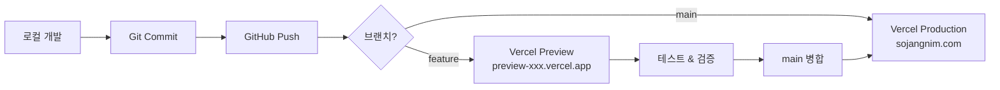
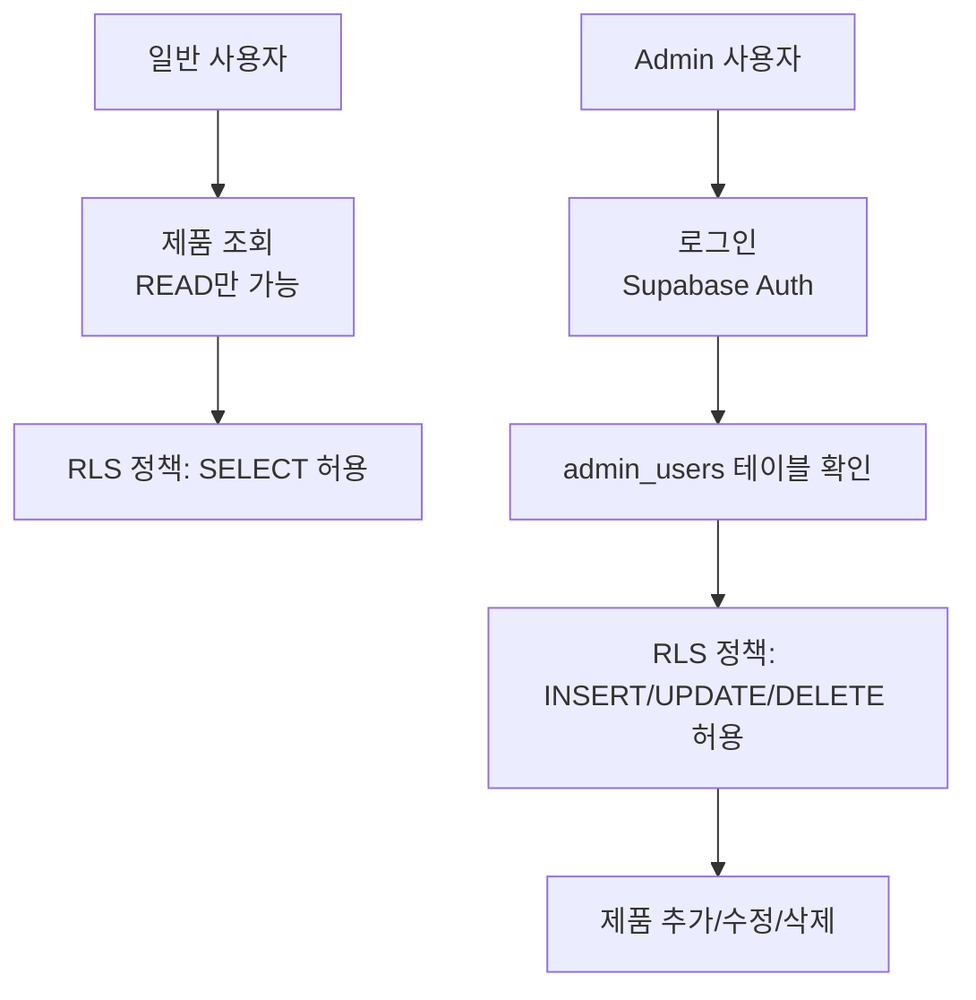

# 🚀 배포 개요

Vercel과 Supabase Cloud를 사용한 배포 전략의 전체 그림을 이해합니다.

## 📌 배포란?

**배포(Deployment)**는 로컬에서 개발한 애플리케이션을 실제 사용자가 접속할 수 있는 인터넷에 공개하는 과정입니다.

### 배포 전후 비교

**배포 전**:
- 접속: `http://localhost:3000` (개발자 컴퓨터에서만)
- 데이터베이스: Docker Supabase (로컬)
- 사용자: 개발자 본인

**배포 후**:
- 접속: `https://sojangnim.com` (전세계 누구나)
- 데이터베이스: Supabase Cloud (클라우드)
- 사용자: 실제 고객

## 🏗️ SaaS 아키텍처

이 프로젝트는 **서버리스 SaaS** 구조로 배포됩니다.

```mermaid
graph TB
    User[사용자<br/>브라우저] --> DNS[도메인<br/>sojangnim.com]
    DNS --> Vercel[Vercel Edge Network<br/>전세계 CDN]
    Vercel --> NextJS[Next.js App<br/>서버리스 함수]
    NextJS --> Supabase[Supabase Cloud<br/>PostgreSQL]

    Admin[관리자] --> AdminPage[/admin 페이지]
    AdminPage --> Auth[Supabase Auth]
    Auth --> Supabase

    Developer[개발자] --> GitHub[GitHub Repository]
    GitHub --> VercelDeploy[Vercel 자동 배포]
    VercelDeploy --> Vercel
```

### 사용하는 SaaS

| 서비스 | 역할 | 무료 티어 |
|--------|------|----------|
| **Vercel** | Next.js 앱 호스팅 | ✅ 100GB 대역폭/월 |
| **Supabase** | PostgreSQL 데이터베이스 | ✅ 500MB DB |
| **GitHub** | 코드 저장소 | ✅ 무제한 공개 저장소 |

## 🔄 배포 흐름

### 자동 배포 파이프라인



### 단계별 설명

#### 1️⃣ 로컬 개발
```bash
# 코드 작성
git add .
git commit -m "feat: 새 기능 추가"
```

#### 2️⃣ GitHub Push
```bash
# feature 브랜치 푸시
git push origin feature/new-feature
```

#### 3️⃣ 자동 Preview 배포
- **Vercel이 자동으로 감지**
- Preview URL 생성: `https://preview-abc123.vercel.app`
- GitHub PR에 코멘트로 URL 제공

#### 4️⃣ 검증 & 병합
- Preview URL에서 테스트
- 문제 없으면 main 브랜치로 병합

#### 5️⃣ Production 배포
- main 브랜치 병합 시 **자동으로 Production 배포**
- 실제 도메인 업데이트: `https://sojangnim.com`

## 🌐 Vercel이란?

**Vercel**은 Next.js를 만든 회사가 제공하는 서버리스 호스팅 플랫폼입니다.

### 주요 특징

- **자동 배포**: Git Push 시 자동 배포
- **글로벌 CDN**: Edge Network로 빠른 속도
- **서버리스**: 서버 관리 불필요
- **무료 SSL**: HTTPS 자동 적용
- **Preview URL**: PR마다 미리보기 URL

### Vercel의 역할

```
사용자 요청
    ↓
Vercel Edge (가장 가까운 서버로 라우팅)
    ↓
Next.js 서버 컴포넌트 렌더링
    ↓
Supabase API 호출
    ↓
HTML 응답
```

## 🗄️ Supabase Cloud란?

**Supabase Cloud**는 관리형 PostgreSQL + REST API + Auth 서비스입니다.

### 주요 특징

- **관리형 DB**: 백업, 스케일링 자동
- **REST API**: PostgreSQL을 API로 자동 변환
- **인증**: 이메일/비밀번호, OAuth 지원
- **실시간**: WebSocket으로 실시간 업데이트
- **무료 티어**: 500MB DB, 1GB 저장공간

### Supabase의 역할

```
Next.js 앱
    ↓
Supabase API (https://xxx.supabase.co)
    ↓
PostgreSQL (categories, products, admin_users)
    ↓
데이터 반환
```

## 🔐 보안 및 권한

### 데이터 접근 제어



### RLS (Row Level Security)

**공개 읽기 정책**:
```sql
CREATE POLICY "모든 사용자는 제품을 조회할 수 있습니다"
    ON products FOR SELECT
    USING (true);
```

**Admin 쓰기 정책**:
```sql
CREATE POLICY "Admin은 제품 추가 가능"
    ON products FOR INSERT
    TO authenticated
    WITH CHECK (
        EXISTS (
            SELECT 1 FROM admin_users
            WHERE email = (SELECT auth.jwt()->>'email')
        )
    );
```

## 📊 배포 환경 비교

### Preview (스테이징)

**목적**: 운영 배포 전 검증

| 항목 | 설정 |
|------|------|
| **URL** | `https://preview-xxx.vercel.app` |
| **트리거** | PR 생성/업데이트 |
| **Supabase** | 개발 프로젝트 (`sojangnim-dev`) |
| **데이터** | 테스트 데이터 |
| **수명** | PR이 열려있는 동안 |

**사용 예시**:
```bash
# feature 브랜치 푸시
git push origin feature/add-stock

# GitHub에서 PR 생성
# → Vercel이 자동으로 Preview 배포
# → https://preview-add-stock-abc123.vercel.app
```

### Production (운영)

**목적**: 실제 서비스 운영

| 항목 | 설정 |
|------|------|
| **URL** | `https://sojangnim.com` |
| **트리거** | main 브랜치 push |
| **Supabase** | 운영 프로젝트 (`sojangnim-prod`) |
| **데이터** | 실제 고객 데이터 |
| **수명** | 영구 |

**사용 예시**:
```bash
# main 브랜치로 병합
git checkout main
git merge feature/add-stock
git push origin main

# → Vercel이 자동으로 Production 배포
# → https://sojangnim.com 업데이트
```

## 🎯 배포 전 체크리스트

### Supabase 준비

- [ ] Supabase Cloud 프로젝트 생성 (개발/운영)
- [ ] 마이그레이션 푸시 완료
- [ ] Admin 사용자 추가
- [ ] RLS 정책 확인
- [ ] API Keys 확보

### Vercel 준비

- [ ] Vercel 계정 생성
- [ ] GitHub 연동
- [ ] 프로젝트 Import
- [ ] 환경 변수 설정
- [ ] 도메인 연결 (선택사항)

### 코드 준비

- [ ] 로컬에서 빌드 테스트 (`npm run build`)
- [ ] E2E 테스트 통과
- [ ] 환경 변수 하드코딩 제거
- [ ] `.env.example` 업데이트

## ⚡ 성능 최적화

### Vercel Edge Network

**CDN (Content Delivery Network)** 활용:
- 사용자와 가장 가까운 서버에서 응답
- 서울, 도쿄, 싱가포르 등 전세계 70+ 지역

**효과**:
- 한국 사용자: 서울 Edge에서 응답 (지연 < 50ms)
- 일본 사용자: 도쿄 Edge에서 응답
- 미국 사용자: 캘리포니아 Edge에서 응답

### Next.js 최적화

**자동 최적화**:
- Server Components: 서버에서 렌더링
- 이미지 최적화: `next/image`
- 코드 분할: 필요한 코드만 로드
- 정적 생성: 빌드 시 HTML 미리 생성

**결과**:
- 초기 로딩: ~1초
- 페이지 전환: ~200ms

## 💰 비용 예상

### 무료 티어 범위

**Vercel Free**:
- 대역폭: 100GB/월
- 빌드 시간: 6,000분/월
- 함수 실행: 1,000,000회/월

**Supabase Free**:
- 데이터베이스: 500MB
- 대역폭: 5GB/월
- 파일 저장: 1GB

**예상 트래픽** (소규모):
- 월 방문자: ~10,000명
- 페이지뷰: ~50,000
- **비용: $0** (무료 티어 충분)

### 유료 전환 시점

**Vercel Pro ($20/월)**:
- 대역폭: 1TB/월
- 함수 실행: 무제한
- 팀 협업 기능

**Supabase Pro ($25/월)**:
- 데이터베이스: 8GB
- 대역폭: 250GB/월
- 일일 백업

**권장 전환 시점**:
- 월 방문자 100,000명 초과
- 데이터베이스 500MB 초과
- 비즈니스 크리티컬 서비스

## 🔄 지속적 배포 (CI/CD)

### GitHub Actions

**자동화된 워크플로우**:
```yaml
name: CI/CD
on:
  pull_request:
  push:
    branches: [main]

jobs:
  test:
    runs-on: ubuntu-latest
    steps:
      - name: E2E 테스트
        run: npm run test:e2e

  deploy:
    needs: test
    runs-on: ubuntu-latest
    steps:
      - name: Vercel 배포
        # Vercel이 자동으로 처리
```

**효과**:
- PR 생성 시 자동 테스트
- 테스트 통과해야만 배포
- 배포 실패 시 자동 롤백

## 📚 배포 관련 문서

### 필수 읽기 (순서대로)

1. **[환경 변수 관리](./environment-variables.md)** ⭐ 중요!
   - API 키 안전하게 관리
   - 환경별 설정 방법

2. **[Vercel 설정](./vercel-setup.md)**
   - Vercel 프로젝트 생성
   - GitHub 연동
   - 자동 배포 설정

3. **[첫 배포 가이드](./first-deployment.md)**
   - 단계별 배포 절차
   - 배포 후 검증
   - 문제 해결

### 고급 주제

4. **[지속적 배포](./continuous-deployment.md)**
   - CI/CD 파이프라인
   - GitHub Actions
   - 자동화 전략

5. **[롤백 전략](./rollback.md)**
   - 배포 실패 시 대응
   - 이전 버전으로 복구
   - 데이터베이스 롤백

## 🚨 주의사항

### ❌ 하지 말아야 할 것

1. **main 브랜치에 직접 푸시**
   - 항상 PR을 통해 배포

2. **환경 변수를 코드에 하드코딩**
   - 반드시 `.env` 파일 사용

3. **운영 DB에서 직접 테스트**
   - 개발 DB에서 먼저 검증

4. **service_role 키를 클라이언트에 노출**
   - 서버 전용 키는 서버에서만

### ✅ 베스트 프랙티스

1. **Preview에서 충분히 테스트**
2. **환경별 DB 분리** (개발/운영)
3. **환경 변수는 Vercel Dashboard에서 관리**
4. **정기적인 백업 확인**
5. **모니터링 도구 활용**

## 🎓 다음 단계

배포를 처음 하신다면 이 순서대로 진행하세요:

1. **[Supabase Cloud 설정](../supabase/cloud-setup.md)** - DB 생성
2. **[환경 변수 관리](./environment-variables.md)** - 키 관리
3. **[Vercel 설정](./vercel-setup.md)** - 호스팅 설정
4. **[첫 배포 가이드](./first-deployment.md)** - 실제 배포

---

**다음 읽을 문서**: [환경 변수 관리](./environment-variables.md)
