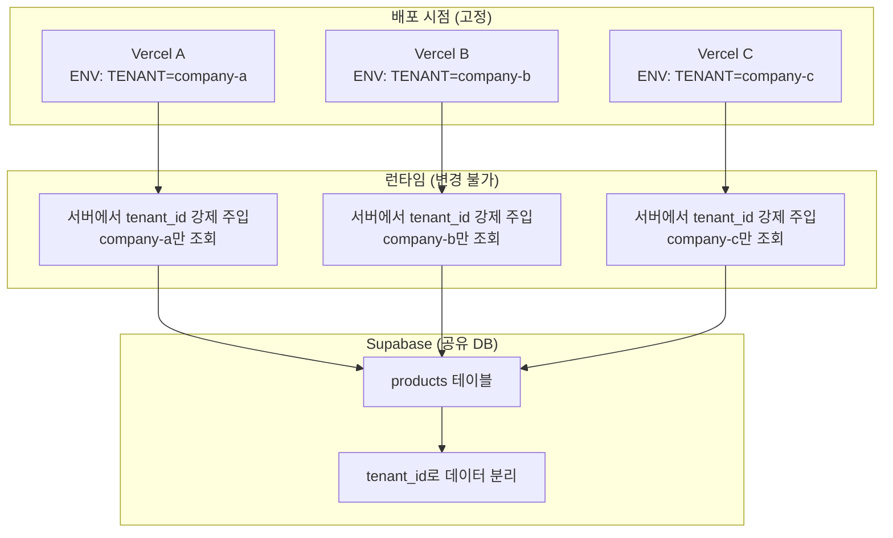
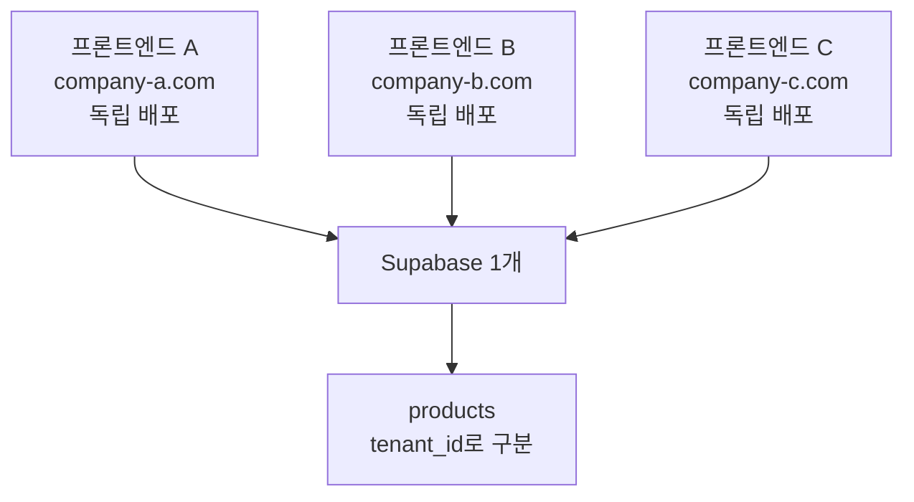
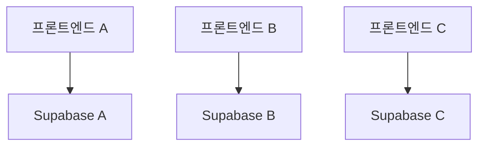

# 멀티 테넌트 아키텍처 가이드

## 개요

소장님 프로젝트를 N개 업장(테넌트)이 공유하는 멀티 테넌트 구조로 확장하는 가이드입니다.

**적용 시나리오**:
- 업장마다 완전히 다른 제품 카탈로그
- 업장별로 색상/로고/레이아웃이 일부 다름
- 소규모 (5개 미만), 저트래픽 환경
- N개의 독립 프론트엔드 배포, Supabase만 공유

## 핵심 구조



**핵심 원칙**:
1. **배포 시 tenant 고정**: 환경변수로 설정, 런타임 변경 불가
2. **서버에서 강제 필터링**: 클라이언트는 DB 직접 접근 불가
3. **완벽한 데이터 격리**: 각 프론트엔드는 자신의 데이터만 접근

---

## 아키텍처 비교

### 방안 1: 단일 DB + 멀티 테넌트 (권장)

**개념**: 하나의 Supabase DB, N개의 독립 프론트엔드



**장점**:
- ✅ **비용 효율**: Supabase 무료 플랜으로 5개 업장 충분 (연간 $1,500 절감)
- ✅ **관리 단순**: 하나의 DB 백업/마이그레이션
- ✅ **코드 재사용**: 같은 코드베이스, 환경변수만 다르게
- ✅ **확장 용이**: 테넌트 추가는 DB 레코드 + 배포만
- ✅ **완벽한 격리**: 서버 강제 필터링으로 데이터 격리 보장

**단점**:
- ⚠️ 스키마 변경 시 모든 테넌트 영향
- ⚠️ 대규모 확장 시 성능 이슈 가능

**적합한 경우**: 소규모 (5~20개), 저~중트래픽, 비용 최소화

---

### 방안 2: 프로젝트별 Supabase 인스턴스

**개념**: 각 업장마다 별도의 Supabase 프로젝트



**장점**:
- ✅ 완전한 물리적 격리
- ✅ 업장별 독립 스케일링

**단점**:
- ❌ **비용 증가**: Pro 플랜 기준 5개 × $25 = $125/월
- ❌ 관리 복잡도 높음

**적합한 경우**: 대규모 (20개 이상), 고트래픽, 엔터프라이즈급

---

## 권장 구현: 방안 1 (단일 DB + N개 프론트엔드)

현재 요구사항(소규모, 저트래픽, 비용 최소화)에 최적화된 구조입니다.

### 1. 데이터베이스 스키마 설계

현재 프로젝트는 **총 3개 테이블**만 있어 마이그레이션이 매우 간단합니다!

#### 1.1 tenants 테이블 추가

```sql
-- supabase/migrations/20250126000000_add_multi_tenant.sql

-- 테넌트 정보 테이블
CREATE TABLE tenants (
  id UUID PRIMARY KEY DEFAULT gen_random_uuid(),
  slug TEXT UNIQUE NOT NULL,           -- 'company-a', 'company-b'
  name TEXT NOT NULL,                  -- '업장 A', '업장 B'
  domain TEXT,                          -- 커스텀 도메인 (선택)

  -- 테마 설정 (JSONB)
  theme JSONB DEFAULT '{
    "colors": {
      "primary": "#1a1a1a",
      "accent": "#4a4a4a"
    },
    "logo_url": ""
  }'::jsonb,

  -- 레이아웃 설정 (JSONB)
  settings JSONB DEFAULT '{
    "layout": {
      "show_hero": true,
      "product_card_style": "list"
    }
  }'::jsonb,

  is_active BOOLEAN DEFAULT true,
  created_at TIMESTAMPTZ DEFAULT now(),
  updated_at TIMESTAMPTZ DEFAULT now()
);

-- 인덱스
CREATE INDEX idx_tenants_slug ON tenants(slug);
CREATE INDEX idx_tenants_domain ON tenants(domain) WHERE domain IS NOT NULL;
```

#### 1.2 기존 3개 테이블에 tenant_id 추가

```sql
-- categories, products, admin_users 테이블 수정
ALTER TABLE categories ADD COLUMN tenant_id UUID REFERENCES tenants(id) ON DELETE CASCADE;
ALTER TABLE products ADD COLUMN tenant_id UUID REFERENCES tenants(id) ON DELETE CASCADE;
ALTER TABLE admin_users ADD COLUMN tenant_id UUID REFERENCES tenants(id) ON DELETE CASCADE;

-- 인덱스 추가 (성능 최적화)
CREATE INDEX idx_categories_tenant ON categories(tenant_id);
CREATE INDEX idx_products_tenant ON products(tenant_id);
CREATE INDEX idx_admin_users_tenant ON admin_users(tenant_id);

-- 기존 데이터 마이그레이션 (디폴트 테넌트 생성)
INSERT INTO tenants (slug, name) VALUES ('default', '기본 업장');

-- 기존 데이터에 디폴트 tenant_id 할당
UPDATE categories SET tenant_id = (SELECT id FROM tenants WHERE slug = 'default');
UPDATE products SET tenant_id = (SELECT id FROM tenants WHERE slug = 'default');
UPDATE admin_users SET tenant_id = (SELECT id FROM tenants WHERE slug = 'default');

-- NOT NULL 제약 추가
ALTER TABLE categories ALTER COLUMN tenant_id SET NOT NULL;
ALTER TABLE products ALTER COLUMN tenant_id SET NOT NULL;
ALTER TABLE admin_users ALTER COLUMN tenant_id SET NOT NULL;
```

---

### 2. 안전한 프론트엔드 구현 (서버 기반)

#### 🚨 보안 원칙

**절대 규칙**:
- ❌ 클라이언트에서 Supabase 직접 접근 금지
- ❌ 클라이언트가 `tenant_id` 조작 불가능하게
- ✅ 서버에서만 DB 접근 (Service Role Key)
- ✅ 서버에서 `tenant_id` 강제 주입

---

#### 2.1 환경변수 설정

```env
# .env.local (로컬 개발)
NEXT_PUBLIC_SUPABASE_URL=https://xxx.supabase.co
SUPABASE_SERVICE_ROLE_KEY=eyJxxx...  # 서버 전용! NEXT_PUBLIC 없음!
TENANT_SLUG=company-a                # 서버 전용! NEXT_PUBLIC 없음!
```

**중요**: `TENANT_SLUG`과 `SUPABASE_SERVICE_ROLE_KEY`는 절대 `NEXT_PUBLIC_` 접두사를 붙이지 마세요! 클라이언트에 노출됩니다.

---

#### 2.2 서버 전용 Supabase 클라이언트

```typescript
// src/lib/supabase/server.ts
import { createClient } from '@supabase/supabase-js'

const supabaseUrl = process.env.NEXT_PUBLIC_SUPABASE_URL!
const serviceRoleKey = process.env.SUPABASE_SERVICE_ROLE_KEY! // 서버 전용!
const tenantSlug = process.env.TENANT_SLUG! // 서버 전용!

// Service Role Key로 클라이언트 생성 (RLS 우회 가능)
const supabaseAdmin = createClient(supabaseUrl, serviceRoleKey, {
  auth: {
    autoRefreshToken: false,
    persistSession: false
  }
})

// 캐싱: 서버 시작 시 1회만 조회
let cachedTenant: { id: string; name: string } | null = null

async function getTenant() {
  if (!cachedTenant) {
    const { data, error } = await supabaseAdmin
      .from('tenants')
      .select('id, name, theme, settings')
      .eq('slug', tenantSlug)
      .eq('is_active', true)
      .single()

    if (error || !data) {
      throw new Error(`Invalid tenant: ${tenantSlug}`)
    }

    cachedTenant = data
  }

  return cachedTenant
}

// 서버 컴포넌트에서 사용할 안전한 클라이언트
export async function getServerSupabase() {
  const tenant = await getTenant()

  return {
    tenant, // 테넌트 정보

    // 모든 쿼리에 tenant_id 자동 주입
    from: (table: string) => {
      return supabaseAdmin
        .from(table)
        .eq('tenant_id', tenant.id) // ← 서버에서 강제로 필터링!
    }
  }
}
```

---

#### 2.3 Server Component에서 사용

```typescript
// src/app/products/page.tsx (Server Component)
import { getServerSupabase } from '@/lib/supabase/server'

export default async function ProductsPage() {
  const supabase = await getServerSupabase()

  // tenant_id가 자동으로 필터링됨 (클라이언트가 조작 불가능!)
  const { data: products, error } = await supabase
    .from('products')
    .select('*')
    .limit(12)

  if (error) {
    return <div>제품을 불러올 수 없습니다.</div>
  }

  return (
    <div>
      <h1>{supabase.tenant.name}</h1>
      <ProductList products={products} />
    </div>
  )
}
```

**장점**:
- ✅ 기존 페이지 코드 거의 그대로!
- ✅ `tenant_id` 필터는 서버에서 자동 추가
- ✅ 클라이언트는 DB 접근 불가

---

#### 2.4 Client Component 지원 (선택)

장바구니는 로컬스토리지 기반이라 DB 접근 불필요하지만, 만약 클라이언트에서 DB 접근이 필요하다면 API 라우트를 사용:

```typescript
// src/app/api/products/route.ts
import { NextResponse } from 'next/server'
import { getServerSupabase } from '@/lib/supabase/server'

export async function GET() {
  const supabase = await getServerSupabase()

  const { data, error } = await supabase
    .from('products')
    .select('*')

  if (error) {
    return NextResponse.json({ error: error.message }, { status: 500 })
  }

  return NextResponse.json({ products: data })
}
```

```typescript
// 클라이언트에서 호출
'use client'

export default function ProductsClient() {
  const [products, setProducts] = useState([])

  useEffect(() => {
    fetch('/api/products')
      .then(res => res.json())
      .then(data => setProducts(data.products))
  }, [])

  return <ProductList products={products} />
}
```

---

#### 2.5 동적 테마 (선택 사항)

업장별 색상/로고가 다르다면:

```typescript
// src/app/layout.tsx
import { getServerSupabase } from '@/lib/supabase/server'

export default async function RootLayout({ children }: { children: React.ReactNode }) {
  const { tenant } = await getServerSupabase()

  return (
    <html lang="ko">
      <head>
        <title>{tenant.name}</title>
        <style dangerouslySetInnerHTML={{ __html: `
          :root {
            --color-primary: ${tenant.theme.colors.primary};
            --color-accent: ${tenant.theme.colors.accent};
          }
        ` }} />
      </head>
      <body>
        {children}
      </body>
    </html>
  )
}
```

---

### 3. 배포 전략

#### N개의 Vercel 프로젝트 배포

**같은 Git 저장소, 환경변수만 다르게!**

##### 프론트엔드 A 배포

```bash
# Vercel Dashboard → New Project → Import Git Repository
# Project Name: sojangnim-company-a
# Environment Variables:
#   NEXT_PUBLIC_SUPABASE_URL=https://xxx.supabase.co
#   SUPABASE_SERVICE_ROLE_KEY=eyJxxx...
#   TENANT_SLUG=company-a  # ← 이것만 다름!
# Domain: company-a.com
```

##### 프론트엔드 B 배포

```bash
# Project Name: sojangnim-company-b
# Environment Variables:
#   NEXT_PUBLIC_SUPABASE_URL=https://xxx.supabase.co  # 동일
#   SUPABASE_SERVICE_ROLE_KEY=eyJxxx...               # 동일
#   TENANT_SLUG=company-b  # ← 다른 값!
# Domain: company-b.com
```

**결과**:
- `company-a.com` 방문 → company-a 데이터만 조회
- `company-b.com` 방문 → company-b 데이터만 조회
- **런타임에 변경 불가능** (재배포 필요)

---

### 4. 보안 검증

#### ✅ 각 프론트엔드는 자신의 데이터만 접근

| 공격 시나리오 | 방어 가능 여부 |
|--------------|--------------|
| 브라우저 콘솔에서 다른 tenant 데이터 요청 | ✅ 불가능 (서버 환경변수) |
| 네트워크 요청 조작 | ✅ 불가능 (서버에서 강제 주입) |
| 직접 Supabase 접근 | ✅ 불가능 (Service Role Key는 서버만) |
| `TENANT_SLUG` 변수 조작 | ✅ 불가능 (빌드 타임에 인라인화) |

#### 실제 동작 검증

```typescript
// 프론트엔드 A (company-a)에서 악의적 시도
// 1. 브라우저 콘솔에서 다른 테넌트 데이터 요청 시도
await fetch('/api/products') // ← 서버가 company-a로 강제 필터링!
// 결과: company-a 데이터만 반환

// 2. 환경변수 조작 시도 (런타임)
process.env.TENANT_SLUG = 'company-b'
// ← Next.js는 빌드 타임에 인라인화하므로 소용없음!
// 결과: 여전히 company-a 데이터만 반환
```

---

## 운영 가이드

### 새 테넌트 추가

1. **DB에 테넌트 레코드 삽입**:
```sql
INSERT INTO tenants (slug, name, theme)
VALUES (
  'company-c',
  '업장 C',
  '{"colors": {"primary": "#000", "accent": "#f00"}}'::jsonb
);
```

2. **카테고리/제품 데이터 입력** (Supabase Dashboard)

3. **새 Vercel 프로젝트 생성**:
   - Git 저장소 연결
   - 환경변수: `TENANT_SLUG=company-c`
   - 도메인: `company-c.com`

4. **배포 및 테스트**

---

### 테넌트 설정 변경

```sql
-- 테마 색상 변경
UPDATE tenants
SET theme = jsonb_set(theme, '{colors,primary}', '"#2d2d2d"')
WHERE slug = 'company-a';

-- 레이아웃 설정 변경
UPDATE tenants
SET settings = jsonb_set(settings, '{layout,show_hero}', 'false')
WHERE slug = 'company-b';
```

**재배포 불필요**: DB 변경만으로 즉시 반영!

---

### tenant_id 변경하려면?

**유일한 방법: 재배포**

```bash
# 1. Vercel Dashboard에서 환경변수 변경
TENANT_SLUG=company-a → TENANT_SLUG=company-c

# 2. Redeploy 버튼 클릭

# 3. 새 배포부터 company-c 데이터 서빙
```

**런타임에는 절대 변경 불가능!** (완벽한 격리 보장)

---

## 성능 최적화

### 1. 테넌트 정보 캐싱

```typescript
// src/lib/supabase/server.ts
let cachedTenant: { id: string } | null = null

async function getTenant() {
  if (!cachedTenant) {
    // DB 조회는 서버 시작 시 1회만
    const { data } = await supabaseAdmin
      .from('tenants')
      .select('id, name, theme')
      .eq('slug', tenantSlug)
      .single()

    cachedTenant = data
  }

  return cachedTenant
}
```

### 2. 인덱스 최적화

```sql
-- 자주 조회하는 조합에 인덱스 추가
CREATE INDEX idx_products_tenant_category ON products(tenant_id, category_id);
CREATE INDEX idx_products_tenant_badge ON products(tenant_id, badge) WHERE badge IS NOT NULL;
```

### 3. 쿼리 최적화

```typescript
// 필요한 컬럼만 select
const { data } = await supabase
  .from('products')
  .select('id, name, price, image_url')
  .limit(12)
```

---

## 비용 분석

### 현재 구조 (업장별 Supabase)

| 항목 | 비용 (5개 업장) |
|------|-----------------|
| Supabase Pro | 5 × $25 = **$125/월** |
| 연간 | **$1,500** |

### 멀티 테넌트 전환 후

| 항목 | 비용 (5개 업장) |
|------|-----------------|
| Supabase 무료 플랜 | **$0/월** |
| Supabase Pro (필요 시) | **$25/월** |
| 연간 절감액 | **$1,200~$1,500** |

**결론**: 연간 최소 $1,200 절감! 🎉

---

## 마이그레이션 체크리스트

- [ ] DB 마이그레이션 파일 작성 (`tenants` 테이블, `tenant_id` 추가)
- [ ] 마이그레이션 실행: `supabase db push`
- [ ] 시드 데이터 삽입 (테넌트 2개 이상)
- [ ] `src/lib/supabase/server.ts` 생성
- [ ] 기존 페이지를 Server Component로 전환
- [ ] 로컬 환경변수 설정 (`TENANT_SLUG`, `SUPABASE_SERVICE_ROLE_KEY`)
- [ ] 로컬에서 테넌트 전환 테스트 (환경변수 변경 후 재시작)
- [ ] Vercel 프로젝트 A 배포 (ENV: `TENANT_SLUG=company-a`)
- [ ] Vercel 프로젝트 B 배포 (ENV: `TENANT_SLUG=company-b`)
- [ ] 각 도메인에서 데이터 격리 검증
- [ ] 브라우저 콘솔에서 조작 시도 (차단되는지 확인)

---

## 트러블슈팅

### Q1: "Invalid tenant" 에러 발생

**원인**: `TENANT_SLUG` 환경변수와 DB의 `slug`가 불일치

**해결**:
```sql
-- DB에 해당 테넌트가 있는지 확인
SELECT * FROM tenants WHERE slug = 'company-a';

-- 없으면 추가
INSERT INTO tenants (slug, name) VALUES ('company-a', '업장 A');
```

### Q2: 모든 테넌트 데이터가 보임

**원인**: `tenant_id` 필터가 적용되지 않음

**해결**:
```typescript
// ❌ 잘못된 사용
import { supabase } from '@/lib/supabase/client'
await supabase.from('products').select('*') // tenant_id 필터 없음!

// ✅ 올바른 사용
import { getServerSupabase } from '@/lib/supabase/server'
const supabase = await getServerSupabase()
await supabase.from('products').select('*') // tenant_id 자동 필터링!
```

### Q3: 클라이언트 컴포넌트에서 DB 접근 필요

**해결**: API 라우트 사용 (2.4 참조)

---

## 참고 자료

- [Supabase Service Role](https://supabase.com/docs/guides/api/api-keys#the-servicerole-key)
- [Next.js Server Components](https://nextjs.org/docs/app/building-your-application/rendering/server-components)
- [Vercel 환경변수 관리](https://vercel.com/docs/projects/environment-variables)

---

**문서 최종 업데이트**: 2025-01-26
