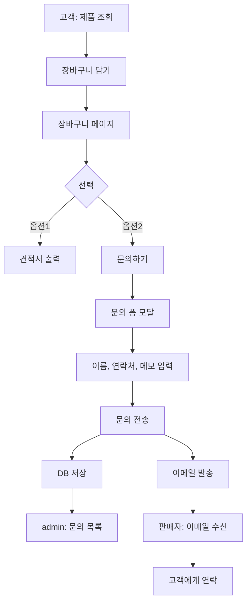

# 문의하기 기능 구현 계획

## 1. 개요

### 배경

현재 "견적서 출력" 기능만으로는 판매자에게 제안하기 약함.
고객이 견적서를 출력해도 판매자는 알 수 없음 → 영업 기회 놓침.

### 목표

```
고객이 "문의하기" → 판매자에게 이메일 알림 → 영업 기회 포착
```

### 핵심 가치

| 대상 | 가치 |
|------|------|
| **판매자** | 고객 연락처 수집, 영업 기회 알림 |
| **구매자** | 견적서 출력 대신 바로 문의 가능 |

---

## 2. 사용자 플로우

### 전체 흐름



### 고객 화면 (장바구니)

```
┌─────────────────────────────────────────────────────┐
│  장바구니                                            │
├─────────────────────────────────────────────────────┤
│  🔨 무선 충전 드릴          5개     ₩445,000        │
│  🔧 충격 렌치              2개     ₩298,000        │
├─────────────────────────────────────────────────────┤
│  총 합계                          ₩743,000        │
├─────────────────────────────────────────────────────┤
│                                                     │
│  [📄 견적서 출력]    [💬 문의하기]                   │
│                                                     │
└─────────────────────────────────────────────────────┘
```

### 문의 폼 모달

```
┌─────────────────────────────────────────────────────┐
│  문의하기                                     [✕]   │
├─────────────────────────────────────────────────────┤
│                                                     │
│  담긴 상품 (2개)                                     │
│  ├─ 무선 충전 드릴 x 5                              │
│  └─ 충격 렌치 x 2                                   │
│                                                     │
│  ─────────────────────────────────────────────────  │
│                                                     │
│  이름/회사명 *                                       │
│  ┌─────────────────────────────────────────────┐   │
│  │ 홍길동                                       │   │
│  └─────────────────────────────────────────────┘   │
│                                                     │
│  연락처 (전화 또는 이메일) *                          │
│  ┌─────────────────────────────────────────────┐   │
│  │ 010-1234-5678                                │   │
│  └─────────────────────────────────────────────┘   │
│                                                     │
│  문의 내용                                          │
│  ┌─────────────────────────────────────────────┐   │
│  │ 대량 구매 시 할인 가능한지 문의드립니다.        │   │
│  │                                              │   │
│  └─────────────────────────────────────────────┘   │
│                                                     │
│  ─────────────────────────────────────────────────  │
│                                                     │
│            [취소]    [문의 보내기]                   │
│                                                     │
└─────────────────────────────────────────────────────┘
```

### 문의 완료 화면

```
┌─────────────────────────────────────────────────────┐
│                                                     │
│               ✓ 문의가 전송되었습니다                 │
│                                                     │
│        담당자가 빠른 시일 내에 연락드리겠습니다.        │
│                                                     │
│               [확인]                                 │
│                                                     │
└─────────────────────────────────────────────────────┘
```

---

## 3. 데이터베이스 설계

### inquiries 테이블

```sql
CREATE TABLE inquiries (
    id UUID PRIMARY KEY DEFAULT gen_random_uuid(),
    tenant_id UUID NOT NULL REFERENCES tenants(id) ON DELETE CASCADE,

    -- 고객 정보
    customer_name TEXT NOT NULL,           -- 이름/회사명
    customer_contact TEXT NOT NULL,        -- 연락처 (전화 또는 이메일)
    message TEXT,                          -- 문의 내용

    -- 장바구니 스냅샷
    items JSONB NOT NULL,                  -- 문의 시점의 장바구니 품목
    total_amount INTEGER NOT NULL,         -- 총 금액

    -- 상태 관리
    status TEXT DEFAULT 'pending',         -- pending, contacted, completed, cancelled
    admin_note TEXT,                       -- 관리자 메모 (내부용)

    -- 추적
    created_at TIMESTAMPTZ DEFAULT now(),
    updated_at TIMESTAMPTZ DEFAULT now()
);

-- 인덱스
CREATE INDEX idx_inquiries_tenant ON inquiries(tenant_id);
CREATE INDEX idx_inquiries_status ON inquiries(tenant_id, status);
CREATE INDEX idx_inquiries_created ON inquiries(tenant_id, created_at DESC);

-- RLS
ALTER TABLE inquiries ENABLE ROW LEVEL SECURITY;

CREATE POLICY "inquiries_select_policy" ON inquiries
    FOR SELECT USING (true);

CREATE POLICY "inquiries_insert_policy" ON inquiries
    FOR INSERT WITH CHECK (true);

CREATE POLICY "inquiries_update_policy" ON inquiries
    FOR UPDATE TO authenticated
    USING (true) WITH CHECK (true);
```

### items JSONB 구조

```json
[
  {
    "product_id": "uuid",
    "product_name": "무선 충전 드릴",
    "product_price": 89000,
    "quantity": 5,
    "subtotal": 445000
  },
  {
    "product_id": "uuid",
    "product_name": "충격 렌치",
    "product_price": 149000,
    "quantity": 2,
    "subtotal": 298000
  }
]
```

### status 값

| 상태 | 설명 |
|------|------|
| `pending` | 신규 문의 (미처리) |
| `contacted` | 연락 완료 |
| `completed` | 처리 완료 (주문/거래 성사) |
| `cancelled` | 취소/무효 |

---

## 4. 환경변수 설계

### 필요한 환경변수

```bash
# ===========================================
# 문의 알림 이메일 설정
# ===========================================

# 판매자 이메일 (문의 수신용)
INQUIRY_NOTIFICATION_EMAIL=seller@example.com

# SMTP 설정
SMTP_HOST=smtp.gmail.com
SMTP_PORT=587
SMTP_SECURE=false
SMTP_USER=your-email@gmail.com
SMTP_PASSWORD=your-app-password

# 발신자 정보
SMTP_FROM_NAME=소장님
SMTP_FROM_EMAIL=noreply@example.com
```

### 테넌트별 설정 (DB)

멀티테넌트 환경에서는 테넌트별로 이메일 설정이 필요할 수 있음.
현재는 환경변수로 단일 설정, 추후 tenants 테이블에 추가 가능.

```sql
-- 추후 확장 시 tenants 테이블에 추가
ALTER TABLE tenants ADD COLUMN notification_email TEXT;
```

---

## 5. API 설계

### POST /api/inquiries

문의 생성

**Request:**
```json
{
  "customer_name": "홍길동",
  "customer_contact": "010-1234-5678",
  "message": "대량 구매 시 할인 가능한지 문의드립니다.",
  "items": [
    {
      "product_id": "uuid",
      "product_name": "무선 충전 드릴",
      "product_price": 89000,
      "quantity": 5
    }
  ],
  "total_amount": 743000
}
```

**Response (201):**
```json
{
  "success": true,
  "inquiry_id": "uuid"
}
```

**처리 로직:**
1. 입력값 검증
2. DB 저장
3. 이메일 발송 (비동기)
4. 응답 반환

### GET /api/admin/inquiries

문의 목록 조회 (관리자용)

**Query Params:**
- `status`: 상태 필터 (선택)
- `page`: 페이지 번호 (기본: 1)
- `limit`: 페이지당 개수 (기본: 20)

**Response:**
```json
{
  "inquiries": [
    {
      "id": "uuid",
      "customer_name": "홍길동",
      "customer_contact": "010-1234-5678",
      "message": "...",
      "items": [...],
      "total_amount": 743000,
      "status": "pending",
      "created_at": "2024-12-06T10:00:00Z"
    }
  ],
  "total": 45,
  "page": 1,
  "limit": 20
}
```

### PATCH /api/admin/inquiries/[id]

문의 상태 업데이트 (관리자용)

**Request:**
```json
{
  "status": "contacted",
  "admin_note": "전화 연락 완료, 견적서 발송함"
}
```

---

## 6. 이메일 템플릿

### 판매자에게 발송되는 알림 이메일

**제목:** `[새 문의] 홍길동님이 문의를 남겼습니다`

**본문:**
```
━━━━━━━━━━━━━━━━━━━━━━━━━━━━━━━━━━━━━
새로운 문의가 접수되었습니다
━━━━━━━━━━━━━━━━━━━━━━━━━━━━━━━━━━━━━

■ 고객 정보
  이름: 홍길동
  연락처: 010-1234-5678

■ 문의 내용
  대량 구매 시 할인 가능한지 문의드립니다.

■ 문의 품목
  ┌────────────────────────────────────┐
  │ 무선 충전 드릴      5개    ₩445,000 │
  │ 충격 렌치          2개    ₩298,000 │
  ├────────────────────────────────────┤
  │ 합계                     ₩743,000 │
  └────────────────────────────────────┘

■ 문의 시각
  2024년 12월 6일 오전 10:30

━━━━━━━━━━━━━━━━━━━━━━━━━━━━━━━━━━━━━
관리자 페이지에서 확인: https://your-site.com/admin/inquiries
━━━━━━━━━━━━━━━━━━━━━━━━━━━━━━━━━━━━━
```

---

## 7. 파일 구조

```
src/
├── app/
│   ├── api/
│   │   ├── inquiries/
│   │   │   └── route.ts              # POST: 문의 생성
│   │   └── admin/
│   │       └── inquiries/
│   │           ├── route.ts          # GET: 문의 목록
│   │           └── [id]/
│   │               └── route.ts      # PATCH: 상태 업데이트
│   ├── admin/
│   │   └── inquiries/
│   │       └── page.tsx              # 문의 목록 페이지
│   └── cart/
│       └── page.tsx                  # 수정: 문의하기 버튼 추가
├── components/
│   ├── inquiry/
│   │   ├── InquiryModal.tsx          # 문의 폼 모달
│   │   └── InquirySuccessModal.tsx   # 완료 모달
│   └── admin/
│       └── InquiryList.tsx           # 문의 목록 컴포넌트
├── lib/
│   └── email/
│       ├── client.ts                 # nodemailer 설정
│       └── templates/
│           └── inquiry-notification.ts # 이메일 템플릿
└── types/
    └── inquiry.ts                    # 타입 정의
```

---

## 8. 구현 단계

### Phase 1: 기반 작업 (Day 1)

| 순서 | 작업 | 상세 |
|------|------|------|
| 1-1 | 마이그레이션 작성 | `inquiries` 테이블 생성 |
| 1-2 | 타입 정의 | `src/types/inquiry.ts` |
| 1-3 | 환경변수 추가 | `.env.example` 업데이트 |

### Phase 2: 고객 기능 (Day 2)

| 순서 | 작업 | 상세 |
|------|------|------|
| 2-1 | 문의 모달 UI | `InquiryModal.tsx` |
| 2-2 | 장바구니 수정 | 문의하기 버튼 추가 |
| 2-3 | 문의 API | `POST /api/inquiries` |
| 2-4 | 완료 모달 | `InquirySuccessModal.tsx` |

### Phase 3: 이메일 발송 (Day 3)

| 순서 | 작업 | 상세 |
|------|------|------|
| 3-1 | nodemailer 설치 | `npm install nodemailer` |
| 3-2 | 이메일 클라이언트 | `src/lib/email/client.ts` |
| 3-3 | 이메일 템플릿 | 알림 이메일 본문 |
| 3-4 | API 연동 | 문의 생성 시 이메일 발송 |

### Phase 4: 관리자 기능 (Day 4)

| 순서 | 작업 | 상세 |
|------|------|------|
| 4-1 | 문의 목록 API | `GET /api/admin/inquiries` |
| 4-2 | 상태 업데이트 API | `PATCH /api/admin/inquiries/[id]` |
| 4-3 | 문의 목록 페이지 | `/admin/inquiries` |
| 4-4 | 사이드바 메뉴 추가 | 문의 관리 링크 |

### Phase 5: 테스트 및 마무리 (Day 5)

| 순서 | 작업 | 상세 |
|------|------|------|
| 5-1 | 전체 플로우 테스트 | 문의 → 이메일 → 관리자 확인 |
| 5-2 | 에러 처리 | 이메일 실패 시 처리 |
| 5-3 | 문서 업데이트 | README, CLAUDE.md |

---

## 9. 필요한 정보

구현을 시작하려면 다음 정보가 필요합니다:

### SMTP 설정

| 항목 | 설명 | 예시 |
|------|------|------|
| **SMTP_HOST** | SMTP 서버 주소 | `smtp.gmail.com` |
| **SMTP_PORT** | SMTP 포트 | `587` (TLS) 또는 `465` (SSL) |
| **SMTP_USER** | SMTP 계정 | `your-email@gmail.com` |
| **SMTP_PASSWORD** | SMTP 비밀번호 또는 앱 비밀번호 | `xxxx-xxxx-xxxx-xxxx` |

### Gmail 사용 시

1. Google 계정 → 보안 → 2단계 인증 활성화
2. 앱 비밀번호 생성 (https://myaccount.google.com/apppasswords)
3. 생성된 16자리 비밀번호를 `SMTP_PASSWORD`에 사용

### 판매자 이메일

| 항목 | 설명 |
|------|------|
| **INQUIRY_NOTIFICATION_EMAIL** | 문의 알림을 받을 판매자 이메일 |

---

## 10. 예상 결과

### 판매자 입장

```
Before:
"고객이 사이트 들어와서 뭘 봤는지 모름"

After:
"고객이 문의 남기면 이메일로 알림 옴"
"어떤 제품에 관심 있는지, 연락처까지 확보"
```

### 제안 메시지 변화

```
Before:
"제품 카탈로그 사이트 만들어드립니다"

After:
"고객이 제품 보고 문의하면, 바로 알림 받고 연락하세요"
"고객 연락처와 관심 품목이 자동으로 정리됩니다"
```

---

## 11. 향후 확장

| 기능 | 설명 | 우선순위 |
|------|------|----------|
| 카카오 알림톡 | 이메일 대신 카톡으로 알림 | 낮음 |
| 문의 통계 | 월별 문의 건수, 인기 품목 | 중간 |
| 자동 응답 | 고객에게 자동 확인 이메일 | 낮음 |
| 웹훅 연동 | Slack, Discord 알림 | 낮음 |

---

## 체크리스트

구현 시작 전 확인:

- [ ] SMTP 정보 준비 (Gmail 앱 비밀번호 등)
- [ ] 판매자 알림 이메일 주소 확정
- [ ] 위 계획 검토 및 피드백
