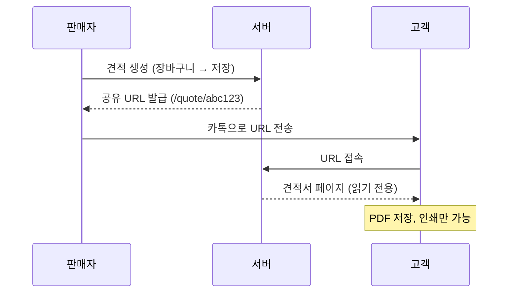
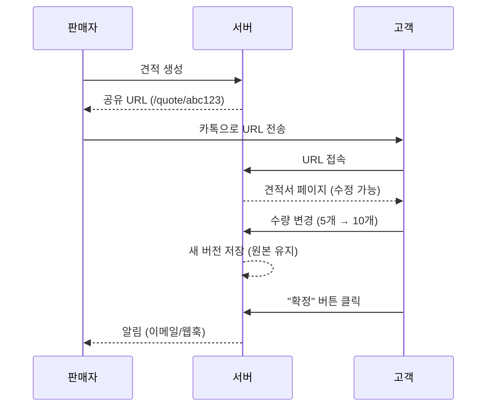
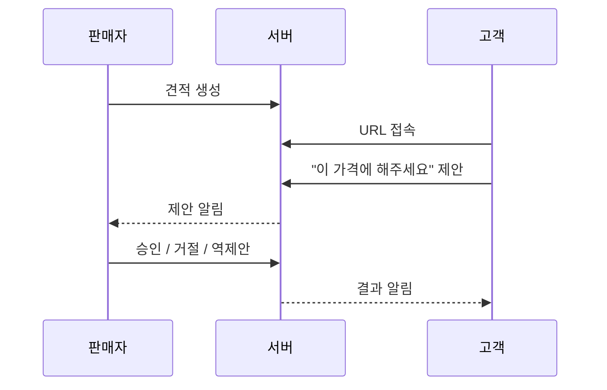
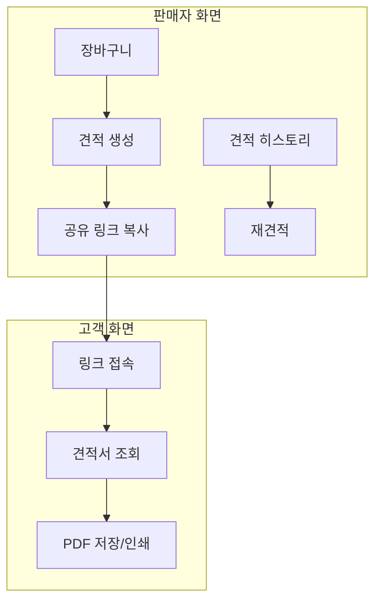

# 견적서 아키텍처 옵션

## 1. 견적 저장 아키텍처

### 현재 상태


- 장바구니: localStorage (브라우저 로컬)
- 견적서: 저장 안 됨 (출력만)
- 히스토리: 없음

### 견적 저장 시 필요한 테이블

```sql
-- 견적서 테이블
CREATE TABLE quotations (
    id UUID PRIMARY KEY DEFAULT gen_random_uuid(),
    tenant_id UUID NOT NULL REFERENCES tenants(id),

    -- 메타 정보
    quotation_number TEXT NOT NULL,        -- 'Q-2024-001'
    status TEXT DEFAULT 'draft',           -- draft, sent, viewed, confirmed, expired

    -- 수신자 정보 (스냅샷)
    recipient JSONB NOT NULL,              -- {name, contactPerson, phone, address}

    -- 금액 (스냅샷)
    total_supply_price INTEGER NOT NULL,   -- 공급가액
    total_tax_amount INTEGER NOT NULL,     -- 세액
    total_amount INTEGER NOT NULL,         -- 합계

    -- 공유 관련
    share_token TEXT UNIQUE,               -- 공유용 토큰 (nanoid)
    share_expires_at TIMESTAMPTZ,          -- 공유 만료일

    -- 추적
    viewed_at TIMESTAMPTZ,                 -- 고객이 본 시점
    confirmed_at TIMESTAMPTZ,              -- 고객이 확정한 시점

    created_at TIMESTAMPTZ DEFAULT now(),
    updated_at TIMESTAMPTZ DEFAULT now()
);

-- 견적 품목 테이블
CREATE TABLE quotation_items (
    id UUID PRIMARY KEY DEFAULT gen_random_uuid(),
    quotation_id UUID NOT NULL REFERENCES quotations(id) ON DELETE CASCADE,

    -- 제품 정보 (스냅샷 - 나중에 가격 변해도 견적은 유지)
    product_id UUID REFERENCES products(id) ON DELETE SET NULL,
    product_name TEXT NOT NULL,
    product_spec TEXT,

    -- 수량 및 금액
    quantity INTEGER NOT NULL,
    unit_price INTEGER NOT NULL,
    supply_price INTEGER NOT NULL,
    tax_amount INTEGER NOT NULL,

    seq INTEGER NOT NULL,                  -- 순번
    created_at TIMESTAMPTZ DEFAULT now()
);

-- 인덱스
CREATE INDEX idx_quotations_tenant ON quotations(tenant_id);
CREATE INDEX idx_quotations_share_token ON quotations(share_token);
CREATE INDEX idx_quotations_status ON quotations(tenant_id, status);
CREATE INDEX idx_quotation_items_quotation ON quotation_items(quotation_id);
```

### 핵심 설계 포인트

| 포인트 | 설명 |
|--------|------|
| **스냅샷 저장** | 제품 가격이 변해도 과거 견적은 그대로 유지 |
| **share_token** | UUID 대신 짧은 토큰 (nanoid) 사용 가능 |
| **status** | 견적 상태 추적 (조회/확정 여부) |
| **tenant_id** | 멀티테넌트 지원 |

---

## 2. 공유 링크 아키텍처 (컨셉별 비교)

### 컨셉 A: 읽기 전용 공유

가장 단순한 방식. 고객은 **보기만** 가능.



**구현**:
```
/quote/[token]/page.tsx  -- 공개 페이지 (인증 불필요)
```

**장점**: 구현 간단, 보안 위험 낮음
**단점**: 고객이 수량 변경 불가 → 전화/카톡으로 다시 요청해야 함

---

### 컨셉 B: 수정 가능한 공유 (권장)

고객이 **수량 수정 후 확정** 가능.



**구현**:
```
/quote/[token]/page.tsx       -- 견적 조회/수정
/api/quote/[token]/update     -- 수량 수정 API
/api/quote/[token]/confirm    -- 확정 API
```

**DB 추가**:
```sql
-- 수정 이력 (선택)
CREATE TABLE quotation_revisions (
    id UUID PRIMARY KEY,
    quotation_id UUID REFERENCES quotations(id),
    revision_number INTEGER,
    items JSONB,                    -- 수정된 품목 스냅샷
    modified_by TEXT,               -- 'customer' | 'seller'
    created_at TIMESTAMPTZ
);
```

**장점**: 고객 편의성 높음, 왕복 소통 감소
**단점**: 구현 복잡도 증가, 수정 권한 관리 필요

---

### 컨셉 C: 협상형 공유

고객이 **희망 가격/수량 제안** → 판매자 승인



**장점**: 가격 협상 가능
**단점**: 복잡함, B2B 소규모에는 오버엔지니어링

---

### 컨셉 D: 임시 링크 (만료 있음)

공유 링크에 **7일 만료** 설정.

```sql
share_expires_at TIMESTAMPTZ  -- 7일 후 자동 만료
```

**장점**: 보안 강화, 오래된 견적 정리
**단점**: 고객이 나중에 다시 볼 수 없음

---

## 3. 컨셉별 비교표

| 항목 | A: 읽기전용 | B: 수정가능 | C: 협상형 | D: 만료링크 |
|------|-------------|-------------|-----------|-------------|
| **구현 난이도** | 쉬움 (1-2일) | 중간 (3-5일) | 어려움 (7일+) | 쉬움 (1일) |
| **고객 편의성** | 낮음 | 높음 | 중간 | 중간 |
| **판매자 편의성** | 낮음 | 높음 | 중간 | 중간 |
| **보안 위험** | 낮음 | 중간 | 중간 | 낮음 |
| **차별화** | 약함 | 강함 | 강함 | 약함 |

---

## 4. 권장 조합

### MVP 추천: A + D 조합

1. **읽기 전용** 공유 (컨셉 A)
2. **7일 만료** 링크 (컨셉 D)
3. **히스토리 저장** (판매자만 조회)



### 확장 추천: B + D 조합

MVP 이후 **수정 가능** 기능 추가.

---

## 5. 카카오톡 수정 오해 정리

> "카카오톡으로 수량을 변경한다는 게 불편해 보여"

**명확히**: 카카오톡은 **링크 전달 수단**일 뿐, 수량 변경은 **웹페이지에서** 합니다.

```
1. 판매자 → 카톡으로 링크 전송
2. 고객 → 링크 클릭 → 브라우저 열림
3. 고객 → 웹페이지에서 수량 변경
4. 고객 → "확정" 버튼 클릭
```

카톡 자체에서 뭔가 하는 게 아닙니다.

---

## 6. 기술 구현 상세

### 공유 토큰 생성

```typescript
// nanoid 사용 (짧고 안전한 토큰)
import { nanoid } from 'nanoid'

const shareToken = nanoid(10)  // 'V1StGXR8_Z'
const shareUrl = `https://sojangnim.vercel.app/quote/${shareToken}`
```

### 공유 페이지 라우트

```
src/app/
├── quote/
│   └── [token]/
│       └── page.tsx      -- 공개 견적 페이지
├── admin/
│   └── quotations/
│       ├── page.tsx      -- 견적 히스토리
│       └── [id]/
│           └── page.tsx  -- 견적 상세
```

### API 구조

```
src/app/api/
├── quotations/
│   ├── route.ts          -- POST: 견적 생성
│   └── [id]/
│       └── route.ts      -- GET: 견적 조회, PATCH: 수정
└── quote/
    └── [token]/
        ├── route.ts      -- GET: 공개 조회
        └── confirm/
            └── route.ts  -- POST: 고객 확정
```

---

## 7. 대안 컨셉: 완전히 다른 방향

### 컨셉 E: QR 코드 기반

오프라인 카탈로그/명함에 QR 코드 인쇄.

```
판매자 → 제품에 QR 스티커 부착
고객 → QR 스캔 → 장바구니에 자동 추가
고객 → 스캔 완료 후 견적 요청
```

**장점**: 오프라인-온라인 연결
**단점**: QR 스티커 제작 필요, 초기 세팅 번거로움

### 컨셉 F: 엑셀 연동

엑셀 파일을 업로드하면 자동으로 견적서 생성.

```
고객 → 엑셀로 품목/수량 작성
고객 → 엑셀 업로드
서버 → 파싱 후 견적서 자동 생성
```

**장점**: 기존 엑셀 사용자 전환 용이
**단점**: 파싱 오류 가능성, 제품 매칭 어려움

### 컨셉 G: 카톡 챗봇 (장기)

카카오 챗봇에서 견적 요청.

```
고객: "드릴 5개 견적 주세요"
챗봇: [드릴 목록 표시]
고객: [선택]
챗봇: [견적서 링크 발송]
```

**장점**: IT 비숙련자에게 익숙한 인터페이스
**단점**: 챗봇 개발 복잡, 카카오 비즈 필요

---

## 8. 최종 권장

### 1단계 (MVP)

```
[ ] quotations 테이블 생성
[ ] 견적 저장 기능 (장바구니 → DB)
[ ] 견적 히스토리 페이지 (/admin/quotations)
[ ] 재견적 기능 (과거 견적 → 장바구니)
```

### 2단계 (공유)

```
[ ] 공유 토큰 생성
[ ] 공개 견적 페이지 (/quote/[token])
[ ] 공유 링크 복사 버튼
[ ] 7일 만료 설정
```

### 3단계 (선택)

```
[ ] 고객 수정 기능 (컨셉 B)
[ ] 이메일/웹훅 알림
[ ] 견적 통계 대시보드
```

---

## 질문 정리

| 질문 | 답변 |
|------|------|
| 견적 저장하려면 어떻게? | `quotations` + `quotation_items` 테이블 추가 |
| 공유 링크는 어떻게? | `/quote/[token]` 공개 라우트, 토큰은 nanoid |
| 카톡에서 수정? | 아니요, 카톡은 링크 전달만. 수정은 웹에서 |
| 앱 자체 구현? | 네, Next.js 페이지로 구현 (외부 서비스 X) |

어떤 컨셉으로 진행할지 결정해 주시면 상세 설계 진행하겠습니다.
