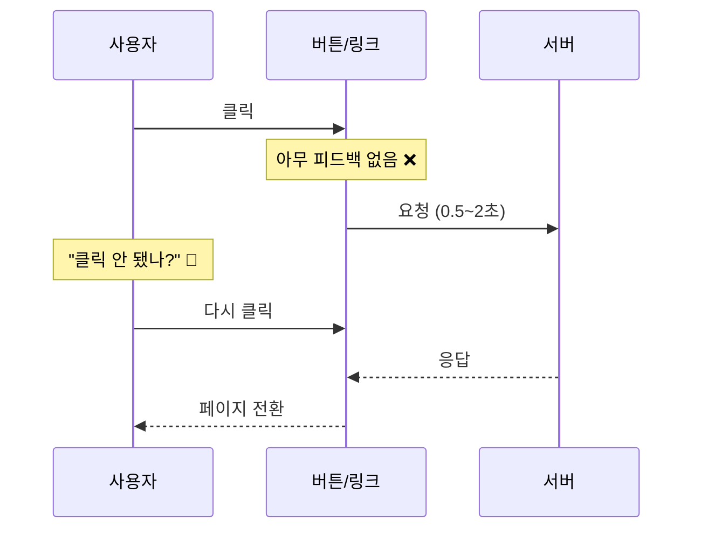
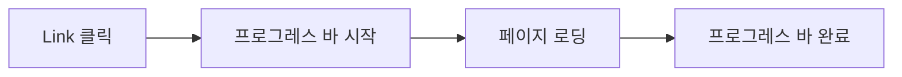
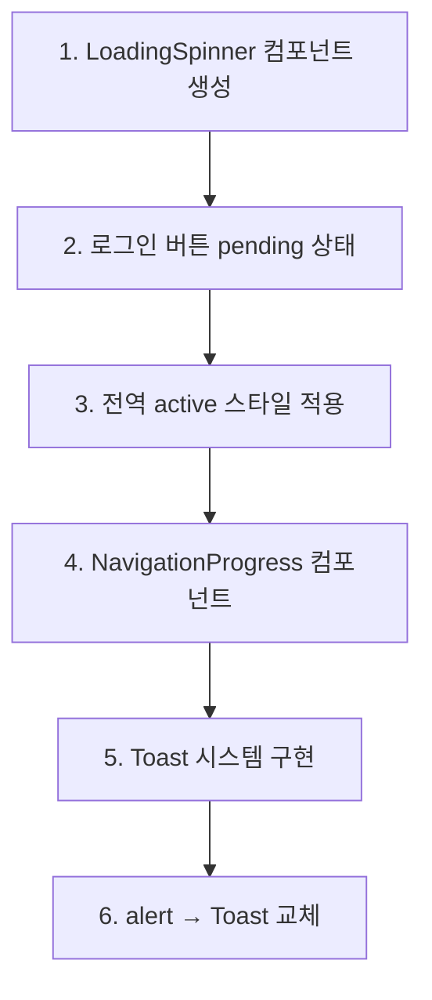
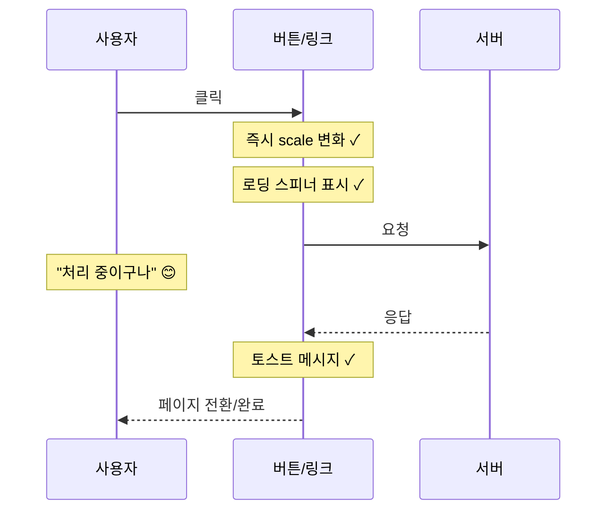

# UI 반응성 개선 계획

## 문제 분석

사용자가 버튼/링크를 클릭했을 때 시각적 피드백이 부족하여 클릭 여부를 인지하기 어려움.

### 현재 문제점



### 영향받는 영역

| 영역 | 파일 | 문제점 |
|------|------|--------|
| 로그인 | `src/app/admin/login/page.tsx` | form submit 후 피드백 없음 |
| 제품 카드 | `src/components/ProductCard.tsx` | Link 클릭 시 피드백 없음 |
| 제품 상세 이동 | `/products/[id]` | 페이지 전환 로딩 없음 |
| 장바구니 담기 | `AddToCartButton.tsx` | alert만 있고 즉각 피드백 없음 |
| Admin 폼 | `NewProductForm.tsx`, `EditProductForm.tsx` | 저장 버튼 클릭 초기 피드백 부족 |

---

## 개선 방안

### 1. 전역 페이지 전환 인디케이터

Next.js 페이지 전환 시 상단에 프로그레스 바 표시.

**구현 방식**: `next/navigation`의 `useRouter` 이벤트 활용 또는 NProgress 라이브러리



**새 파일**: `src/components/NavigationProgress.tsx`

```tsx
// 예시 구현
'use client'
import { useEffect, useState } from 'react'
import { usePathname, useSearchParams } from 'next/navigation'

export default function NavigationProgress() {
  const [isNavigating, setIsNavigating] = useState(false)
  const pathname = usePathname()
  const searchParams = useSearchParams()

  useEffect(() => {
    setIsNavigating(false)
  }, [pathname, searchParams])

  // 전역 클릭 이벤트로 Link 클릭 감지
  useEffect(() => {
    const handleClick = (e: MouseEvent) => {
      const target = e.target as HTMLElement
      const link = target.closest('a')
      if (link?.href && !link.target && !link.download) {
        const url = new URL(link.href)
        if (url.origin === window.location.origin) {
          setIsNavigating(true)
        }
      }
    }
    document.addEventListener('click', handleClick)
    return () => document.removeEventListener('click', handleClick)
  }, [])

  if (!isNavigating) return null

  return (
    <div className="fixed top-0 left-0 right-0 z-50 h-1 bg-gray-200">
      <div className="h-full bg-[#1a1a1a] animate-progress" />
    </div>
  )
}
```

**우선순위**: 높음
**예상 효과**: 모든 페이지 전환에 대한 시각적 피드백 제공

---

### 2. 로그인 버튼 pending 상태

React 19의 `useFormStatus` 활용.

**수정 파일**: `src/app/admin/login/page.tsx`

```tsx
// SubmitButton 컴포넌트 분리
'use client'
import { useFormStatus } from 'react-dom'

function SubmitButton() {
  const { pending } = useFormStatus()

  return (
    <button
      type="submit"
      disabled={pending}
      className="w-full bg-[#1a1a1a] text-white px-6 py-3 rounded-md
                 hover:bg-black transition-colors font-semibold
                 disabled:opacity-70 disabled:cursor-not-allowed"
    >
      {pending ? (
        <span className="flex items-center justify-center gap-2">
          <LoadingSpinner size="sm" />
          로그인 중...
        </span>
      ) : (
        'Login'
      )}
    </button>
  )
}
```

**우선순위**: 높음
**예상 효과**: 로그인 버튼 클릭 즉시 로딩 상태 표시

---

### 3. 버튼 클릭 시 즉각적 시각적 피드백

모든 버튼에 `active` 상태 스타일 추가.

**수정 방식**: Tailwind CSS `active:` 접두사 활용

```css
/* 기존 */
.btn {
  @apply bg-[#1a1a1a] hover:bg-black transition-colors;
}

/* 개선 */
.btn {
  @apply bg-[#1a1a1a] hover:bg-black active:scale-95
         active:bg-gray-800 transition-all duration-100;
}
```

**영향 파일**:
- `src/components/ProductCard.tsx` - 담기 버튼
- `src/components/AddToCartButton.tsx` - 장바구니 버튼
- `src/app/admin/login/page.tsx` - 로그인 버튼
- `src/components/admin/NewProductForm.tsx` - 저장 버튼
- `src/components/admin/EditProductForm.tsx` - 저장 버튼

**우선순위**: 중간
**예상 효과**: 클릭 즉시 버튼이 눌리는 느낌 제공

---

### 4. Link 클릭 피드백

제품 카드 등 Link 클릭 시 시각적 피드백.

**수정 파일**: `src/components/ProductCard.tsx`

```tsx
// Link에 클릭 피드백 추가
<Link
  href={`/products/${product.id}`}
  className="block active:opacity-70 transition-opacity"
>
  {/* 이미지 영역 */}
</Link>
```

**우선순위**: 중간
**예상 효과**: 제품 클릭 시 즉각적인 반응

---

### 5. 장바구니 담기 피드백 개선

`alert()` 대신 토스트 메시지 사용.

**새 파일**: `src/components/Toast.tsx`

```tsx
'use client'
import { useState, useEffect } from 'react'

interface ToastProps {
  message: string
  isVisible: boolean
  onClose: () => void
}

export default function Toast({ message, isVisible, onClose }: ToastProps) {
  useEffect(() => {
    if (isVisible) {
      const timer = setTimeout(onClose, 2000)
      return () => clearTimeout(timer)
    }
  }, [isVisible, onClose])

  if (!isVisible) return null

  return (
    <div className="fixed bottom-4 right-4 bg-[#1a1a1a] text-white
                    px-4 py-3 rounded-lg shadow-lg animate-slide-up z-50">
      ✓ {message}
    </div>
  )
}
```

**수정 파일**: `src/components/ProductCard.tsx`, `src/components/AddToCartButton.tsx`

**우선순위**: 낮음
**예상 효과**: 더 부드러운 피드백, 사용자 흐름 방해 최소화

---

### 6. Admin 폼 제출 버튼 개선

클릭 즉시 버튼 상태 변경.

**수정 파일**: `src/components/admin/NewProductForm.tsx`, `EditProductForm.tsx`

```tsx
// 기존: 버튼 disabled만 변경
<button disabled={loading}>
  {loading ? '저장 중...' : '제품 추가'}
</button>

// 개선: 즉각적인 시각 피드백 + 스피너
<button
  disabled={loading}
  className="... active:scale-95 disabled:opacity-70"
>
  {loading ? (
    <span className="flex items-center justify-center gap-2">
      <LoadingSpinner size="sm" />
      저장 중...
    </span>
  ) : (
    '제품 추가'
  )}
</button>
```

**우선순위**: 중간
**예상 효과**: 저장 버튼 클릭 시 즉각적인 피드백

---

## 구현 순서



### 단계별 작업

1. **공통 컴포넌트 생성**
   - `src/components/ui/LoadingSpinner.tsx`
   - `src/components/ui/Toast.tsx`
   - `src/components/NavigationProgress.tsx`

2. **로그인 페이지 개선**
   - `SubmitButton` 클라이언트 컴포넌트 분리
   - `useFormStatus` 적용

3. **버튼 스타일 통일**
   - 모든 버튼에 `active:scale-95 transition-all` 적용

4. **전역 네비게이션 프로그레스**
   - `layout.tsx`에 `NavigationProgress` 추가

5. **토스트 시스템**
   - Zustand store 또는 Context로 전역 토스트 관리
   - `alert()` 호출을 토스트로 교체

---

## 추가 고려사항

### Skeleton Loading

데이터 로딩 중 레이아웃 유지를 위한 스켈레톤 UI.

```tsx
// 제품 목록 로딩 시
<div className="animate-pulse bg-gray-200 h-[182px] rounded-lg" />
```

### Optimistic Updates

장바구니 담기 시 서버 응답 전에 UI 먼저 업데이트.

```tsx
// 현재: alert 후 상태 변경
// 개선: 즉시 카운트 증가 → 실패 시 롤백
```

---

## 예상 결과



**핵심 개선점**:
- 클릭 즉시 버튼 상태 변화 (100ms 이내)
- 로딩 중임을 명확히 표시
- 중복 클릭 방지 (disabled 상태)
- 작업 완료 시 부드러운 피드백
