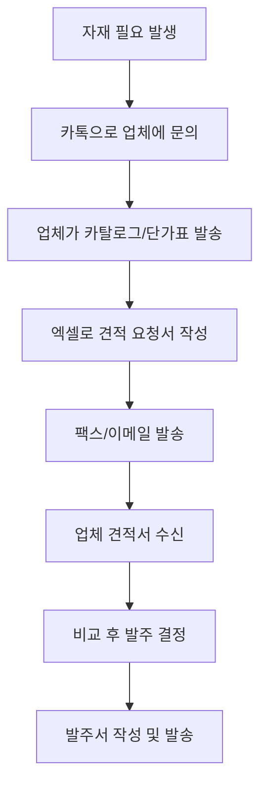
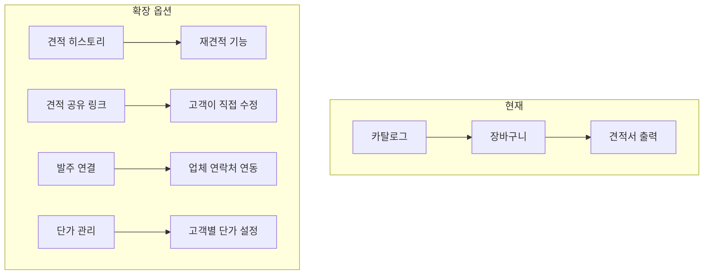
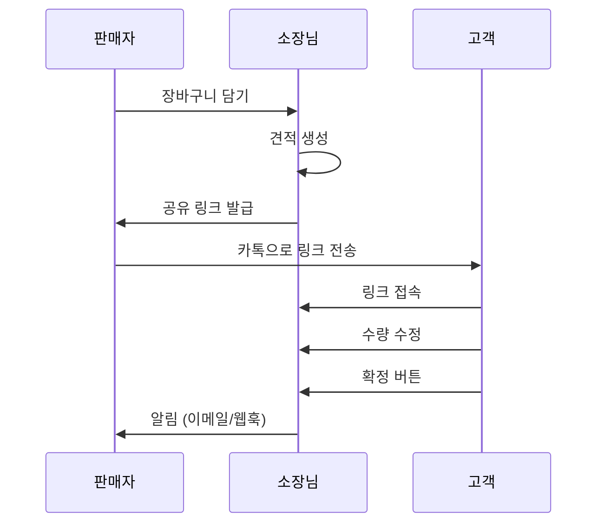

# UX 개선 및 차별화 전략

## 현재 상태 분석

### 현재 견적서 기능 플로우


### 현재 장점

1. **회원가입 불필요**: 즉시 사용 가능
2. **깔끔한 견적서 템플릿**: A4 최적화, 회사 정보 포함
3. **localStorage 저장**: 페이지 새로고침에도 장바구니 유지

### 현재 문제점

| 문제 | 영향 | 심각도 |
|------|------|--------|
| 견적서만으로는 차별화 부족 | 엑셀과 비교 시 명확한 우위 없음 | 높음 |
| 단순 카탈로그 역할 | 실제 업무 효율화에 한계 | 높음 |
| 견적서 저장/관리 불가 | 과거 견적 조회 불가 | 중간 |
| 모바일 UX 미흡 | 현장에서 사용 어려움 | 중간 |

---

## 타겟 사용자 분석

### 페르소나: 건설현장 담당자

```yaml
이름: 김현장
나이: 35-50세
직책: 현장소장, 공무담당자, 자재담당자
IT 숙련도: 낮음 (엑셀 기본, 스마트폰 카톡/네이버 수준)
근무환경: 현장 사무실, 차량 이동 중
사용기기: 스마트폰 (80%), 현장 PC (20%)
```

### 현재 업무 방식



### 핵심 니즈

1. **빠른 견적 요청**: 여러 업체에 한 번에 문의
2. **가격 비교**: 업체별 단가 비교
3. **이력 관리**: 과거 발주 내역 조회
4. **현장에서 접근**: 모바일 필수
5. **간단한 조작**: 복잡한 UI는 사용 안 함

---

## 경쟁 서비스 분석

### 직접 경쟁

| 서비스 | 특징 | 약점 |
|--------|------|------|
| 나만의발주 | 건설 자재 발주 특화, 실시간 재고, 단가 검증 | 복잡한 온보딩, 베타 단계 |
| 엑셀 견적 프로그램 | 익숙함, 로컬 저장 | 공유 어려움, 버전 관리 X |
| 크몽 견적 프로그램 | 맞춤 개발 | 비용, 유지보수 |

### 간접 경쟁

| 대안 | 사용자 행동 |
|------|-------------|
| 카카오톡 | 업체에 직접 문의, 사진으로 견적 |
| 네이버 스마트스토어 | 제품 검색 후 문의 |
| 전화 | 급할 때 직접 통화 |

---

## 차별화 포인트 도출

### 핵심 질문

> "엑셀로 견적서 만드는 것보다 왜 이 서비스를 써야 하는가?"

### 현재 소장님의 가치

```
✅ 제품 카탈로그 + 견적서 자동 생성
❌ 하지만 엑셀도 템플릿 있으면 비슷함
```

### 추가해야 할 가치



---

## MVP 개선 방향 (3가지 옵션)

### 옵션 A: 견적 공유 링크 (권장)

**핵심**: 견적서를 링크로 공유하면 고객이 수정 가능



**장점**:
- 고객 입장에서 편리함 (카톡 링크 클릭만)
- 판매자는 수정 내역 확인 가능
- 엑셀로 불가능한 워크플로우

**필요 개발**:
- 견적 저장 테이블 (`quotations`)
- 공유 링크 생성 (`/quote/{uuid}`)
- 수정 가능한 견적 뷰

### 옵션 B: 견적 히스토리 + 재견적

**핵심**: 과거 견적 저장 및 재사용

```
견적 목록
├── 2024-12-01 OO건설 (3,500,000원)
├── 2024-11-28 △△산업 (1,200,000원)
└── 2024-11-15 □□건설 (5,800,000원)
    └── [재견적] 버튼 → 장바구니에 동일 품목 담기
```

**장점**:
- 반복 거래 시 편리
- 매출/견적 통계 가능

**단점**:
- 판매자만의 편의성
- 고객 경험은 동일

### 옵션 C: 카카오 알림톡 연동

**핵심**: 견적서를 카카오 알림톡으로 발송

**장점**:
- IT 숙련도 낮은 고객도 익숙
- 링크 클릭률 높음

**단점**:
- 카카오 비즈니스 인증 필요
- 발송 비용 (건당 7~15원)
- 개발 복잡도 증가

---

## UX 개선안 (IT 비숙련자 대상)

### 1. 원탭 액션 (버튼 최소화)

**현재**: 수량 입력 → 담기 버튼 클릭
**개선**: 수량 버튼 (+/-) + 담기 버튼 통합

```
┌────────────────────────────────┐
│  🔨 무선 충전 드릴                │
│  ₩89,000                       │
│                                │
│  [ - ]  5  [ + ]   [🛒 담기]    │
└────────────────────────────────┘
```

### 2. 플로팅 장바구니 버튼

현재 헤더의 장바구니 아이콘은 눈에 잘 띄지 않음

**개선**: 우하단 플로팅 버튼 + 수량 뱃지

```
                    ┌─────┐
                    │ 🛒  │
                    │  3  │  ← 담긴 수량
                    └─────┘
```

### 3. 진행 상태 표시

현재 견적서 출력 버튼만 존재

**개선**: 단계 표시

```
━━━━━━━━━━━━━━━━━━━━━━━━━━━━━━━━━━
  ① 제품 선택    ② 수량 확인    ③ 견적서 출력
       ✓             ●              ○
━━━━━━━━━━━━━━━━━━━━━━━━━━━━━━━━━━
```

### 4. 큰 터치 영역

모바일에서 버튼이 작음

**현재**: `py-2 px-4` (약 40px 높이)
**개선**: `py-4 px-6` (약 56px 높이) + 터치 영역 확대

### 5. 견적 완료 화면 개선

현재 브라우저 인쇄 다이얼로그만 표시

**개선**: 완료 화면 추가

```
┌────────────────────────────────┐
│          ✓ 견적서 완료           │
│                                │
│  OO건설 귀중                    │
│  총 금액: ₩3,500,000           │
│                                │
│  [📄 PDF 저장]  [🔗 링크 공유]   │
│                                │
│  [📱 카톡 전송]  [✉️ 이메일]     │
└────────────────────────────────┘
```

---

## 모바일 최적화 우선순위

| 순위 | 개선 항목 | 효과 | 난이도 |
|------|----------|------|--------|
| 1 | 플로팅 장바구니 버튼 | 접근성 ↑ | 쉬움 |
| 2 | 터치 영역 확대 | 오조작 ↓ | 쉬움 |
| 3 | 수량 +/- 버튼 | 입력 편의 ↑ | 쉬움 |
| 4 | 하단 고정 CTA | 전환율 ↑ | 중간 |
| 5 | 견적 완료 화면 | 공유 기능 | 중간 |

---

## 권장 실행 계획

### Phase 1: UX 퀵윈 (1-2일)

1. 플로팅 장바구니 버튼 추가
2. 터치 영역 확대 (버튼 크기)
3. 수량 +/- 버튼 개선

### Phase 2: 견적 공유 기능 (3-5일)

1. `quotations` 테이블 생성
2. 견적 저장 API
3. 공유 가능한 견적 페이지 (`/quote/{id}`)
4. 공유 링크 복사 기능

### Phase 3: 알림 기능 (선택)

1. 고객 수정 시 이메일 알림
2. 카카오 알림톡 연동 (비용 발생)

---

## 결론

### 핵심 차별화

> **"카탈로그 → 견적서"가 아니라 "카탈로그 → 공유 가능한 견적서"**

엑셀 견적서는 만들고 → 저장하고 → 첨부해서 보내야 함.
소장님은 **링크 하나로 공유**하면 끝.

### 타겟 메시지

```
❌ "제품 카탈로그 사이트 만들어드립니다"
✅ "카톡으로 견적 링크 공유하면, 고객이 직접 수량 조절해서 확정합니다"
```

### 다음 단계

1. 위 개선안 중 어떤 방향으로 진행할지 결정
2. 실제 건설현장 담당자 1-2명 인터뷰 (가능하다면)
3. Phase 1 퀵윈 먼저 구현하여 데모 업데이트
