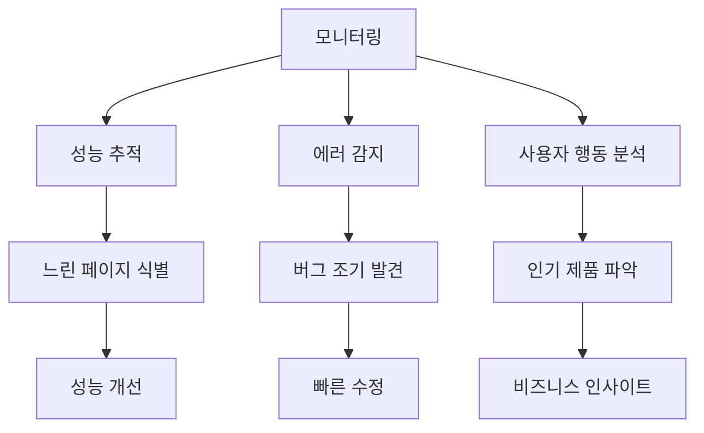

# 📊 모니터링 가이드

Vercel과 Supabase의 모니터링 도구를 활용하여 서비스 상태를 추적하고 문제를 조기에 발견하는 방법을 안내합니다.

## 📌 모니터링이 필요한 이유

### 모니터링의 목적



### 주요 지표

1. **성능**: 페이지 로딩 속도, API 응답 시간
2. **가용성**: 서비스 정상 작동 여부
3. **에러**: 발생한 오류 및 빈도
4. **사용량**: 방문자 수, 페이지뷰, 인기 페이지

## 📈 Vercel 모니터링

### Vercel Analytics (무료 티어)

**접속**: https://vercel.com/dashboard → 프로젝트 선택 → **Analytics** 탭

#### 기본 지표

**Pageviews** (페이지뷰):
- 총 페이지 조회 수
- 시간대별 트래픽
- 인기 페이지 순위

**Top Pages**:
```
/products         → 1,234 views
/                 → 856 views
/products/[id]    → 423 views
/cart             → 189 views
```

**Visitors** (방문자):
- 고유 방문자 수
- 국가별 분포

#### Web Vitals (Pro 플랜)

**LCP (Largest Contentful Paint)**:
- 가장 큰 콘텐츠 로딩 시간
- 목표: **< 2.5초**

**FID (First Input Delay)**:
- 첫 상호작용 반응 시간
- 목표: **< 100ms**

**CLS (Cumulative Layout Shift)**:
- 레이아웃 이동 점수
- 목표: **< 0.1**

**예시 대시보드**:
```
LCP: 1.8s (Good)
FID: 45ms (Good)
CLS: 0.05 (Good)
```

### Vercel Deployments

**접속**: Vercel Dashboard → **Deployments** 탭

#### 배포 상태 확인

**최근 배포 목록**:
- 배포 시간
- Git 커밋 메시지
- 배포 상태 (✅ Ready, ❌ Failed, 🔄 Building)
- 배포 URL

**상태별 의미**:
```
✅ Ready      → 정상 배포 완료
❌ Failed     → 빌드 실패, 로그 확인 필요
🔄 Building   → 현재 빌드 중
⏸️ Canceled   → 수동 취소
```

#### 배포 로그 확인

**Deployment 클릭** → **Logs** 탭

**빌드 로그**:
```bash
> Building
  ✓ Compiled successfully
  ✓ Linting and checking validity of types
  ✓ Creating an optimized production build

> Deployment complete
```

**에러 로그 예시**:
```bash
❌ Type error: Property 'price' does not exist on type 'Product'
   src/app/products/page.tsx:45:12
```

### Vercel Functions Logs

**접속**: Deployment → **Functions** 탭

**서버리스 함수 로그**:
- API Routes 실행 로그
- 에러 스택 트레이스
- 실행 시간

**예시**:
```
[GET /api/products]
Duration: 234ms
Status: 200
Memory: 128MB
```

**에러 확인**:
```
[POST /api/checkout]
Duration: 1,024ms
Status: 500
Error: Database connection timeout
```

## 🗄️ Supabase 모니터링

### Supabase Dashboard

**접속**: https://supabase.com/dashboard → 프로젝트 선택

#### Database 사용량

**Settings → Database → Usage**

**주요 지표**:
- **Database Size**: 현재 DB 크기 / 500MB (Free tier)
- **Bandwidth**: API 요청 대역폭 / 5GB/월
- **Connections**: 동시 연결 수

**예시**:
```
Database Size: 45MB / 500MB (9%)
Bandwidth: 1.2GB / 5GB (24%)
Active Connections: 3 / 60
```

**⚠️ 용량 초과 주의**:
- DB 크기 > 90%: 데이터 정리 필요
- Bandwidth > 90%: 쿼리 최적화 또는 플랜 업그레이드

#### Table Editor 활동

**Table Editor** → 각 테이블

**확인 사항**:
- 제품 개수 (`products` 테이블)
- 카테고리 개수 (`categories` 테이블)
- Admin 사용자 수 (`admin_users` 테이블)

**SQL로 확인**:
```sql
-- 전체 데이터 개수
SELECT
  'categories' AS table_name,
  COUNT(*) AS row_count
FROM categories
UNION ALL
SELECT
  'products',
  COUNT(*)
FROM products
UNION ALL
SELECT
  'admin_users',
  COUNT(*)
FROM admin_users;
```

**출력 예시**:
```
table_name    | row_count
--------------+-----------
categories    | 5
products      | 42
admin_users   | 2
```

### Supabase Logs

**Logs** 섹션 (왼쪽 메뉴)

#### API Logs

**Logs → API**

**확인 가능한 정보**:
- API 요청 URL
- HTTP 메서드 (GET, POST, etc.)
- 응답 상태 코드
- 응답 시간

**예시 로그**:
```
2025-01-25 14:23:45 | GET /rest/v1/products | 200 | 45ms
2025-01-25 14:23:50 | POST /rest/v1/products | 401 | 12ms (Unauthorized)
```

**에러 필터링**:
- Status Code: `400-599` (클라이언트/서버 에러)

**느린 쿼리 확인**:
- Duration > 1000ms (1초 초과)

#### Database Logs

**Logs → Database**

**PostgreSQL 로그**:
- 쿼리 실행 시간
- 슬로우 쿼리
- Connection 에러

**예시**:
```sql
-- 1.2초 소요된 쿼리
SELECT * FROM products
WHERE description ILIKE '%드릴%'
ORDER BY created_at DESC;

Duration: 1,245ms
```

**최적화 필요 신호**:
- Duration > 500ms
- Full table scan 경고

### Supabase Auth Logs

**Authentication → Logs**

**확인 가능한 정보**:
- 로그인 시도
- 로그인 성공/실패
- 새 사용자 등록

**예시**:
```
2025-01-25 15:30:12 | Login success | admin@example.com
2025-01-25 15:35:45 | Login failed  | wrong@example.com (Invalid credentials)
```

**보안 확인**:
- 반복적인 로그인 실패 → 공격 시도 의심
- 비정상적인 로그인 시간/위치

## 🔔 알림 설정

### Vercel 알림

**Vercel Dashboard → Settings → Notifications**

**알림 유형**:
- **Deployment Failed**: 배포 실패 시
- **Deployment Ready**: 배포 완료 시
- **Domain Configuration**: 도메인 설정 변경

**알림 채널**:
- 이메일
- Slack (Integration 필요)

**권장 설정**:
```
✅ Deployment Failed → Email
❌ Deployment Ready → Off (너무 많은 알림)
✅ Domain Configuration → Email
```

### Supabase 알림

**Supabase Dashboard → Settings → Notifications**

**알림 유형**:
- **Database Usage**: DB 용량 80% 초과 시
- **Bandwidth Usage**: 대역폭 80% 초과 시
- **Project Paused**: 프로젝트 일시 중지 시

**권장 설정**:
```
✅ Database Usage → Email
✅ Bandwidth Usage → Email
✅ Project Paused → Email + Slack
```

## 📊 커스텀 모니터링

### 브라우저 콘솔 에러 추적

**사용자가 보고한 문제 재현**:

1. **브라우저 개발자 도구 열기** (F12)
2. **Console** 탭 확인
3. 에러 메시지 확인

**예시 에러**:
```javascript
Error: Failed to fetch
  at fetchProducts (client.ts:12)
  at ProductList.tsx:34

Uncaught TypeError: Cannot read property 'price' of undefined
  at ProductCard.tsx:18
```

**해결**:
- 에러 메시지를 복사하여 코드에서 해당 위치 찾기
- `console.log`로 디버깅

### Network 탭으로 API 호출 확인

**F12 → Network 탭**

**확인 사항**:
- Supabase API 요청 성공 여부
- 응답 시간
- 응답 데이터

**예시**:
```
GET https://xxx.supabase.co/rest/v1/products
Status: 200 OK
Time: 234ms
Size: 12.5KB
```

**느린 요청 식별**:
- Time > 1000ms: 쿼리 최적화 필요
- Size > 100KB: 응답 데이터 축소 필요

### 성능 프로파일링

**Lighthouse 사용**:

1. 브라우저 개발자 도구 → **Lighthouse** 탭
2. **Analyze page load** 클릭
3. 보고서 확인

**점수**:
- **Performance**: 90+ (Good)
- **Accessibility**: 90+ (Good)
- **Best Practices**: 90+ (Good)
- **SEO**: 90+ (Good)

**개선 제안 예시**:
```
⚠️ Largest Contentful Paint: 3.2s
   → 이미지 최적화 필요

⚠️ First Contentful Paint: 2.1s
   → 불필요한 JavaScript 제거
```

## 🚨 문제 감지 및 대응

### 배포 실패

**증상**: Vercel Deployment 상태가 ❌ Failed

**확인**:
1. Deployment → **Logs** 확인
2. 에러 메시지 읽기

**흔한 원인**:
- TypeScript 타입 에러
- 린트 에러
- 환경 변수 누락

**해결**:
```bash
# 로컬에서 빌드 테스트
npm run build

# 에러 수정 후 재배포
git add .
git commit -m "fix: 빌드 에러 수정"
git push origin main
```

### 페이지 로딩 느림

**증상**: Lighthouse Performance 점수 < 50

**확인**:
1. Network 탭에서 느린 요청 찾기
2. Supabase 쿼리 확인

**해결**:
- 이미지 최적화 (`next/image` 사용)
- Supabase 쿼리 최적화 (필요한 컬럼만 select)
- 인덱스 추가

**쿼리 최적화 예시**:
```typescript
// ❌ 모든 컬럼 가져오기
const { data } = await supabase.from('products').select('*')

// ✅ 필요한 컬럼만
const { data } = await supabase
  .from('products')
  .select('id, name, price, image_url')
  .limit(10)
```

### Supabase 용량 초과

**증상**: Database Size > 450MB (90%)

**확인**:
```sql
-- 테이블별 크기 확인
SELECT
  schemaname,
  tablename,
  pg_size_pretty(pg_total_relation_size(schemaname||'.'||tablename)) AS size
FROM pg_tables
WHERE schemaname = 'public'
ORDER BY pg_total_relation_size(schemaname||'.'||tablename) DESC;
```

**해결**:
1. 불필요한 데이터 삭제
2. 이미지를 외부 스토리지로 이동 (image_url만 저장)
3. 플랜 업그레이드 ($25/월 → 8GB)

### Admin 로그인 실패 증가

**증상**: Auth Logs에서 반복적인 로그인 실패

**확인**:
```sql
-- 최근 실패한 로그인 시도 (Supabase Dashboard에서)
-- Auth → Logs → Filter: Failed
```

**대응**:
1. IP 주소 확인
2. 비정상적인 패턴 식별 (동일 IP에서 연속 실패)
3. 필요 시 비밀번호 재설정

## 📋 일일 모니터링 체크리스트

### 아침 (오전 9시)

- [ ] Vercel Dashboard → Deployments 상태 확인
- [ ] 최근 24시간 배포 성공 여부
- [ ] Supabase Dashboard → Database Usage 확인
- [ ] 제품 개수 변화 확인 (예상치와 일치?)

### 오후 (오후 3시)

- [ ] Vercel Analytics → Pageviews 확인
- [ ] 인기 페이지 Top 5
- [ ] Supabase Logs → API Logs 에러 확인
- [ ] 느린 쿼리 (> 1초) 있는가?

### 저녁 (오후 6시)

- [ ] Admin 활동 확인 (제품 추가/수정)
- [ ] 이상 징후 없는가? (비정상적인 트래픽, 에러 급증)

## 📊 주간 모니터링 리포트

### 매주 월요일 오전

**Vercel Analytics 리포트**:
```
지난주 (1/18-1/24):
- 총 페이지뷰: 5,432
- 고유 방문자: 1,234
- Top Pages:
  1. /products (2,100 views)
  2. / (1,800 views)
  3. /products/[id] (890 views)

전주 대비: +12% ↑
```

**Supabase 리포트**:
```
지난주 DB 사용량:
- Database Size: 48MB (+3MB)
- Bandwidth: 1.8GB (+0.3GB)
- 제품 수: 45개 (+3개)

Admin 활동:
- 제품 추가: 5개
- 제품 수정: 12건
- 제품 삭제: 2개
```

**액션 아이템**:
- [ ] 느린 페이지 최적화
- [ ] 에러 수정
- [ ] 인기 제품 프로모션 기획

## 🛠️ 모니터링 도구 추가 (선택사항)

### Sentry (에러 추적)

**설치**:
```bash
npm install --save @sentry/nextjs
npx @sentry/wizard@latest -i nextjs
```

**환경 변수**:
```env
NEXT_PUBLIC_SENTRY_DSN=https://xxx@o000.ingest.sentry.io/000
```

**효과**:
- 실시간 에러 알림
- 스택 트레이스 자동 수집
- 사용자 영향도 분석

### Google Analytics 4

**설치**:
```bash
npm install react-ga4
```

**설정**:
```typescript
// src/app/layout.tsx
import ReactGA from 'react-ga4'

ReactGA.initialize('G-XXXXXXXXXX')
```

**효과**:
- 상세한 사용자 행동 추적
- 전환율 분석
- 사용자 세그먼트

## 📚 다음 단계

- [데이터베이스 유지보수](./database-maintenance.md) - 백업 및 최적화
- [Admin 운영 가이드](./admin-operations.md) - 일상적인 관리 작업
- [롤백 전략](../deployment/rollback.md) - 배포 실패 시 대응

---

**모니터링 관련 질문**이 있으시면 [트러블슈팅 문서](../development/troubleshooting.md)를 참고하세요!
