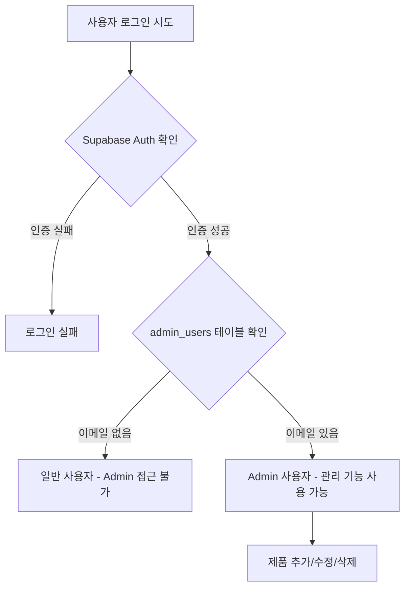

# 🔐 Admin 운영 가이드

Admin 페이지를 통한 일상적인 제품 관리 및 운영 작업을 안내합니다.

## 📌 Admin 시스템 개요

### Admin 접근 권한

**소장님 프로젝트의 Admin은 화이트리스트 방식**입니다.



### Admin 권한 구조

- **인증**: Supabase Auth (이메일/비밀번호)
- **권한**: `admin_users` 테이블에 이메일 등록 여부
- **RLS 정책**: Admin만 제품 INSERT/UPDATE/DELETE 가능

## 🚀 Admin 로그인

### 1단계: Admin 페이지 접속

**URL**:
- 로컬: `http://localhost:3000/admin/login`
- 운영: `https://sojangnim.com/admin/login`

### 2단계: 로그인

**로그인 정보**:
- Email: `admin@example.com` (또는 등록된 Admin 이메일)
- Password: (Supabase Auth에서 설정한 비밀번호)

**로그인 버튼 클릭**

### 3단계: Admin 대시보드 확인

로그인 성공 시 `/admin/products`로 리다이렉트됩니다.

**Admin 네비게이션**:
- **Products**: 제품 목록 및 관리
- **로그아웃**: 세션 종료

## 📦 제품 관리

### 제품 목록 확인

**URL**: `/admin/products`

**표시되는 정보**:
- 제품 이미지 (없으면 📦 이모지)
- 제품명
- 카테고리
- 가격
- 배지 (신제품, 베스트, 프리미엄, 할인)
- 생성일

**정렬**: 최신 순 (created_at DESC)

### 제품 추가

#### 1단계: 제품 추가 페이지 이동

**제품 추가** 버튼 클릭 → `/admin/products/new`

#### 2단계: 제품 정보 입력

**필수 필드**:
- **제품명**: 예) `무선 드릴 세트`
- **설명**: 예) `20V 리튬이온 배터리 포함, 고토크 무선 드릴`
- **가격**: 예) `180000` (숫자만, 쉼표 없이)
- **카테고리**: 드롭다운에서 선택 (전동공구, 수공구 등)

**선택 필드**:
- **배지**: 신제품, 베스트, 프리미엄, 할인 중 선택
- **이미지 URL**: 제품 이미지 URL (없으면 📦 표시)
- **사양**: JSON 형식 (아래 예시 참고)

#### 3단계: 사양 입력 (선택)

**JSON 형식**:
```json
{
  "전압": "20V",
  "토크": "180Nm",
  "배터리": "2.0Ah",
  "무게": "1.8kg"
}
```

**주의사항**:
- 큰따옴표 필수 (`"key": "value"`)
- 마지막 항목 뒤에 쉼표 없음
- 잘못된 JSON은 저장 시 에러 발생

**검증**:
- 사양 필드에 입력 후 저장 전 JSON 유효성 자동 검증
- 유효하지 않으면 에러 메시지 표시

#### 4단계: 저장

**저장** 버튼 클릭

**성공**:
- "제품이 추가되었습니다" 메시지
- `/admin/products`로 리다이렉트
- 제품 목록에 새 제품 표시

**실패**:
- 에러 메시지 확인
- 입력값 검증 (필수 필드, JSON 형식 등)

### 제품 수정

#### 1단계: 수정할 제품 선택

**제품 목록**에서 **수정** 버튼 클릭 → `/admin/products/[id]/edit`

#### 2단계: 정보 수정

- 기존 값이 폼에 자동으로 채워짐
- 수정할 필드만 변경

**예시: 가격 인하**
- 기존 가격: `180000`
- 새 가격: `150000`
- 배지 변경: `할인`

#### 3단계: 저장

**저장** 버튼 클릭

**성공**:
- "제품이 수정되었습니다" 메시지
- 제품 목록으로 리다이렉트
- 공개 페이지에도 즉시 반영

### 제품 삭제

**⚠️ 주의**: 삭제된 제품은 복구할 수 없습니다!

#### 1단계: 삭제 버튼 클릭

**제품 목록**에서 **삭제** 버튼 클릭

#### 2단계: 확인 대화상자

브라우저 확인 창:
```
정말 이 제품을 삭제하시겠습니까?
이 작업은 되돌릴 수 없습니다.
```

**취소**: 아무 일도 일어나지 않음
**확인**: 제품 영구 삭제

#### 3단계: 삭제 완료

- "제품이 삭제되었습니다" 메시지
- 목록에서 제품 사라짐
- 공개 페이지에서도 즉시 제거

## 🔐 Admin 사용자 관리

### 새 Admin 추가

**시나리오**: 새 직원에게 Admin 권한 부여

#### 로컬 환경

**1단계: Supabase Studio에서 Auth 사용자 생성**

http://localhost:54323 → Authentication → Users → **Add user**

- Email: `new-admin@example.com`
- Password: 강력한 비밀번호
- **Auto Confirm User** 체크
- **Create**

**2단계: admin_users 테이블에 추가**

**SQL Editor**:
```sql
INSERT INTO admin_users (email) VALUES
('new-admin@example.com');
```

**✅ 새 Admin 추가 완료**

#### 클라우드 환경

**1단계: Supabase Dashboard → Authentication → Users**

https://supabase.com/dashboard → 프로젝트 선택 → Authentication → Users

**Add user**:
- Email: `new-admin@example.com`
- Password: 비밀번호 설정
- **Auto Confirm User** 체크
- **Create user**

**2단계: SQL Editor에서 admin_users 추가**

```sql
INSERT INTO admin_users (email) VALUES
('new-admin@example.com');
```

**✅ 클라우드 Admin 추가 완료**

### Admin 권한 제거

**시나리오**: 퇴사자 Admin 권한 회수

**1단계: admin_users 테이블에서 삭제**

```sql
DELETE FROM admin_users
WHERE email = 'ex-admin@example.com';
```

**2단계 (선택사항): Supabase Auth 사용자 삭제**

- Supabase Dashboard → Authentication → Users
- 해당 사용자 찾기
- **Delete user**

**✅ Admin 권한 제거 완료**

**효과**:
- 해당 이메일은 더 이상 `/admin` 접근 불가
- 기존 로그인 세션도 제품 수정 권한 없음 (RLS 정책)

### Admin 목록 확인

**SQL Editor**:
```sql
-- 현재 등록된 Admin 목록
SELECT email, created_at
FROM admin_users
ORDER BY created_at DESC;
```

**출력 예시**:
```
email                  | created_at
-----------------------+---------------------------
admin@example.com      | 2025-01-24 10:00:00+00
manager@example.com    | 2025-01-25 14:30:00+00
```

## 📊 일상적인 운영 작업

### 신제품 등록

**주기**: 신제품 입고 시

**프로세스**:
1. 제품 정보 수집 (이름, 가격, 사양)
2. 제품 이미지 준비 (URL)
3. Admin 로그인
4. **제품 추가** → 정보 입력
5. 배지를 **신제품**으로 설정
6. 저장
7. 공개 페이지에서 확인

**체크리스트**:
- [ ] 제품명 정확한가?
- [ ] 가격 올바른가?
- [ ] 카테고리 적절한가?
- [ ] 사양 JSON 형식 정확한가?
- [ ] 이미지 로드되는가?

### 가격 변경

**주기**: 프로모션, 재고 정리 등

**프로세스**:
1. Admin 로그인
2. 제품 목록에서 대상 제품 찾기
3. **수정** 클릭
4. 가격 필드 수정
5. (선택) 배지를 **할인**으로 변경
6. 저장
7. 공개 페이지에서 가격 확인

**예시: 할인 프로모션**
```
기존: 180,000원 (신제품)
변경: 150,000원 (할인)
```

### 재고 소진 제품 숨기기

**방법 1: 제품 삭제** (영구 제거)
- 더 이상 판매하지 않을 제품
- **삭제** 버튼 → 확인

**방법 2: 배지 변경** (임시 표시)
- 일시적 재고 부족
- 설명에 "재입고 예정" 추가
- 배지를 제거하거나 별도 표시

**⚠️ 현재는 숨김 기능이 없습니다**
- 제품 삭제만 가능
- 향후 `is_active` 필드 추가로 숨김 기능 구현 가능

### 제품 정보 업데이트

**주기**: 제조사 사양 변경, 설명 개선 등

**프로세스**:
1. Admin 로그인
2. 제품 **수정**
3. 해당 필드 수정 (설명, 사양 등)
4. 저장

**예시: 사양 추가**
```json
// 기존
{
  "전압": "20V",
  "토크": "180Nm"
}

// 추가
{
  "전압": "20V",
  "토크": "180Nm",
  "무게": "1.8kg",
  "보증기간": "2년"
}
```

## 🚨 일반적인 문제 해결

### "로그인할 수 없습니다"

**원인**: 이메일/비밀번호 오류 또는 권한 없음

**해결**:
1. 이메일/비밀번호 재확인
2. Supabase Auth에서 사용자 존재 확인
3. `admin_users` 테이블에 이메일 등록 확인

```sql
-- Admin 여부 확인
SELECT * FROM admin_users WHERE email = 'your-email@example.com';
```

### "제품을 추가할 수 없습니다"

**원인**: JSON 형식 오류 또는 필수 필드 누락

**해결**:
1. 필수 필드 (이름, 설명, 가격, 카테고리) 입력 확인
2. 사양 JSON 검증:
   - 큰따옴표 사용
   - 마지막 항목 뒤 쉼표 제거
   - JSON Validator로 검증 (https://jsonlint.com/)

**올바른 JSON**:
```json
{
  "전압": "20V"
}
```

**잘못된 JSON**:
```json
{
  '전압': '20V',  // 작은따옴표 사용 (X)
}
```

### "제품 목록이 비어있습니다"

**원인**: DB 연결 오류 또는 실제 제품 없음

**해결**:
1. Supabase 연결 확인 (환경 변수)
2. RLS 정책 확인
3. 제품 테이블 직접 확인

```sql
-- 제품 개수 확인
SELECT COUNT(*) FROM products;

-- RLS 정책 확인
SELECT * FROM pg_policies WHERE tablename = 'products';
```

### "수정/삭제가 작동하지 않습니다"

**원인**: RLS 정책 또는 세션 문제

**해결**:
1. 로그아웃 후 재로그인
2. 브라우저 콘솔에서 에러 확인 (F12)
3. RLS 정책 확인:

```sql
-- Admin 쓰기 권한 확인
SELECT policyname, cmd, qual
FROM pg_policies
WHERE tablename = 'products' AND cmd IN ('INSERT', 'UPDATE', 'DELETE');
```

## 📋 Admin 운영 체크리스트

### 일일 점검

- [ ] 로그인 정상 작동
- [ ] 제품 목록 로드
- [ ] 공개 페이지 확인

### 주간 점검

- [ ] 신제품 등록
- [ ] 가격 변경 사항 적용
- [ ] 재고 소진 제품 정리
- [ ] 제품 정보 업데이트

### 월간 점검

- [ ] Admin 사용자 목록 검토
- [ ] 미사용 제품 정리
- [ ] 제품 이미지 링크 확인
- [ ] 카테고리별 제품 수 균형 확인

## 🎓 고급 작업

### 대량 제품 추가

**현재는 UI를 통한 개별 추가만 가능**합니다.

**대량 추가 시 SQL 사용**:

```sql
-- 5개 제품 동시 추가
INSERT INTO products (name, description, price, category_id, badge, specs) VALUES
('제품1', '설명1', 100000, (SELECT id FROM categories WHERE slug = 'power-tools'), '신제품', '{"전압": "20V"}'::jsonb),
('제품2', '설명2', 150000, (SELECT id FROM categories WHERE slug = 'power-tools'), '베스트', '{"토크": "180Nm"}'::jsonb),
('제품3', '설명3', 200000, (SELECT id FROM categories WHERE slug = 'hand-tools'), '프리미엄', '{"재질": "크롬바나듐"}'::jsonb);
```

**⚠️ Supabase Dashboard SQL Editor에서만 실행**

### 카테고리 관리

**현재는 카테고리 추가/수정 UI가 없습니다.**

**SQL로 카테고리 추가**:

```sql
-- 새 카테고리 추가
INSERT INTO categories (name, slug) VALUES
('충전공구', 'cordless-tools');

-- 카테고리 이름 변경
UPDATE categories
SET name = '전동/충전공구'
WHERE slug = 'power-tools';
```

## 📚 다음 단계

- [모니터링](./monitoring.md) - Admin 활동 추적 및 성능 확인
- [데이터베이스 유지보수](./database-maintenance.md) - 백업 및 복구
- [트러블슈팅](../development/troubleshooting.md) - 개발 환경 문제 해결

---

**Admin 운영 관련 질문**이 있으시면 [트러블슈팅 문서](../development/troubleshooting.md)를 참고하세요!
