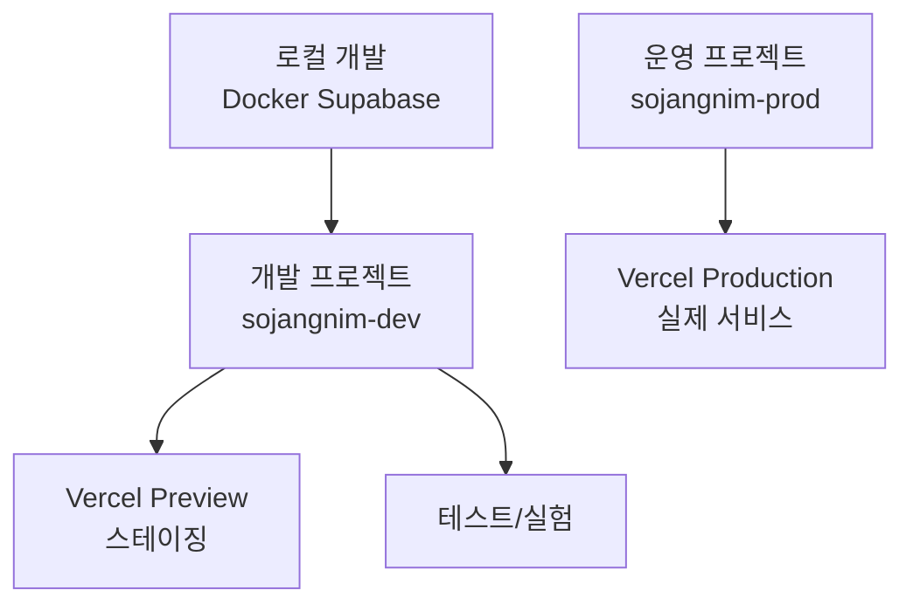

# ☁️ Supabase Cloud 설정 가이드

실제 운영 환경을 위한 Supabase Cloud 프로젝트 생성 및 설정 방법을 배웁니다.

## 📌 Supabase Cloud란?

**Supabase Cloud**는 Supabase가 제공하는 관리형 PostgreSQL 서비스입니다.

### 로컬 vs 클라우드

| 항목 | 로컬 (Docker) | 클라우드 (Supabase Cloud) |
|------|--------------|--------------------------|
| **위치** | 개발자 컴퓨터 | Supabase 서버 (AWS) |
| **접근** | localhost | 인터넷 URL |
| **데이터** | 시드 데이터 (가짜) | 실제 데이터 |
| **백업** | 수동 | 자동 (일일 백업) |
| **확장성** | 제한적 | 자동 스케일링 |
| **비용** | 무료 | 무료 티어 또는 유료 |
| **용도** | 개발/테스트 | 스테이징/프로덕션 |

## 🎯 2개 프로젝트 전략

**권장**: 개발용과 운영용 프로젝트를 분리합니다.



### 프로젝트 구분

| 프로젝트명 | 용도 | 데이터 | 연결 환경 |
|-----------|------|--------|----------|
| **sojangnim-dev** | 개발/테스트 | 테스트 데이터 | 로컬, Vercel Preview |
| **sojangnim-prod** | 운영 | 실제 데이터 | Vercel Production |

## 🚀 1단계: Supabase 계정 생성

### 계정 가입

1. **Supabase 웹사이트 접속**
   - https://supabase.com

2. **Sign Up 클릭**

3. **GitHub로 로그인** (권장)
   - GitHub 계정 연동
   - 또는 이메일로 가입

4. **이메일 인증**
   - 가입 확인 이메일 클릭

**✅ 로그인 완료**

## 📦 2단계: Organization 생성 (최초 1회)

**Organization**은 프로젝트들을 그룹으로 관리하는 단위입니다.

### Organization 만들기

1. Dashboard에서 **New Organization** 클릭

2. **Organization 정보 입력**
   - Name: `소장님` 또는 `Sojangnim`
   - Plan: **Free** 선택 (월 500MB DB, 1GB 파일 저장)

3. **Create Organization**

> 💡 **팁**: 개인 프로젝트는 Free 플랜으로 시작하세요. 나중에 언제든 업그레이드 가능합니다.

## 🏗️ 3단계: 개발 프로젝트 생성

먼저 개발/테스트용 프로젝트를 만듭니다.

### 프로젝트 생성

1. **New Project** 클릭

2. **프로젝트 정보 입력**
   - **Name**: `sojangnim-dev`
   - **Database Password**: 강력한 비밀번호 생성 (저장 필수!)
   - **Region**: `Northeast Asia (Seoul)` 선택 (한국 서버)
   - **Pricing Plan**: **Free**

3. **Create new project** 클릭

**대기**: 프로젝트 생성에 1-2분 소요됩니다.

### 프로젝트 정보 확인

프로젝트가 생성되면 **Settings** → **API** 메뉴에서 다음 정보를 확인할 수 있습니다:

```
Project URL: https://abcdefgh.supabase.co
API Key (anon, public): eyJhbGciOiJIUzI1NiIsInR5cCI6IkpXVCJ9...
API Key (service_role, secret): eyJhbGciOiJIUzI1NiIsInR5cCI6IkpXVCJ9...
```

**⚠️ 중요**: 이 정보를 안전한 곳에 저장하세요! (비밀번호 관리자 추천)

## 🔗 4단계: 로컬 프로젝트와 연결

Supabase CLI로 로컬 프로젝트와 클라우드를 연결합니다.

### Supabase CLI 로그인

```bash
# Supabase 계정으로 로그인
supabase login
```

**브라우저가 자동으로 열리고** 인증을 요청합니다.
- **Authorize** 클릭
- 터미널로 돌아오면 로그인 완료

### 프로젝트 연결

```bash
# 프로젝트 루트 디렉토리에서 실행
cd /path/to/sojangnim

# 클라우드 프로젝트와 연결
supabase link --project-ref <your-project-ref>
```

**Project Reference 찾기**:
1. Supabase Dashboard → **Settings** → **General**
2. **Reference ID** 복사 (예: `abcdefgh`)

**입력 예시**:
```bash
supabase link --project-ref abcdefgh
```

**비밀번호 입력**:
```
Enter your database password:
```
→ 프로젝트 생성 시 설정한 비밀번호 입력

**✅ 연결 완료**:
```
Linked sojangnim to project abcdefgh
```

## 📤 5단계: 마이그레이션 푸시

로컬에서 작성한 마이그레이션을 클라우드 DB에 적용합니다.

### 마이그레이션 확인

```bash
# 로컬 마이그레이션 파일 목록
ls supabase/migrations/
```

**출력 예시**:
```
20251024000000_initial_schema.sql
20250125000000_create_admin_users.sql
20251024000001_add_admin_rls_policies.sql
```

### 클라우드로 푸시

```bash
# 마이그레이션 푸시
supabase db push
```

**실행 과정**:
```
Applying migration 20251024000000_initial_schema.sql...
Applying migration 20250125000000_create_admin_users.sql...
Applying migration 20251024000001_add_admin_rls_policies.sql...

Migration complete!
```

**✅ 성공!** 클라우드 DB에 테이블이 생성되었습니다.

### Supabase Dashboard에서 확인

1. **Table Editor** 메뉴 클릭
2. `categories`, `products`, `admin_users` 테이블 확인

**아직 데이터는 없습니다!** (시드 데이터는 로컬 전용)

## 📊 6단계: 초기 데이터 입력

운영/스테이징 환경에 초기 데이터를 입력합니다.

### 방법 1: Supabase Dashboard에서 직접 입력

**Table Editor** → `categories` 테이블 → **Insert row**

**카테고리 추가 예시**:
- name: `전동공구`
- slug: `power-tools`

**또는 SQL Editor에서 일괄 입력**:

```sql
-- 카테고리 데이터
INSERT INTO categories (name, slug) VALUES
('전동공구', 'power-tools'),
('수공구', 'hand-tools'),
('측정공구', 'measuring-tools'),
('안전용품', 'safety-equipment'),
('작업대', 'workbenches');
```

### 방법 2: 로컬 시드 데이터 일부 사용

```bash
# 로컬 seed.sql에서 운영용 데이터만 추출
cat supabase/seed.sql | grep "INSERT INTO categories"

# Supabase Dashboard → SQL Editor에 붙여넣기
```

> 💡 **주의**: 시드 데이터 전체를 운영 DB에 넣지 마세요! 필요한 데이터만 선별적으로 입력하세요.

> 🔍 더 자세한 방법은 [데이터 동기화 문서](./data-sync.md)를 참고하세요.

## 🔐 7단계: Admin 사용자 추가

운영 환경에서 Admin 기능을 사용하려면 Admin 사용자를 추가해야 합니다.

### Admin 이메일 추가

**SQL Editor**에서 실행:

```sql
-- Admin 화이트리스트에 추가
INSERT INTO admin_users (email) VALUES
('your-email@example.com');  -- 실제 이메일로 변경
```

### Supabase Auth 사용자 생성

1. **Authentication** → **Users** 메뉴

2. **Add user** → **Create new user**

3. **사용자 정보 입력**
   - Email: `your-email@example.com` (admin_users와 동일)
   - Password: 강력한 비밀번호
   - **Auto Confirm User** 체크 (이메일 인증 생략)

4. **Create user**

**✅ 완료!** 이제 `/admin/login`에서 로그인 가능합니다.

## 🌍 8단계: 프로덕션 프로젝트 생성 (선택사항)

운영 서비스를 시작할 준비가 되면 프로덕션 프로젝트를 만듭니다.

### 프로젝트 생성

**개발 프로젝트와 동일한 과정**:

1. **New Project** 클릭
2. **Name**: `sojangnim-prod`
3. **Database Password**: 새로운 강력한 비밀번호
4. **Region**: `Northeast Asia (Seoul)`
5. **Pricing Plan**: 트래픽에 따라 선택

### 마이그레이션 푸시

```bash
# 프로덕션 프로젝트로 전환
supabase link --project-ref <prod-project-ref>

# 마이그레이션 푸시 (검증 완료된 마이그레이션만!)
supabase db push
```

**⚠️ 주의**: 프로덕션 DB는 신중하게 다루세요!

## 📋 Supabase 대시보드 메뉴 설명

### Table Editor
- 테이블 데이터 조회/수정/삭제
- 새 row 추가
- 컬럼 구조 확인

### SQL Editor
- SQL 쿼리 직접 실행
- 마이그레이션 스크립트 테스트
- 복잡한 데이터 조작

### Authentication
- 사용자 관리
- Admin 사용자 추가/삭제
- 인증 설정

### Database
- 데이터베이스 전체 구조
- Triggers, Functions, Extensions
- RLS 정책 확인

### Storage (사용 안 함)
- 파일 업로드/다운로드
- 현재 프로젝트는 미사용 (이미지 URL만 사용)

### Settings
- **API**: URL 및 API Keys
- **Database**: 연결 정보
- **Billing**: 요금제 및 사용량

## 💰 Supabase 요금제

### Free Tier (무료)

**제한**:
- 데이터베이스: 500MB
- 파일 저장: 1GB
- 대역폭: 5GB/월
- Edge Functions: 500,000 호출/월

**충분한 경우**:
- 개인 프로젝트
- MVP 및 프로토타입
- 트래픽이 적은 서비스

### Pro Tier ($25/월)

**제한**:
- 데이터베이스: 8GB
- 파일 저장: 100GB
- 대역폭: 250GB/월
- 일일 백업
- 이메일 지원

**권장**:
- 프로덕션 서비스
- 비즈니스 크리티컬 앱

> 💡 **팁**: 개발 프로젝트는 Free, 프로덕션은 Pro 플랜 사용하세요.

## 🔍 클라우드 프로젝트 모니터링

### Database 사용량 확인

**Dashboard** → **Settings** → **Billing**

- 데이터베이스 크기
- 대역폭 사용량
- API 호출 수

### 쿼리 성능 확인

**Dashboard** → **Database** → **Query Performance**

- 느린 쿼리 확인
- 인덱스 최적화 제안

## 🔄 로컬 ↔ 클라우드 전환

### 현재 연결 프로젝트 확인

```bash
supabase status
```

### 다른 프로젝트로 전환

```bash
# 개발 프로젝트
supabase link --project-ref <dev-project-ref>

# 프로덕션 프로젝트
supabase link --project-ref <prod-project-ref>
```

### 로컬로 돌아가기

```bash
# 로컬 Supabase 시작
supabase start
```

## 🚨 주의사항

### ❌ 절대 하지 말 것

1. **service_role key를 클라이언트에 노출**
   - `service_role` 키는 **서버 전용**!
   - 클라이언트에서는 `anon` 키만 사용

2. **프로덕션 DB에서 직접 테스트**
   - 항상 개발 DB에서 먼저 테스트
   - 검증 완료 후 프로덕션 적용

3. **비밀번호를 Git에 커밋**
   - 환경 변수 파일은 `.gitignore`에 추가

4. **RLS 정책 비활성화**
   - 보안을 위해 RLS는 항상 활성화

### ✅ 베스트 프랙티스

1. **2개 프로젝트 분리** (개발/운영)
2. **강력한 비밀번호 사용**
3. **정기적인 백업 확인**
4. **사용량 모니터링**
5. **마이그레이션 단계적 적용**

## 🛠️ 문제 해결

### "Invalid project ref"

**원인**: Project Reference ID가 잘못됨

**해결**:
```bash
# Dashboard에서 Reference ID 다시 확인
# Settings → General → Reference ID
```

### "Database password incorrect"

**원인**: 비밀번호 오류

**해결**:
```bash
# 비밀번호 재설정
# Dashboard → Settings → Database → Reset database password
```

### "Migration failed"

**원인**: 마이그레이션 SQL 오류 또는 이미 적용됨

**해결**:
```bash
# 클라우드 DB 마이그레이션 히스토리 확인
# Dashboard → SQL Editor
SELECT * FROM supabase_migrations.schema_migrations;

# 필요시 마이그레이션 롤백 후 재실행
```

## 📚 다음 단계

- [데이터 동기화](./data-sync.md) - 로컬 ↔ 클라우드 데이터 관리
- [환경 변수 관리](../deployment/environment-variables.md) - API 키 안전하게 관리
- [Vercel 설정](../deployment/vercel-setup.md) - 클라우드 DB와 연결

---

**다음 읽을 문서**: [배포 개요](../deployment/overview.md)
