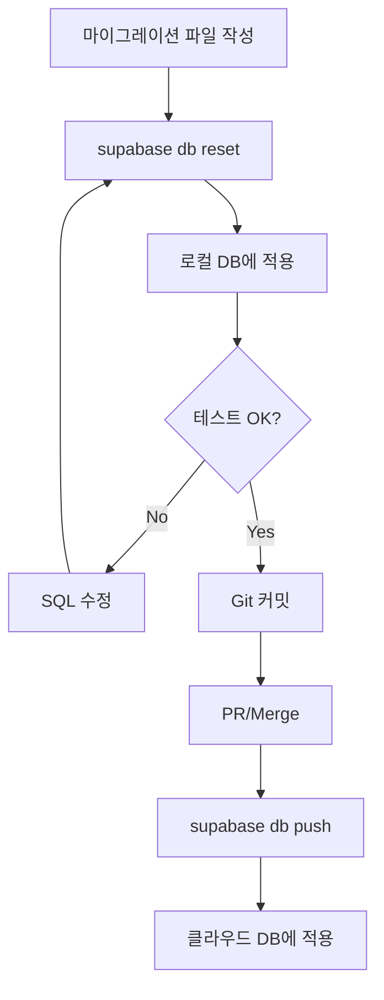

# 🔄 Supabase 마이그레이션 가이드

데이터베이스 스키마 변경을 안전하게 관리하는 마이그레이션 시스템을 배웁니다.

## 📌 마이그레이션이란?

**마이그레이션(Migration)**은 데이터베이스 스키마 변경을 버전 관리하는 방법입니다.

### 왜 필요한가요?

**❌ 마이그레이션 없이**:
- "내 컴퓨터에서는 잘 되는데..." (환경마다 DB 구조가 다름)
- 어떤 순서로 SQL을 실행해야 하는지 모름
- 운영 DB를 잘못 건드려서 데이터 손실

**✅ 마이그레이션 사용**:
- 모든 개발자가 동일한 DB 구조 사용
- Git으로 DB 변경 이력 추적
- 자동으로 순서대로 실행
- 로컬 → 클라우드 동기화 간편

### 비유로 이해하기

```
Git은 "코드 변경 이력"을 관리한다면,
마이그레이션은 "DB 변경 이력"을 관리합니다.
```

## 📂 마이그레이션 파일 구조

```
supabase/
├── config.toml                  # Supabase 설정
├── seed.sql                     # 초기 데이터 (개발용)
└── migrations/                  # 마이그레이션 파일들
    ├── 20251024000000_initial_schema.sql         # 1번째: 초기 스키마
    ├── 20250125000000_create_admin_users.sql     # 2번째: Admin 테이블
    └── 20251024000001_add_admin_rls_policies.sql # 3번째: RLS 정책
```

### 파일명 규칙

```
<타임스탬프>_<설명>.sql
```

**타임스탬프**: `YYYYMMDDHHmmss` 형식 (시간순 정렬)
**설명**: 소문자, 언더스코어로 구분

**예시**:
- `20251024000000_initial_schema.sql` - 2025년 10월 24일 00:00:00
- `20250125120000_add_product_images.sql` - 2025년 1월 25일 12:00:00

## 🔍 기존 마이그레이션 살펴보기

### 1번 마이그레이션: 초기 스키마

**파일**: `supabase/migrations/20251024000000_initial_schema.sql`

```sql
-- 카테고리 테이블 생성
CREATE TABLE categories (
    id UUID PRIMARY KEY DEFAULT gen_random_uuid(),
    name TEXT NOT NULL,
    slug TEXT NOT NULL UNIQUE,
    created_at TIMESTAMPTZ DEFAULT now()
);

-- 제품 배지 ENUM
CREATE TYPE product_badge AS ENUM ('신제품', '베스트', '프리미엄', '할인');

-- 제품 테이블 생성
CREATE TABLE products (
    id UUID PRIMARY KEY DEFAULT gen_random_uuid(),
    name TEXT NOT NULL,
    description TEXT,
    price NUMERIC(10, 2) NOT NULL,
    image_url TEXT,
    category_id UUID REFERENCES categories(id),
    badge product_badge,
    specs JSONB,
    created_at TIMESTAMPTZ DEFAULT now()
);

-- 인덱스 생성 (성능 최적화)
CREATE INDEX idx_products_category ON products(category_id);
CREATE INDEX idx_products_badge ON products(badge);

-- RLS (Row Level Security) 활성화
ALTER TABLE categories ENABLE ROW LEVEL SECURITY;
ALTER TABLE products ENABLE ROW LEVEL SECURITY;

-- 공개 읽기 권한
CREATE POLICY "모든 사용자는 카테고리를 조회할 수 있습니다"
    ON categories FOR SELECT
    USING (true);

CREATE POLICY "모든 사용자는 제품을 조회할 수 있습니다"
    ON products FOR SELECT
    USING (true);
```

**무엇을 하나요?**
- `categories`, `products` 테이블 생성
- `product_badge` ENUM 타입 정의
- 인덱스 추가 (빠른 검색)
- RLS 정책으로 누구나 조회 가능하게 설정

### 2번 마이그레이션: Admin 사용자 테이블

**파일**: `supabase/migrations/20250125000000_create_admin_users.sql`

```sql
-- Admin 사용자 화이트리스트
CREATE TABLE IF NOT EXISTS admin_users (
    id UUID PRIMARY KEY DEFAULT gen_random_uuid(),
    email TEXT NOT NULL UNIQUE,
    created_at TIMESTAMPTZ DEFAULT now()
);

-- RLS 활성화
ALTER TABLE admin_users ENABLE ROW LEVEL SECURITY;

-- Admin만 자신의 정보 조회 가능
CREATE POLICY "Admin 사용자는 자신의 정보를 조회할 수 있습니다"
    ON admin_users FOR SELECT
    TO authenticated
    USING (email = (SELECT auth.jwt()->>'email'));
```

**무엇을 하나요?**
- `admin_users` 테이블 생성
- Admin 이메일 화이트리스트 관리
- 본인 정보만 조회 가능하도록 RLS 설정

### 3번 마이그레이션: Admin RLS 정책

**파일**: `supabase/migrations/20251024000001_add_admin_rls_policies.sql`

```sql
-- Admin은 제품 추가 가능
CREATE POLICY "Admin은 제품 추가 가능"
    ON products FOR INSERT
    TO authenticated
    WITH CHECK (
        EXISTS (
            SELECT 1 FROM admin_users
            WHERE email = (SELECT auth.jwt()->>'email')
        )
    );

-- Admin은 제품 수정 가능
CREATE POLICY "Admin은 제품 수정 가능"
    ON products FOR UPDATE
    TO authenticated
    USING (
        EXISTS (
            SELECT 1 FROM admin_users
            WHERE email = (SELECT auth.jwt()->>'email')
        )
    );

-- Admin은 제품 삭제 가능
CREATE POLICY "Admin은 제품 삭제 가능"
    ON products FOR DELETE
    TO authenticated
    USING (
        EXISTS (
            SELECT 1 FROM admin_users
            WHERE email = (SELECT auth.jwt()->>'email')
        )
    );
```

**무엇을 하나요?**
- Admin만 제품 추가/수정/삭제 가능
- 일반 사용자는 읽기만 가능

## 🚀 마이그레이션 실행하기

### 로컬 환경에서

```bash
# 현재 Supabase 상태 확인
supabase status

# 마이그레이션 실행 (자동으로 순서대로 실행)
supabase db reset
```

**`supabase db reset`은**:
1. 기존 DB를 완전히 삭제
2. `migrations/` 폴더의 모든 `.sql` 파일을 타임스탬프 순서로 실행
3. `seed.sql` 시드 데이터 삽입

### 클라우드 환경으로 푸시

```bash
# Supabase Cloud 프로젝트와 연결
supabase link --project-ref <your-project-ref>

# 로컬 마이그레이션을 클라우드로 푸시
supabase db push
```

> 💡 클라우드 배포는 [Supabase Cloud 설정 문서](./cloud-setup.md)를 참고하세요.

## ✍️ 새 마이그레이션 만들기

### 시나리오: 제품에 "재고" 필드 추가하기

#### 1단계: 마이그레이션 파일 생성

```bash
supabase migration new add_product_stock
```

**생성된 파일**: `supabase/migrations/20250125153000_add_product_stock.sql`

#### 2단계: SQL 작성

파일을 열어서 SQL을 작성합니다:

```sql
-- 재고 컬럼 추가
ALTER TABLE products
ADD COLUMN stock INTEGER NOT NULL DEFAULT 0;

-- 재고 인덱스 추가
CREATE INDEX idx_products_stock ON products(stock);

-- 재고가 0 이하인 제품은 품절로 표시
ALTER TABLE products
ADD COLUMN is_available BOOLEAN GENERATED ALWAYS AS (stock > 0) STORED;
```

#### 3단계: 로컬에서 테스트

```bash
# 마이그레이션 적용
supabase db reset

# Supabase Studio에서 확인
# http://localhost:54323
```

**Table Editor**에서 `products` 테이블을 보면:
- `stock` 컬럼 추가됨 (기본값 0)
- `is_available` 컬럼 추가됨 (자동 계산)

#### 4단계: Git 커밋

```bash
git add supabase/migrations/20250125153000_add_product_stock.sql
git commit -m "feat: 제품 재고 관리 기능 추가"
```

#### 5단계: 클라우드에 푸시 (운영 배포 시)

```bash
supabase db push
```

## 🎨 시드 데이터 (seed.sql)

**시드 데이터**는 개발/테스트용 초기 데이터입니다.

**파일**: `supabase/seed.sql`

```sql
-- 카테고리 데이터
INSERT INTO categories (id, name, slug) VALUES
('11111111-1111-1111-1111-111111111111', '전동공구', 'power-tools'),
('22222222-2222-2222-2222-222222222222', '수공구', 'hand-tools'),
...

-- 제품 데이터
INSERT INTO products (name, description, price, category_id, badge, specs) VALUES
(
  '무선 드릴 세트',
  '20V 리튬이온 배터리 포함',
  180000,
  '11111111-1111-1111-1111-111111111111',
  '신제품',
  '{"전압": "20V", "토크": "180Nm", "배터리": "2.0Ah"}'::jsonb
),
...
```

### 시드 데이터 수정하기

**주의**: 운영 환경에서는 시드 데이터를 사용하지 않습니다!

시드 데이터는 **로컬 개발**과 **스테이징** 환경에서만 사용합니다.

```bash
# 시드 데이터 편집
vi supabase/seed.sql

# 재적용
supabase db reset
```

## 🔄 마이그레이션 롤백

**Supabase는 자동 롤백을 지원하지 않습니다.** 수동으로 롤백 마이그레이션을 작성해야 합니다.

### 예시: stock 컬럼 제거 (롤백)

```bash
supabase migration new rollback_product_stock
```

```sql
-- 추가한 컬럼 제거
ALTER TABLE products
DROP COLUMN IF EXISTS stock,
DROP COLUMN IF EXISTS is_available;

-- 인덱스 제거
DROP INDEX IF EXISTS idx_products_stock;
```

**권장 방법**:
1. 마이그레이션을 신중하게 작성
2. 로컬/스테이징에서 충분히 테스트
3. 운영 환경에는 검증된 마이그레이션만 푸시

## 🛠️ 마이그레이션 베스트 프랙티스

### ✅ DO (좋은 예)

```sql
-- 1. 안전한 기본값 제공
ALTER TABLE products
ADD COLUMN stock INTEGER NOT NULL DEFAULT 0;

-- 2. IF NOT EXISTS 사용
CREATE TABLE IF NOT EXISTS admin_users (...);

-- 3. 인덱스 동시 생성 (테이블 잠금 방지)
CREATE INDEX CONCURRENTLY idx_products_name ON products(name);

-- 4. 주석으로 설명 추가
-- 제품 재고 관리를 위한 컬럼 추가
ALTER TABLE products ADD COLUMN stock INTEGER;
```

### ❌ DON'T (나쁜 예)

```sql
-- 1. 기본값 없이 NOT NULL 추가 (기존 데이터에 에러)
ALTER TABLE products ADD COLUMN stock INTEGER NOT NULL;

-- 2. 테이블 삭제 (데이터 손실!)
DROP TABLE products;

-- 3. 컬럼 타입 변경 (데이터 손실 가능)
ALTER TABLE products ALTER COLUMN price TYPE INTEGER;

-- 4. 외래 키 제약 없이 삭제
DELETE FROM categories WHERE id = '...';
```

## 🔍 마이그레이션 상태 확인

### 현재 적용된 마이그레이션 목록

```bash
# Supabase Studio에서 확인
# http://localhost:54323 → SQL Editor

SELECT * FROM supabase_migrations.schema_migrations;
```

### 로컬 ↔ 클라우드 차이 확인

```bash
# 로컬 DB와 마이그레이션 파일 차이
supabase db diff

# 특정 스키마만 비교
supabase db diff --schema public
```

## 🚨 문제 해결

### "Migration already exists"

**원인**: 동일한 타임스탬프의 마이그레이션 파일이 이미 존재

**해결**:
```bash
# 다른 이름으로 생성
supabase migration new add_feature_v2
```

### "Syntax error in migration"

**원인**: SQL 문법 오류

**해결**:
1. 마이그레이션 파일 열기
2. SQL 문법 확인
3. Supabase Studio SQL Editor에서 테스트
4. 수정 후 `supabase db reset` 재실행

### "Foreign key constraint violation"

**원인**: 외래 키 제약 조건 위반

**해결**:
```sql
-- 외래 키 있는 데이터 먼저 삭제
DELETE FROM products WHERE category_id = '...';
-- 그 다음 카테고리 삭제
DELETE FROM categories WHERE id = '...';
```

## 📊 마이그레이션 흐름도



## 🎓 실전 예제

### 예제 1: 카테고리에 설명 추가

```bash
supabase migration new add_category_description
```

```sql
-- 설명 컬럼 추가
ALTER TABLE categories
ADD COLUMN description TEXT;

-- 기존 카테고리에 설명 추가
UPDATE categories SET description = '전동으로 작동하는 공구' WHERE slug = 'power-tools';
UPDATE categories SET description = '손으로 사용하는 공구' WHERE slug = 'hand-tools';
-- ...
```

### 예제 2: 제품 조회수 추가

```bash
supabase migration new add_product_view_count
```

```sql
-- 조회수 컬럼
ALTER TABLE products
ADD COLUMN view_count INTEGER NOT NULL DEFAULT 0;

-- 조회수 증가 함수
CREATE OR REPLACE FUNCTION increment_view_count(product_id UUID)
RETURNS VOID AS $$
BEGIN
    UPDATE products
    SET view_count = view_count + 1
    WHERE id = product_id;
END;
$$ LANGUAGE plpgsql;

-- 인기 제품 뷰 (조회수 순)
CREATE VIEW popular_products AS
SELECT * FROM products
ORDER BY view_count DESC
LIMIT 10;
```

## 📚 다음 단계

- [RLS 정책](./rls-policies.md) - 보안 정책 이해하기
- [Supabase Cloud 설정](./cloud-setup.md) - 운영 환경 배포
- [데이터 동기화](./data-sync.md) - 로컬 ↔ 클라우드 동기화

---

**질문이 있으신가요?** [트러블슈팅 문서](../development/troubleshooting.md)를 확인하세요!
