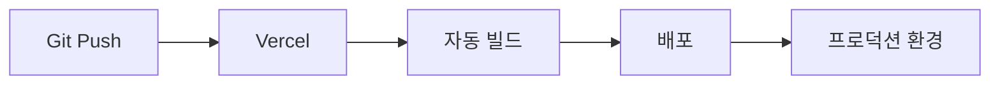
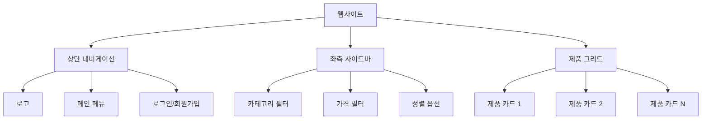
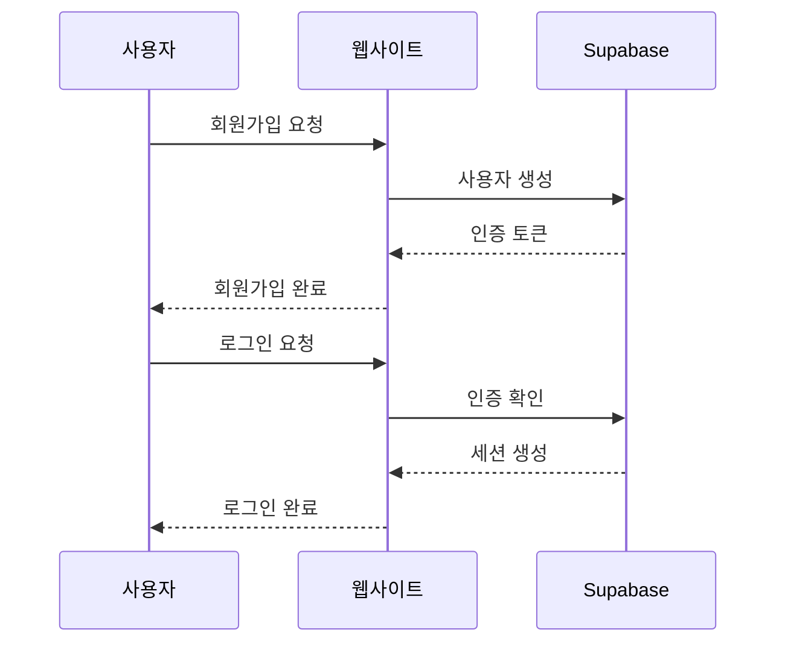
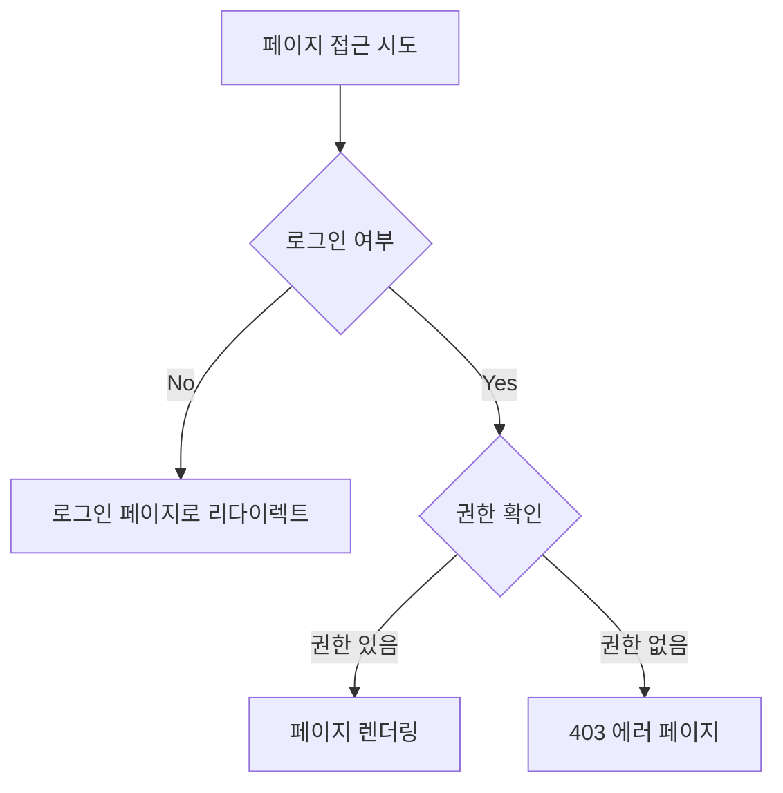
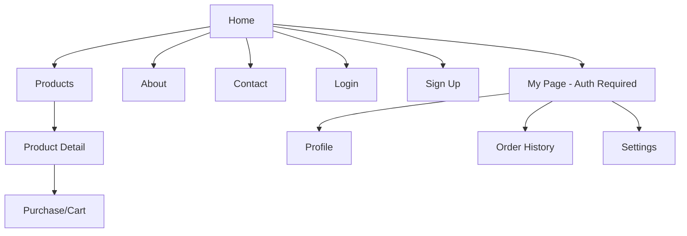
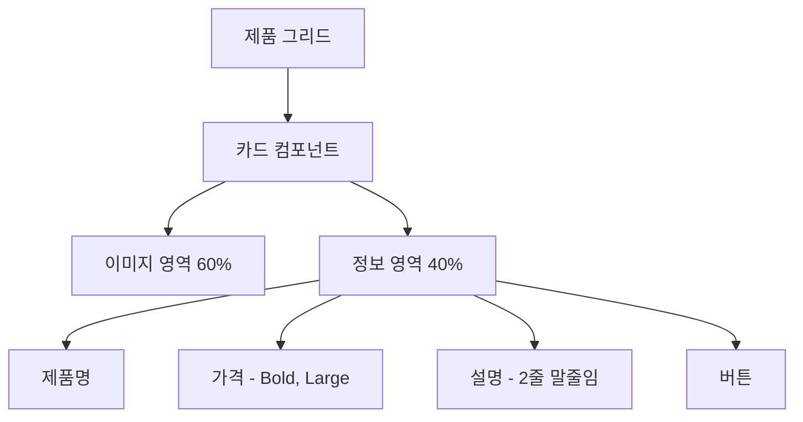
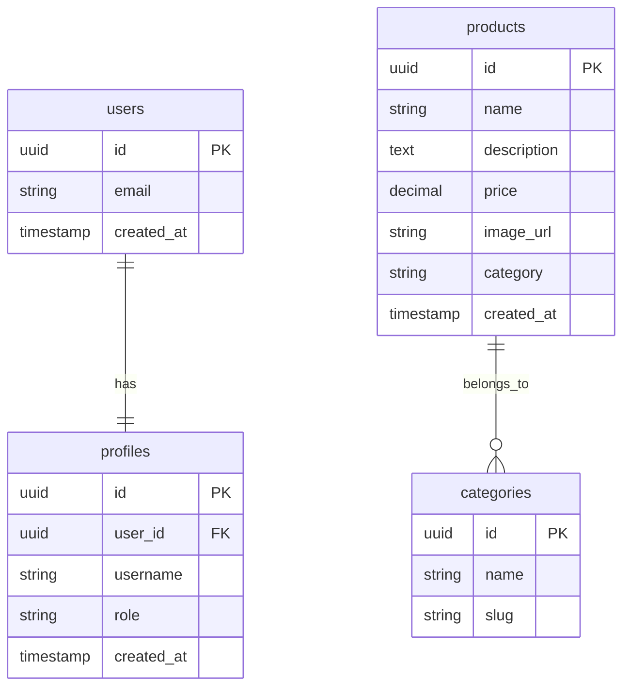

# 제품 페이지 웹사이트 PRD (Product Requirements Document)

## 1. 프로젝트 개요

### 1.1 목표
모던한 디자인의 제품 페이지를 중심으로 한 웹사이트 구축. 사용자는 제품을 한눈에 확인하고, 회원가입을 통해 특정 페이지에 접근할 수 있습니다.

### 1.2 핵심 가치
- **직관적인 UI**: 제품 이미지, 설명, 가격이 한눈에 들어오는 레이아웃
- **모던한 디자인**: 최신 웹 디자인 트렌드 반영
- **보안**: 회원가입 및 권한 기반 페이지 접근 제어

## 2. 기술 스택

### 2.1 프론트엔드
- **프레임워크**: Next.js (React 기반)
- **스타일링**: Tailwind CSS
- **UI 컴포넌트**: shadcn/ui 또는 커스텀 컴포넌트

### 2.2 백엔드 & 인프라
- **호스팅**: Vercel
- **인증/데이터베이스**: Supabase
  - 사용자 인증 (Authentication)
  - PostgreSQL 데이터베이스
  - Row Level Security (RLS) 기반 권한 관리

### 2.3 배포 파이프라인

## 3. 주요 기능

### 3.1 제품 페이지 (메인 기능)

#### 3.1.1 레이아웃 구조

#### 3.1.2 제품 카드 구성요소
각 제품 카드는 다음을 포함합니다:
- **제품 이미지**: 고품질 썸네일 (정사각형 또는 4:3 비율)
- **제품명**: 간결하고 명확한 타이틀
- **가격**: 크고 읽기 쉬운 폰트
- **간단한 설명**: 1-2줄 요약
- **액션 버튼**: "상세보기" 또는 "구매하기"

#### 3.1.3 탭/네비게이션 위치
- **상단 탭**: 가로 메뉴 (Home, Products, About, Contact 등)
- **좌측 탭**: 세로 카테고리 메뉴 (제품 분류별)

### 3.2 사용자 인증

#### 3.2.1 회원가입
- 이메일 + 비밀번호 방식
- 이메일 인증 (선택적)
- 소셜 로그인 (선택적: Google, GitHub 등)

#### 3.2.2 로그인
- 세션 기반 인증 (Supabase Auth)
- "로그인 유지" 옵션

#### 3.2.3 인증 플로우

### 3.3 권한 기반 페이지 접근

#### 3.3.1 페이지 권한 레벨
- **Public**: 누구나 접근 가능 (홈, 제품 목록)
- **Authenticated**: 로그인한 사용자만 접근 (마이페이지, 주문 내역)
- **Premium**: 특정 권한을 가진 사용자만 접근 (관리자 페이지 등)

#### 3.3.2 권한 확인 로직

## 4. 페이지 구조

### 4.1 사이트맵

### 4.2 주요 페이지 목록

| 페이지 | 경로 | 권한 | 설명 |
|--------|------|------|------|
| 홈 | `/` | Public | 랜딩 페이지 |
| 제품 목록 | `/products` | Public | 제품 그리드 뷰 |
| 제품 상세 | `/products/[id]` | Public | 개별 제품 정보 |
| 로그인 | `/login` | Public | 로그인 폼 |
| 회원가입 | `/signup` | Public | 회원가입 폼 |
| 마이페이지 | `/my-page` | Auth | 사용자 대시보드 |
| 주문내역 | `/orders` | Auth | 구매 이력 |
| 관리자 | `/admin` | Admin | 제품 관리 (선택적) |

## 5. 디자인 요구사항

### 5.1 디자인 컨셉
- **모던하고 깔끔한 UI**: 여백을 활용한 미니멀 디자인
- **반응형 디자인**: 모바일, 태블릿, 데스크톱 대응
- **일관된 색상 팔레트**: 브랜드 아이덴티티 반영
- **고품질 이미지**: 제품이 돋보이는 비주얼

### 5.2 레이아웃 우선순위
1. **제품 이미지**: 가장 눈에 띄는 영역
2. **가격**: 크고 명확하게 표시
3. **제품명**: 중간 크기, 가독성 높은 폰트
4. **설명**: 작지만 읽기 쉬운 텍스트

### 5.3 UI 컴포넌트 예시

## 6. 데이터베이스 스키마

### 6.1 주요 테이블

#### users (Supabase Auth 기본 테이블)
- `id` (UUID, PK)
- `email` (string)
- `created_at` (timestamp)

#### profiles (사용자 프로필 확장)
- `id` (UUID, FK → users.id)
- `username` (string)
- `role` (enum: user, admin)
- `created_at` (timestamp)

#### products (제품 정보)
- `id` (UUID, PK)
- `name` (string)
- `description` (text)
- `price` (decimal)
- `image_url` (string)
- `category` (string)
- `created_at` (timestamp)

#### categories (카테고리)
- `id` (UUID, PK)
- `name` (string)
- `slug` (string)

### 6.2 ER 다이어그램

## 7. 개발 단계

### 7.1 Phase 1: 초기 셋업
- [ ] Next.js 프로젝트 생성
- [ ] Tailwind CSS 설정
- [ ] Supabase 프로젝트 생성 및 연동
- [ ] Vercel 배포 파이프라인 구성

### 7.2 Phase 2: 인증 시스템
- [ ] Supabase Auth 통합
- [ ] 회원가입 페이지 구현
- [ ] 로그인 페이지 구현
- [ ] 인증 상태 관리 (Context/Zustand)
- [ ] Protected Route 구현

### 7.3 Phase 3: 제품 페이지
- [ ] 제품 목록 페이지 레이아웃
- [ ] 제품 카드 컴포넌트
- [ ] 필터링/정렬 기능
- [ ] 제품 상세 페이지
- [ ] 반응형 디자인 적용

### 7.4 Phase 4: 추가 기능
- [ ] 마이페이지 구현
- [ ] 장바구니 기능 (선택적)
- [ ] 검색 기능
- [ ] 관리자 대시보드 (선택적)

### 7.5 Phase 5: 테스트 & 배포
- [ ] 크로스 브라우저 테스트
- [ ] 모바일 반응형 테스트
- [ ] 성능 최적화 (이미지 lazy loading, code splitting)
- [ ] 프로덕션 배포

## 8. 성공 지표

- **사용자 경험**: 제품 카드에서 정보를 3초 이내에 파악 가능
- **성능**: First Contentful Paint < 1.5초
- **접근성**: WCAG 2.1 AA 수준 준수
- **전환율**: 제품 상세 페이지 방문율 > 30%

## 9. 향후 확장 가능성

- 결제 시스템 통합 (Stripe, Toss Payments)
- 제품 리뷰 및 평점 시스템
- 위시리스트 기능
- 다국어 지원
- SEO 최적화 (메타 태그, sitemap)
- 분석 도구 통합 (Google Analytics, Mixpanel)

## 10. 참고 리소스

- [Next.js 공식 문서](https://nextjs.org/docs)
- [Supabase 공식 문서](https://supabase.com/docs)
- [Tailwind CSS 문서](https://tailwindcss.com/docs)
- [Vercel 배포 가이드](https://vercel.com/docs)
