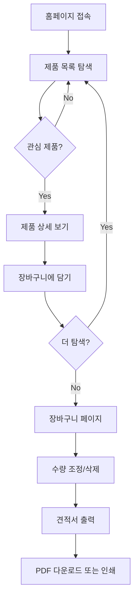
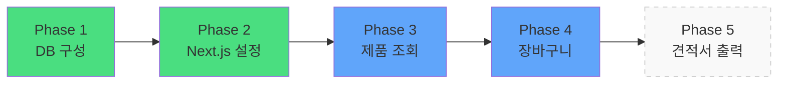
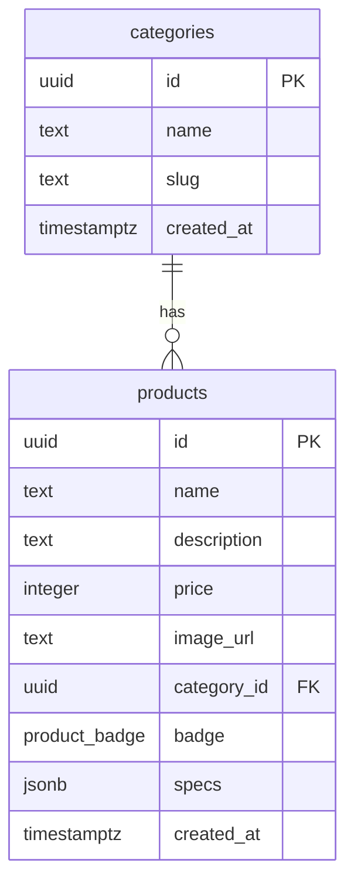

# 소장님 프로젝트 - 견적서 출력용 카탈로그 사이트

## 프로젝트 목표
제품을 조회하고 장바구니에 담아 견적서를 출력할 수 있는 카탈로그 웹사이트 구축

## 핵심 개념
- **회원가입/로그인 없음**: 누구나 바로 접근
- **제품 조회 중심**: 카테고리별 분류 및 상세 정보 제공
- **장바구니 기능**: 브라우저 로컬에 저장 (로그인 불필요)
- **견적서 출력**: 장바구니 내용을 PDF 또는 인쇄물로 변환 (추후 구현)
- **결제 없음**: 견적만 확인하는 용도

---

## 사용자 흐름



---

## 기술 스택

### 프론트엔드
- **Next.js 14** (App Router)
- **TypeScript**
- **Tailwind CSS**
- **Zustand** (장바구니 상태 관리)

### 백엔드 & 데이터
- **Supabase** (PostgreSQL)
  - 제품 데이터 저장
  - 카테고리 관리
  - 읽기 전용 (관리자 기능 없음)

### 배포
- **Vercel**

---

## 전체 로드맵



---

## Phase 상세

### ✅ Phase 1: Supabase DB 구성
**목표**: 제품 데이터를 저장할 데이터베이스 준비

- [ ] Supabase 프로젝트 생성
- [ ] `categories` 테이블 생성
- [ ] `products` 테이블 생성 (badge 포함)
- [ ] RLS 정책 설정 (읽기 전용)
- [ ] 샘플 데이터 입력

📄 **문서**: `01-supabase-setup.md`

---

### ✅ Phase 2: Next.js 프로젝트 설정
**목표**: 개발 환경 구축 및 Supabase 연결

- [ ] Next.js 프로젝트 생성
- [ ] Tailwind CSS 설정
- [ ] Supabase 클라이언트 설치 및 연결
- [ ] TypeScript 타입 정의
- [ ] 기본 폴더 구조 구성

📄 **문서**: `02-nextjs-setup.md`

---

### ✅ Phase 3: 제품 조회 기능
**목표**: 홈페이지, 제품 목록, 제품 상세 페이지 구현

- [ ] Header, Footer 공통 컴포넌트
- [ ] 홈페이지 (Hero + 최신 제품)
- [ ] 제품 목록 페이지
  - 카테고리 필터링
  - Badge 표시 (신제품, 베스트 등)
  - 리스트형 레이아웃
- [ ] 제품 상세 페이지
  - 제품 정보 상세 표시
  - 스펙 정보
  - "장바구니 담기" 버튼 (Phase 4에서 연결)

📄 **문서**: `03-product-display.md`

---

### ✅ Phase 4: 장바구니 기능
**목표**: 제품을 장바구니에 담고 관리하는 기능

- [ ] Zustand로 장바구니 상태 관리
- [ ] 로컬스토리지 연동 (새로고침 후에도 유지)
- [ ] "장바구니 담기" 버튼 기능 연결
- [ ] 장바구니 페이지 (`/cart`)
  - 담긴 제품 목록
  - 수량 변경
  - 개별 삭제
  - 총액 계산
- [ ] Header에 장바구니 아이콘 + 개수 표시

📄 **문서**: `04-cart-feature.md`

---

### 🔜 Phase 5: 견적서 출력 (추후 구현)
**목표**: 장바구니 내용을 견적서로 변환

- [ ] 견적서 레이아웃 디자인
- [ ] PDF 생성 라이브러리 통합 (예: react-pdf)
- [ ] "견적서 출력" 버튼 기능 구현
- [ ] 인쇄 최적화 CSS

📄 **문서**: `05-quotation.md` (나중에 작성)

---

## 최종 폴더 구조

```
sojangnim/
├── design-mockups/           # HTML 디자인 참고
├── tasks/                    # 작업 계획 문서
│   ├── 00-overview.md       # 이 파일
│   ├── 01-supabase-setup.md
│   ├── 02-nextjs-setup.md
│   ├── 03-product-display.md
│   └── 04-cart-feature.md
│
├── public/
│   └── images/
│       └── products/
│
├── src/
│   ├── app/                  # 페이지 라우트
│   │   ├── page.tsx         # 홈
│   │   ├── products/        # 제품 목록 + 상세
│   │   ├── cart/            # 장바구니
│   │   └── layout.tsx       # 루트 레이아웃
│   │
│   ├── components/           # 재사용 컴포넌트
│   │   ├── Header.tsx
│   │   ├── Footer.tsx
│   │   ├── ProductCard.tsx
│   │   └── CategorySidebar.tsx
│   │
│   ├── lib/
│   │   └── supabase/
│   │       └── client.ts    # Supabase 연결
│   │
│   ├── store/               # 상태 관리
│   │   └── cart.ts          # Zustand 장바구니 store
│   │
│   └── types/
│       └── product.ts       # TypeScript 타입
│
├── .env.local               # Supabase 환경 변수
├── prd.md
└── README.md
```

---

## 데이터베이스 스키마 (간단 버전)



---

## 제외되는 기능 (PRD에서 삭제)

- ❌ 회원가입/로그인
- ❌ 마이페이지
- ❌ 주문 내역
- ❌ 관리자 페이지
- ❌ 결제 시스템
- ❌ 리뷰/평점
- ❌ 위시리스트

---

## 포함되는 기능 (최소 MVP)

- ✅ 제품 목록 조회
- ✅ 카테고리 필터링
- ✅ 제품 상세 보기
- ✅ Badge 표시 (신제품, 베스트 등)
- ✅ 장바구니 담기
- ✅ 장바구니 관리 (수량 변경/삭제)
- ✅ 견적서 출력 (Phase 5)

---

## 성공 지표

- **사용자 경험**: 제품 정보를 3초 이내에 파악 가능
- **성능**: First Contentful Paint < 2초
- **기능성**: 장바구니에 최소 10개 제품 담기 가능
- **출력**: 견적서 PDF 생성 및 다운로드

---

## 다음 단계

🔜 **Phase 1 시작**: `01-supabase-setup.md` 문서 참고
