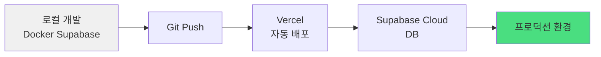

# Phase 5: 프로덕션 배포

## 목표
로컬 개발 환경에서 프로덕션(Vercel + Supabase Cloud)으로 배포

---

## 배포 아키텍처



---

## 1. Supabase Cloud 프로젝트 생성

### 1.1 계정 생성 및 프로젝트 생성
1. https://supabase.com 접속
2. "Start your project" 클릭
3. GitHub 계정으로 로그인
4. "New Project" 클릭
5. 프로젝트 정보 입력:
   - **Name**: `sojangnim-prod` (또는 원하는 이름)
   - **Database Password**: 강력한 비밀번호 생성 (저장 필수!)
   - **Region**: `Northeast Asia (Seoul)` 선택
   - **Pricing Plan**: Free 선택
6. "Create new project" 클릭 (2-3분 소요)

---

## 2. 로컬 마이그레이션을 Cloud로 배포

### 2.1 Supabase CLI로 Cloud 연결
```bash
# 현재 위치: /Users/infograb/Workspace/Personal/pghoya2956/sojangnim

# Cloud 프로젝트와 연결
supabase link --project-ref <project-id>

# project-id는 Supabase 대시보드 URL에서 확인
# 예: https://app.supabase.com/project/abc123def456
# → project-id = abc123def456
```

**비밀번호 입력**:
- 프로젝트 생성 시 입력한 Database Password 사용

### 2.2 마이그레이션 배포
```bash
# 로컬 마이그레이션을 Cloud에 푸시
supabase db push

# 성공 메시지 확인
```

### 2.3 Seed 데이터 적용 (선택)
```bash
# Cloud에 Seed 데이터 적용
supabase db reset --db-url <database-url>

# 또는 Supabase Dashboard에서 SQL Editor로 직접 실행
```

**또는 Supabase Dashboard 사용**:
1. Supabase Dashboard → SQL Editor
2. `supabase/seed.sql` 내용 복사
3. 붙여넣기 후 "Run" 클릭

---

## 3. Supabase Cloud API 키 확인

### 3.1 API 설정 확인
1. Supabase Dashboard → **Project Settings** (톱니바퀴 아이콘)
2. **API** 메뉴 선택
3. 다음 정보 복사:

```
Project URL: https://xxxxx.supabase.co
anon public key: eyJhbGciOiJIUzI1NiIsInR5cCI6IkpXVCJ9...
```

⚠️ **중요**: 이 정보는 Vercel 환경 변수로 사용됩니다!

---

## 4. GitHub 저장소 준비

### 4.1 .gitignore 확인
**파일**: `.gitignore`

다음 내용이 포함되어 있는지 확인:
```
# dependencies
/node_modules
/.pnp
.pnp.js

# testing
/coverage

# next.js
/.next/
/out/

# production
/build

# misc
.DS_Store
*.pem

# debug
npm-debug.log*
yarn-debug.log*
yarn-error.log*

# local env files
.env*.local

# vercel
.vercel

# typescript
*.tsbuildinfo
next-env.d.ts

# supabase
.branches
.temp
.env
```

### 4.2 Git 저장소 생성 (아직 안 했다면)
```bash
# Git 초기화 (이미 되어 있으면 스킵)
git init

# 모든 변경사항 추가
git add .

# 커밋
git commit -m "feat: 프로덕션 배포 준비

- Next.js 프로젝트 완성
- Supabase 마이그레이션 파일
- 제품 조회, 장바구니 기능 구현"
```

### 4.3 GitHub 원격 저장소 생성
1. https://github.com 접속
2. "New repository" 클릭
3. Repository name: `sojangnim`
4. Public 또는 Private 선택
5. "Create repository" 클릭

### 4.4 원격 저장소 연결 및 푸시
```bash
# 원격 저장소 추가
git remote add origin https://github.com/<your-username>/sojangnim.git

# 푸시
git branch -M main
git push -u origin main
```

---

## 5. Vercel 배포

### 5.1 Vercel 계정 생성
1. https://vercel.com 접속
2. "Sign Up" 클릭
3. GitHub 계정으로 로그인

### 5.2 프로젝트 Import
1. Vercel Dashboard에서 "Add New..." → "Project" 클릭
2. GitHub 저장소 목록에서 `sojangnim` 선택
3. "Import" 클릭

### 5.3 환경 변수 설정
**Configure Project** 화면에서:

1. **Environment Variables** 섹션 확장
2. 다음 변수 추가:

| Name | Value | Environment |
|------|-------|-------------|
| `NEXT_PUBLIC_SUPABASE_URL` | `https://xxxxx.supabase.co` | Production |
| `NEXT_PUBLIC_SUPABASE_ANON_KEY` | `eyJhbGci...` | Production |

⚠️ **주의**:
- Supabase Cloud의 URL과 Key 사용 (로컬 localhost 아님!)
- **All** 환경에 적용하려면 체크박스 선택

### 5.4 배포 설정
- **Framework Preset**: Next.js (자동 감지됨)
- **Build Command**: `npm run build` (기본값)
- **Output Directory**: `.next` (기본값)
- **Install Command**: `npm install` (기본값)

### 5.5 배포 시작
1. "Deploy" 버튼 클릭
2. 빌드 로그 확인
3. 배포 완료 시 URL 확인 (예: `https://sojangnim.vercel.app`)

---

## 6. 배포 확인

### 6.1 프로덕션 사이트 접속
```
https://your-project.vercel.app
```

### 6.2 확인 사항
- [ ] 홈페이지 로딩
- [ ] 제품 목록 표시 (Supabase Cloud 데이터)
- [ ] 카테고리 필터링 작동
- [ ] 제품 상세 페이지 접근
- [ ] 장바구니 추가/삭제 작동
- [ ] 장바구니 페이지 접근

### 6.3 에러 발생 시
1. Vercel Dashboard → 프로젝트 → "Deployments" 탭
2. 최신 배포 클릭 → "Runtime Logs" 확인
3. 환경 변수가 제대로 설정되었는지 확인

---

## 7. 지속적 배포 (CI/CD) 설정

### 7.1 자동 배포 확인
Vercel은 GitHub와 연동되어 자동 배포됩니다:


### 7.2 브랜치별 배포
- **main 브랜치**: 프로덕션 배포
- **다른 브랜치**: Preview 배포 (미리보기 URL 생성)

```bash
# 예: 새 기능 개발
git checkout -b feature/new-product-filter
# 코드 작성
git add .
git commit -m "feat: 새로운 필터 추가"
git push origin feature/new-product-filter

# Vercel이 자동으로 Preview URL 생성
# 예: https://sojangnim-git-feature-new-product-filter.vercel.app
```

---

## 8. 도메인 연결 (선택)

### 8.1 커스텀 도메인 추가
1. Vercel Dashboard → 프로젝트 → "Settings" → "Domains"
2. 도메인 입력 (예: `sojangnim.com`)
3. DNS 설정 안내에 따라 도메인 제공업체에서 설정

### 8.2 DNS 설정 예시
도메인 제공업체(가비아, 호스팅KR 등)에서:
- **Type**: `A`
- **Name**: `@`
- **Value**: `76.76.21.21` (Vercel IP)

또는
- **Type**: `CNAME`
- **Name**: `www`
- **Value**: `cname.vercel-dns.com`

---

## 9. 성능 최적화

### 9.1 이미지 최적화
Vercel은 `next/image` 자동 최적화 제공:
- WebP 변환
- 반응형 크기 조정
- Lazy loading

### 9.2 캐싱 설정
Next.js App Router는 자동으로 캐싱:
- Static 페이지: 빌드 시 생성
- Dynamic 데이터: ISR (Incremental Static Regeneration)

### 9.3 분석 도구 추가 (선택)
**Vercel Analytics**:
1. Vercel Dashboard → 프로젝트 → "Analytics"
2. "Enable" 클릭

```bash
# 패키지 설치
npm install @vercel/analytics

# app/layout.tsx에 추가
import { Analytics } from '@vercel/analytics/react'

export default function RootLayout({ children }) {
  return (
    <html>
      <body>
        {children}
        <Analytics />
      </body>
    </html>
  )
}
```

---

## 10. 데이터베이스 관리

### 10.1 로컬 개발 vs 프로덕션

| 환경 | DB | URL | 용도 |
|------|----|----|------|
| 로컬 | Docker Supabase | `http://localhost:54321` | 개발 & 테스트 |
| 프로덕션 | Supabase Cloud | `https://xxxxx.supabase.co` | 실사용자 데이터 |

### 10.2 스키마 변경 워크플로우
```bash
# 1. 로컬에서 새 마이그레이션 생성
supabase migration new add_product_stock

# 2. 마이그레이션 파일 작성
# supabase/migrations/xxxxx_add_product_stock.sql

# 3. 로컬에서 테스트
supabase db reset

# 4. Git 커밋
git add supabase/migrations/
git commit -m "feat: 제품 재고 컬럼 추가"

# 5. Cloud에 적용
supabase db push

# 6. GitHub 푸시 (Vercel 자동 배포)
git push origin main
```

---

## 11. 모니터링 및 로그

### 11.1 Vercel 로그 확인
1. Vercel Dashboard → 프로젝트 → "Deployments"
2. 배포 클릭 → "Runtime Logs"

### 11.2 Supabase 모니터링
1. Supabase Dashboard → **Database** → **Logs**
2. 쿼리 성능 및 에러 확인

---

## 12. 백업 전략

### 12.1 Supabase 자동 백업
- Free Plan: 7일 백업 보관
- Pro Plan: 30일 백업 보관

### 12.2 수동 백업
```bash
# Supabase Cloud에서 백업
supabase db dump -f backup.sql --db-url <database-url>

# 복원
psql <database-url> < backup.sql
```

---

## 13. 보안 체크리스트

- [ ] `.env.local`이 `.gitignore`에 포함됨
- [ ] Supabase RLS 정책 확인
- [ ] API 키가 GitHub에 노출되지 않음
- [ ] HTTPS 적용 (Vercel 기본 제공)
- [ ] 환경 변수가 Vercel에만 저장됨

---

## 14. 완료 체크리스트

### Supabase Cloud
- [ ] 프로젝트 생성
- [ ] 로컬 마이그레이션 푸시 (`supabase db push`)
- [ ] Seed 데이터 적용
- [ ] API URL 및 anon key 복사

### GitHub
- [ ] 저장소 생성
- [ ] 코드 푸시
- [ ] `.gitignore` 확인

### Vercel
- [ ] 프로젝트 Import
- [ ] 환경 변수 설정 (Supabase Cloud URL/Key)
- [ ] 배포 성공
- [ ] 프로덕션 사이트 접속 확인

### 기능 테스트
- [ ] 제품 목록 조회
- [ ] 카테고리 필터링
- [ ] 제품 상세 페이지
- [ ] 장바구니 추가/삭제
- [ ] 반응형 디자인 확인 (모바일/태블릿)

---

## 15. 트러블슈팅

### 문제 1: "Error: Invalid API credentials"
**해결**:
1. Vercel 환경 변수 확인
2. Supabase Cloud URL/Key가 정확한지 확인
3. 환경 변수 업데이트 후 재배포

### 문제 2: 제품 데이터가 안 보임
**해결**:
1. Supabase Dashboard → Table Editor에서 데이터 확인
2. RLS 정책 확인
3. 브라우저 콘솔에서 네트워크 에러 확인

### 문제 3: 빌드 실패
**해결**:
1. Vercel 배포 로그 확인
2. 로컬에서 `npm run build` 테스트
3. TypeScript 에러 수정

### 문제 4: "supabase link" 실패
**해결**:
```bash
# Supabase CLI 최신 버전 확인
supabase --version

# 업데이트
brew upgrade supabase

# 다시 시도
supabase link --project-ref <project-id>
```

---

## 16. 다음 단계

✅ **배포 완료!**

이제 다음을 고려할 수 있습니다:
- 📄 **견적서 출력 기능** (PDF 생성)
- 🔍 **검색 기능** 추가
- 📊 **관리자 대시보드** (제품 관리)
- 🔐 **회원 인증** (선택적)
- 📧 **이메일 알림** (견적 발송)
- 💳 **결제 연동** (선택적)

---

## 축하합니다! 🎉

프로덕션 배포가 완료되었습니다:
- ✅ 로컬 개발 환경 (Docker Supabase)
- ✅ 프로덕션 DB (Supabase Cloud)
- ✅ 웹 호스팅 (Vercel)
- ✅ CI/CD 파이프라인 (GitHub → Vercel)
